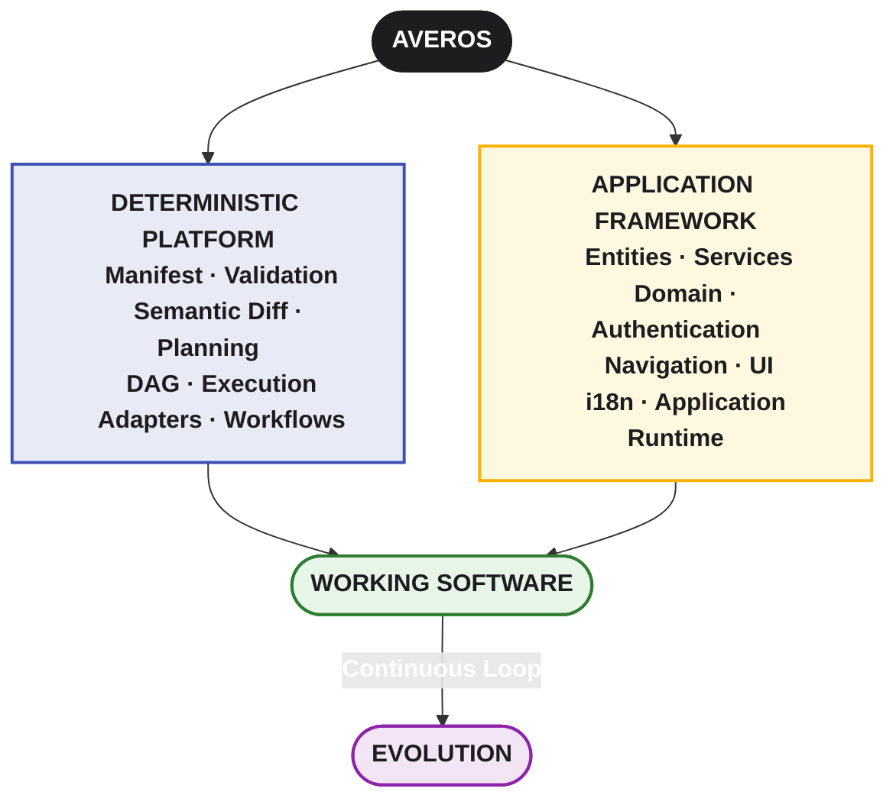
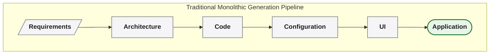
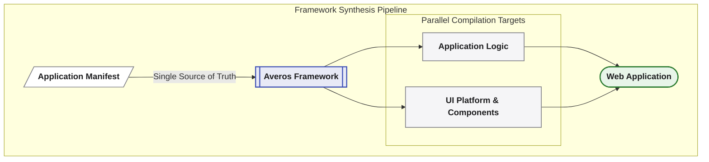

_AI defines. Averos builds._

      

## About this documentation

This documentation provides the technical reference for building applications with Averos.

It covers the application model and its core concepts, including **entities, fields, services, validation, domain logic, authentication, navigation, layouts, and UI components**, as well as the workflows and tooling used to turn those definitions into working applications.

It also serves as a reference for understanding the current Averos application architecture and the capabilities provided by its framework and platform packages.

The broader deterministic architecture — including the **application manifest, validation, semantic change, execution planning, dependency resolution, orchestration, and adapters** — is documented separately and will continue to evolve as the Averos platform and its ecosystem mature.

---

## What is Averos?

**Averos** is a deterministic software construction and evolution platform designed to turn structured application intent into reliable, executable software — and to keep that software evolvable as requirements change.

At its core, Averos provides a structured representation of an application and the machinery required to transform that representation into a working system. It brings together application modeling, validation, dependency-aware planning, deterministic execution, application workflows, technology-specific adapters, and a reusable application runtime into a single development model.

Applications can be defined through entities, fields, services, validation rules, domain logic, authentication, navigation, layouts, and user interfaces, while the Averos execution layer determines how those definitions are validated, planned, and realized. The same model can then be revised and executed again, allowing application changes to be handled as explicit evolution rather than uncontrolled regeneration.

This makes Averos more than a conventional application framework and more than a code-generation tool. It provides a controlled layer between application intent and implementation — one in which software can be defined, inspected, validated, planned, executed, and evolved through a consistent and reproducible process.

The framework and platform components provide the building blocks for the resulting applications, while the broader Averos architecture provides the deterministic path from intent to software.

---

## What Averos provides

Averos brings together two complementary dimensions of software construction: a **deterministic platform for transforming application intent into software**, and an **application framework for defining the capabilities and experience of the resulting application**.

### The deterministic platform

The platform provides the machinery that turns an application manifest into controlled, executable change.

It encompasses:

* **Application manifests** — a structured representation of application intent and state.
* **Validation** — ensure that the application definition is coherent and executable before changes are applied.
* **Semantic evolution** — identify what has changed and determine which parts of the application are actually affected.
* **Execution planning** — transform application changes into an explicit, dependency-aware execution plan.
* **Dependency resolution** — determine the correct order in which operations must be performed.
* **Deterministic execution** — apply planned operations through a controlled and observable execution process.
* **Adapters and workflows** — connect the platform to specific technologies and application-building mechanisms.

This layer is deliberately separated from any particular application technology. The platform defines **how software changes are modeled, validated, planned, and executed**, while adapters determine **how those operations are realized for a particular technology stack**.

### The application framework

On top of that foundation, Averos provides the building blocks from which complete applications can be constructed.

These include:

* **Entities and fields** — define application data, structure, and relationships.
* **Validation** — express domain and application constraints.
* **Services** — encapsulate application operations and interactions with data.
* **Domain controllers** — resolving and serving valid value sets for application fields from any data source.
* **Authentication and authorization** — integrate authentication providers through a consistent application API.
* **Layouts and navigation** — structure application workflows and user experiences.
* **UI components** — provide reusable, responsive, and customizable application interfaces.
* **Internationalization** — support multilingual applications through built-in translation capabilities.
* **Application generation** — transform the application model into a complete working application.

These capabilities are designed as a coordinated system rather than as a collection of unrelated features. Together, they provide a reusable application architecture while leaving room for application-specific behaviour, customization, and extension.

### One model, two dimensions

The two layers work together around the **application manifest**.

The manifest describes what the application should be. The deterministic platform determines how that intent can be safely and reproducibly realized. The application framework provides the domain, behaviour, and presentation capabilities from which the resulting software is built.

Conceptually:

This separation is fundamental to Averos.

**The platform controls the path from intent to execution.
The framework defines the application that travels that path.**

The result is more than application scaffolding or code generation. It is a development model in which applications can be **defined, inspected, validated, planned, built, and evolved** through a common and structured representation.

---

## Who this documentation is for

This documentation is intended primarily for **developers building applications with Averos**.

A basic understanding of web application development is recommended, particularly for developers who want to customize or extend generated applications.

For advanced development topics, familiarity with:

* **TypeScript**
* **Angular**
* **HTML and CSS**
* modern web application concepts

will be useful.

You do not need to be an expert in every technology used by Averos to get started. The framework provides reusable UI components and application conventions that reduce the amount of infrastructure that needs to be implemented manually.

---

## A framework built around application structure

Traditional application development often begins directly with implementation details:

Averos introduces a more structured development approach.

At the center of this approach is the **application manifest**: a structured representation of the application that can be authored directly, produced with AI, or designed visually. It provides the common contract through which Averos validates, plans, and executes application changes.

The application manifest is first expressed through  **domain, behaviour, configuration, and presentation requirements**, which Averos can then use as the basis for application generation.

This separation allows the framework to provide consistent foundations while leaving room for application-specific implementation.

---

## The Averos application architecture

The documentation that follows focuses primarily on the architecture of applications built with Averos.

You will progressively discover the major building blocks of an Averos application, including:

1. **Application configuration**
2. **Entities and fields**
3. **Relationships and validation**
4. **Services**
5. **Domain controllers**
6. **Authentication and authorization**
7. **Layouts and navigation**
8. **UI components**
9. **Translations and internationalization**
10. **Application generation and customization**

Each concept is introduced independently and then connected to the larger application architecture.

The intention is not simply to document individual APIs, but to explain **how the different parts of an Averos application fit together**.

---

## The UI platform

Averos applications use a dedicated UI platform built around reusable application components and responsive layouts.

The UI platform provides the building blocks required to create consistent application interfaces while abstracting much of the repetitive work involved in implementing common application screens and interactions.

It is built on top of modern web technologies including **Angular, Angular Material, TypeScript, SCSS, and internationalization tooling**.

The platform is designed to be customizable rather than restrictive.

You can use the provided components and layouts as they are, configure their behaviour, or extend them when an application requires something beyond the standard building blocks.

---

## Application generation

A central capability of Averos is the ability to transform an application manifest into a working application — and to apply subsequent changes to that application as it evolves.

Rather than treating generation as a one-time operation, Averos can use the same application model to construct an initial application and subsequently apply explicit changes to it.

The generation process brings together the application's domain model, configuration, services, UI structure, translations, and other required resources.

This means that instead of manually creating the same foundational files and structures for every project, Averos can systematically construct them from the application's definition.

The result is not a proprietary runtime environment or an opaque generated artifact. The application remains a **normal web application**: its source can be inspected, built, run, customized, tested, and integrated into a conventional development workflow.

You can inspect its source code, run it locally, build it, customize it, and integrate it with the rest of your development environment.

---

## Authentication

Authentication is an integral part of the Averos application architecture.

Averos follows a **Bring Your Own Auth (BYOA)** model, allowing an application to use different authentication systems while exposing a consistent authentication API to the rest of the application.

Depending on the application's configuration, authentication can be provided through systems such as:

* a development-oriented dummy provider
* **Keycloak / OpenID Connect**
* **Firebase Authentication**
* social identity providers
* a custom authentication implementation

Authentication is therefore a **configuration concern and extension point**, rather than an architectural limitation imposed by the framework.

The authentication documentation provides the details required to configure and use each supported provider.

---

## Start with the concepts

If you are new to Averos, the recommended approach is to explore the documentation progressively.

Start by understanding the **application model**, then move through the individual application building blocks:

```mermaid
flowchart TD
    classDef top fill:#1d1d1f,stroke:#1d1d1f,stroke-width:2px,color:#ffffff,font-weight:bold
    classDef domain fill:#f5f5f7,stroke:#86868b,stroke-width:1.5px,color:#1d1d1f
    classDef logic fill:#e8eaf6,stroke:#3f51b5,stroke-width:1.5px,color:#1d1d1f
    classDef presentation fill:#fff8e1,stroke:#ffb300,stroke-width:1.5px,color:#1d1d1f
    classDef engine fill:#e8f5e9,stroke:#2e7d32,stroke-width:2px,color:#1d1d1f,font-weight:bold

    subgraph DeclarativeManifest Hierarchy ["Declarative Manifest Hierarchy"]
        APP[/"`**Application**`"/]:::top
        CFG["`**Configuration**`"]:::domain
        ENT["`**Entities & Fields**`"]:::domain
        VAL["`**Validation & Relationships**`"]:::domain
        SVC["`**Services**`"]:::logic
        CTL["`**Domain Controllers**`"]:::logic
        AUTH["`**Authentication**`"]:::logic
        LAY["`**Layouts & Navigation**`"]:::presentation
        UIC["`**UI Components**`"]:::presentation
        GEN[["`**Generation**`"]]:::engine

        APP --> CFG
        CFG --> ENT
        ENT --> VAL
        VAL --> SVC
        SVC --> CTL
        CTL --> AUTH
        AUTH --> LAY
        LAY --> UIC
        UIC --> GEN
    end
```

Once these concepts are familiar, the individual APIs and implementation details become much easier to understand.

---

## Beyond the framework

Averos is no longer only a collection of application-generation components.

The framework is now part of a broader architecture in which **structured application intent, application state, validation, planning, execution, and technology-specific adapters** provide the foundation for building and evolving software.

The broader architectural model is described separately in:

<a href="/averos/how-averos-works/introduction/" title="How Averos Works" class="btn btn--success btn--small" target="_blank"> How Averos Works → </a>

This documentation section, however, remains focused on the practical side of building applications with Averos: **the application architecture, framework capabilities, UI platform, and the tools used to turn an application definition into working software.**

---

## Your Averos journey starts here

Whether you are exploring an existing application, designing a new one, or extending the framework itself, the documentation is intended to give you both the **conceptual foundation** and the **technical reference** needed to work effectively with Averos.

Start with the core concepts, explore the application architecture, and then build your way toward the more advanced capabilities.

>**Define the intent. Understand the model. Let Averos build, execute, and evolve the application.**
> **Define it. Understand it. Build it. Evolve it.**

