## Overview

Sensitive and personal data should never be reachable by unknown users. Any application that deals with such data needs at least one trusted **authentication** layer, usually backed by an **authorization** model and, in most cases, an **access token** / **refresh token** mechanism. <br/>
The market already offers no shortage of authentication providers — [**Auth0**](https://auth0.com/ "Auth0"), [**Firebase Auth**](https://firebase.google.com/docs/auth "Firebase Auth"), [**Clerk**](https://clerk.com/ "Clerk Authentication and user management"), [**Keycloak**](https://www.keycloak.org/ "Keycloak"), [**Amazon Cognito**](https://aws.amazon.com/cognito/ "Amazon Cognito") — each with its own conventions, SDKs and token formats. <br/>

Rather than lock you into one of them, **Averos** provides an authentication and authorization layer designed around a **Bring Your Own Auth (BYOA)** architecture. Instead of requiring applications to use a specific authentication server or identity provider, Averos defines a common contract that allows an application to integrate the authentication system that best fits its requirements.


**Philosophy:** provider-agnostic, claims-based, standards-compliant.

- ✅ **Provider-agnostic** — works with JWT, OAuth2, OpenID Connect, Keycloak, Auth0, social logins, or a fully custom API
- ✅ **Claims-based model** — the same internal user shape maps cleanly onto JWT, OIDC and SAML claims
- ✅ **Multi-provider support** — register more than one provider and switch between them at runtime
- ✅ **Fine-grained authorization** — roles, permissions and resource-based access control, together or independently
- ✅ **Declarative UI** — show or hide content based on permissions without writing authorization logic in every component
- ✅ **Sensible defaults** — authentication is opt-in and works out of the box once a provider is registered
- ✅ **Type-safe** — the entire authentication surface is fully typed

This approach allows Averos applications to work with a wide range of authentication technologies, including:

* JSON Web Tokens (JWT)
* OAuth 2.0
* OpenID Connect (OIDC)
* Keycloak
* Auth0
* Firebase Authentication
* Enterprise identity providers
* Social authentication providers
* Custom authentication APIs

> 🔖 **Design principle:** Averos does not dictate *where* authentication comes from. It defines *how authentication is exposed to the application*.
{: .notice--success}

---

## Averos Authentication Architecture

An Averos application never talks to your identity provider directly. It talks to a single, stable facade, which in turn delegates to whichever provider you've configured:

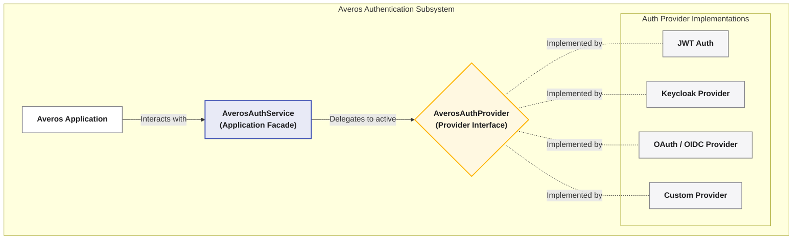

This indirection is what makes BYOA possible: your components, guards, and templates are written once against the **facade**, and never need to change when you swap the underlying provider — say, from a dummy provider in development to your real identity system in production.

**Three moving parts**

- **The Auth Service** — the single entry point your app talks to: current user, authentication status, login/logout, and all authorization checks.
- **The Provider Contract** — the abstract agreement every provider must honor: how it initializes, authenticates, manages tokens, and reports roles/permissions. Averos doesn't care how a provider fulfills the contract internally.
- **Provider Implementations** — concrete adapters (yours or a community one) that fulfill the contract for a specific identity system.

### AverosAuthService

`AverosAuthService` is the primary facade exposed to the application.

Application components, guards, directives, and other services interact with this facade rather than communicating directly with a particular authentication provider.

The facade provides a consistent API for:

* Authentication state
* Current user information
* Login and logout
* Session management
* Token access and refresh
* Roles
* Permissions
* Resource authorization
* Email verification state
* Provider selection

This means that application code can remain largely independent from the underlying authentication technology.

### AverosAuthProvider

`AverosAuthProvider` defines the contract that an authentication implementation must satisfy.

A provider is responsible for translating the capabilities of an external authentication system into the common Averos authentication model.

For example, a JWT provider might obtain and validate JWTs, while an OIDC provider might interact with an identity provider and its discovery, authorization, and token endpoints.

The application does not need to know these implementation details.

---

### The Canonical User Model - AuthUser

Whatever provider you use, Averos normalizes the authenticated user into one consistent shape, `AuthUser`. It provides a common user model regardless of which authentication provider is being used.

This makes it possible for application features to work with users consistently across different authentication systems.

The Canonical User Model is what the rest of your application — guards, directives, components — actually works with, so switching providers never means touching your UI code.

---

## Bring Your Own Auth (BYOA)

The BYOA architecture separates **application authentication requirements** from **authentication-provider implementation details**.

Without this abstraction, an application can become tightly coupled to a particular authentication service. Replacing that service can then require changes throughout the application.

With Averos, the application interacts with the Averos authentication facade while the provider handles the integration-specific details.

For example:

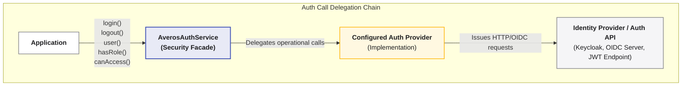

This provides several important benefits.

### Provider independence

Applications are not required to adopt a particular identity provider.

### Replaceable authentication

An application can change authentication providers without redesigning its authentication-aware components.

### Consistent application API

Components and services use the same Averos authentication API regardless of the provider underneath.

### Testability

Applications can use a dummy or test provider during development and testing while using a production authentication provider in deployed environments.

### Multiple providers

Averos can register multiple authentication providers and select the appropriate provider at runtime.

---

## The AuthUser Model

The `AuthUser` model is the common language between Averos and an authentication provider.

At minimum, an authenticated user has an identity and a username. Additional profile and authorization information can be supplied when available.

The model conceptually contains the following groups of information.

| Property        | Description                                           |
| --------------- | ----------------------------------------------------- |
| `id`            | Unique identifier of the user                         |
| `username`      | User's canonical username or login identifier         |
| `email`         | User's email address, when available                  |
| `emailVerified` | Indicates whether the email address has been verified |
| `displayName`   | User's display name                                   |
| `givenName`     | User's first or given name                            |
| `familyName`    | User's last or family name                            |
| `picture`       | URL of the user's profile picture                     |
| `locale`        | User's preferred locale                               |
| `roles`         | Roles assigned to the user                            |
| `permissions`   | Fine-grained permissions assigned to the user         |
| `expiresAt`     | Authentication/session expiration information         |
| `createdAt`     | User creation timestamp, when available               |
| `updatedAt`     | Last user update timestamp, when available            |
| `metadata`      | Provider-specific user information                    |
| `provider`      | Identifier of the provider associated with the user   |

## Required identity information

A provider should always be able to establish the user's:

* `id`
* `username`

These fields form the minimum identity contract between the provider and Averos.

## Optional profile information

Profile information such as email address, display name, name, picture, and locale can be provided when the underlying authentication system exposes them.

Averos does not require every provider to support every profile attribute.

## Authorization information

Roles and permissions allow providers to expose authorization information to Averos.

A provider can therefore integrate authentication systems that use:

* Roles
* Scopes
* Permissions
* Claims
* Groups
* Custom authorization policies

The provider is responsible for translating its native authorization model into the Averos representation.

## Provider metadata

The `metadata` field is intended for provider-specific information that does not belong to the common Averos user model.

This allows applications to retain useful provider-specific information without coupling the core authentication model to a particular identity system.

>🔖 **Security note:** Authentication tokens and other sensitive credentials should not be treated as ordinary user profile data. In particular, refresh tokens should not be exposed through the `AuthUser` model.
{: .notice--success}

---

## Authentication Provider Responsibilities

An Averos authentication provider acts as an adapter between Averos and an external authentication system.

A provider is expected to handle the following responsibilities.

### Initialization

The provider initializes its authentication state when the application starts.

Initialization can include:

* Restoring an existing session
* Reading provider-specific persisted state
* Validating an existing authentication session
* Establishing the initial user state

Initialization should result in either an authenticated user or an unauthenticated state.

### Authentication

The provider performs the authentication operation required by the underlying identity system.

Depending on the provider, authentication may involve:

* Username and password
* OAuth authorization
* OpenID Connect
* Social login
* Single sign-on
* API-based authentication
* Custom authentication mechanisms

### Logout

The provider terminates the authentication session according to the capabilities of the underlying system.

Local authentication state should be cleared even when the remote logout operation cannot be completed.

### Token management

When tokens are used, the provider is responsible for their lifecycle.

This can include:

* Obtaining access tokens
* Exposing the current access token to Averos
* Refreshing expired or expiring tokens
* Determining session validity
* Reporting token issuance and expiration information

A provider does not have to use JWTs. Averos authentication is provider-agnostic and can also support session or cookie-based authentication models.

### Authorization

The provider exposes authorization information through the Averos model.

This includes:

* Roles
* Permissions
* Resource access
* Custom authorization policies

A provider may implement simple claim-based authorization or more sophisticated policy evaluation depending on the authentication system.

---

## Authentication State

Averos maintains authentication state through the authentication facade.

The application can use this state to determine:

* Whether authentication has completed initialization
* Whether a user is authenticated
* Which user is currently authenticated
* Whether authentication is currently loading
* Which roles and permissions are available
* Whether the user's email has been verified
* Whether an authentication error has occurred

Averos angular adapter uses Angular Signals for reactive authentication state.

This allows the user interface to react automatically when authentication state changes.

For example, when a user logs in:

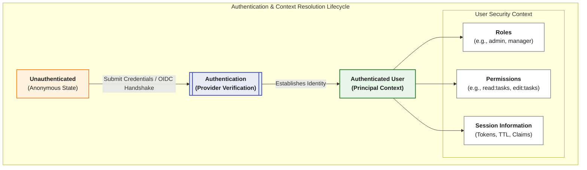

When the user logs out or the session becomes invalid, the state returns to an unauthenticated condition.

---

## Bootstrapping Authentication

Authentication is enabled when Averos is bootstrapped with authentication enabled and at least one authentication provider registered.

For modern Angular applications using standalone configuration, the conceptual setup is:

```typescript
provideAverosCore({
  enableAuthentication: true,

  authProvidersConfig: {
    defaultProvider: 'MyAuthProvider',

    providers: [
      {
        name: 'MyAuthProvider',
        provider: MyAuthProvider,
        config: {
          // Provider-specific configuration
        }
      }
    ]
  }
})
```

The important concepts are:

1. Authentication is explicitly enabled.
2. One or more providers are registered.
3. One provider can be selected as the default provider.
4. Provider-specific configuration is passed to the provider.
5. Application code interacts with `AverosAuthService`, not directly with the provider.

For applications using the legacy Angular module-based bootstrap model, Averos also supports authentication configuration through the corresponding `AverosCoreModule` configuration.

---

## Authentication Provider Configuration

Authentication configuration is divided into two conceptual areas:

1. **Provider configuration** — determines which authentication providers are available and how they are initialized.
2. **HTTP authentication configuration** — determines how authentication information is transmitted through HTTP requests.

This separation is important.

The provider answers:

> **How does this application authenticate users?**

The HTTP configuration answers:

> **How should authenticated HTTP requests be handled?**

---

### Provider Configuration

The authentication provider configuration contains the following concepts.

| Configuration          | Description                                                   |
| ---------------------- | ------------------------------------------------------------- |
| `defaultProvider`      | Name of the provider selected when authentication starts      |
| `providers`            | Collection of authentication providers registered with Averos |
| `providers[].name`     | Unique application-level name assigned to a provider          |
| `providers[].provider` | Provider implementation registered with Averos                |
| `providers[].config`   | Configuration passed to that specific provider                |
| `config`               | Global authentication-provider configuration                  |

### `defaultProvider`

Specifies the provider that should be active when the application starts.

The value must correspond to the name of one of the registered providers.

This makes the authentication mechanism explicit while allowing multiple providers to coexist.

### `providers`

Defines the providers available to the application.

Each registered provider has:

* A unique name
* A provider implementation
* Optional provider-specific configuration

Averos does not impose a fixed list of providers.

### Provider-specific `config`

The `config` property is intentionally provider-dependent.

For example, a JWT provider may require an API location and authentication endpoints, while an OIDC provider may require an issuer, client identifier, and redirect configuration.

These settings belong to the provider rather than to the Averos core configuration.

---

## Global Authentication Configuration

The global authentication configuration controls behavior shared by the authentication subsystem.

| Configuration                 | Type      | Description                                                                           |
| ----------------------------- | --------- | ------------------------------------------------------------------------------------- |
| `debug`                       | `boolean` | Enables authentication-related diagnostic logging                                     |
| `persistState`                | `boolean` | Controls persistence of authentication state where supported                          |
| `storageKey`                  | `string`  | Defines the storage key used for persisted authentication state                       |
| `defaultTokenLifetimeMinutes` | `number`  | Defines the default token lifetime used when a provider does not supply its own value |

Sensible defaults are provided by Averos, so applications only need to override settings when their requirements differ from the defaults.

### `debug`

Enables additional authentication diagnostics.

This is useful during development and troubleshooting but should be used carefully in production environments to avoid exposing sensitive information through logs.

### `persistState`

Controls whether authentication state may be persisted between application sessions.

Persistence behavior ultimately depends on the authentication provider and its security model.

Applications should carefully consider whether persistent authentication state is appropriate for their environment.

### `storageKey`

Defines the storage identifier used when authentication state is persisted.

Customizing this can be useful when:

* Multiple applications share the same origin
* Several authentication contexts coexist
* Storage namespaces need to be separated

### `defaultTokenLifetimeMinutes`

Provides a default lifetime when token expiration information is not supplied by the provider.

Provider-supplied expiration information should take precedence when available.

---

## HTTP Authentication Configuration

Authentication providers determine how users authenticate.

The HTTP authentication configuration determines how authenticated requests are handled by the Averos HTTP authentication interceptor.

The available configuration options are:

| Configuration          | Type       | Default         | Description                                                                |
| ---------------------- | ---------- | --------------- | -------------------------------------------------------------------------- |
| `tokenHeader`          | `string`   | `Authorization` | HTTP header used to transmit the authentication token                      |
| `tokenPrefix`          | `string`   | `Bearer`        | Authentication scheme placed before the token                              |
| `publicRoutes`         | `string[]` | `[]`            | URL patterns that bypass authentication-token attachment                   |
| `unauthorizedRedirect` | `string`   | `/login`        | Route used when authentication cannot be recovered                         |
| `withCredentials`      | `boolean`  | `true`          | Controls whether browser credentials are included in cross-origin requests |
| `maxRefreshRetries`    | `number`   | `1`             | Maximum number of automatic token-refresh attempts                         |

---

### `tokenHeader`

Defines the HTTP header used when transmitting an access token.

The default is:

```text
Authorization
```

This follows the standard HTTP authentication convention and is recommended for most token-based authentication systems.

Custom headers can be used when required by an existing backend or authentication service.

Examples include:

* `Authorization`
* `X-Auth-Token`
* `X-Access-Token`
* Other provider-specific headers

---

### `tokenPrefix`

Defines the authentication scheme placed before the token.

The default is:

```text
Bearer
```

This results in the conventional:

```text
Authorization: Bearer <token>
```

Applications using a different authentication scheme can customize this value.

A provider that requires a raw token can use an empty prefix.

---

### `publicRoutes`

Defines requests that should bypass authentication-token attachment.

Typical public routes include:

* Authentication endpoints
* Registration
* Password recovery
* Email verification
* Health checks
* Public API resources
* Public documentation
* Static resources

For example:

```text
/api/health
/api/version
/public/*
/auth/register
/auth/forgot-password
```

Public-route handling only controls client-side token transmission.

It **does not replace backend authorization**.

The backend must independently determine whether a resource is public or protected.

> **Security principle:** Never rely on `publicRoutes`, route guards, or UI authorization as the ultimate security boundary. The backend must always enforce authorization.

---

### `unauthorizedRedirect`

Defines the route used when authentication fails and the session cannot be recovered.

The default route is:

```text
/login
```

Averos can use this route after an unrecoverable authentication failure, such as an unsuccessful token refresh.

Applications may choose a dedicated route such as:

```text
/session-expired
```

This can be useful when the application wants to distinguish an expired session from an initial login.

---

### `withCredentials`

Controls whether browser credentials are included in cross-origin HTTP requests.

This setting is particularly relevant to cookie-based authentication.

When enabled, the browser can include credentials such as authentication cookies in cross-origin requests, subject to the server's CORS configuration.

Cookie-based authentication therefore requires compatible server-side CORS settings.

For purely token-based authentication where cookies are not required, applications may choose to disable this behavior.

---

### `maxRefreshRetries`

Defines how many times Averos may attempt automatic token refresh after an authentication-related `401 Unauthorized` response.

The default is:

```text
1
```

The general flow is:

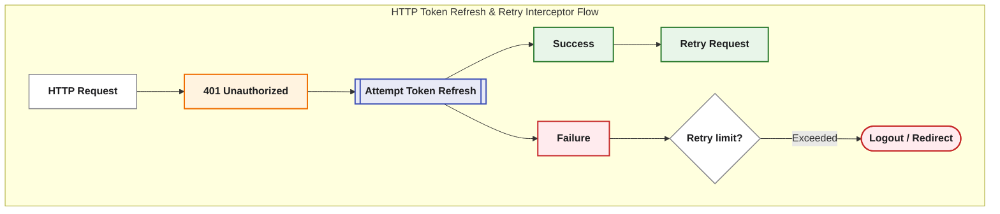

A low retry count is generally preferable because authentication failures should not result in prolonged retry loops.

Applications with unreliable network conditions may choose a slightly higher value, but excessive retries can delay failure handling.

---

## Authentication and HTTP Requests

When authentication is enabled, Averos can integrate authentication state with the application's HTTP communication.

The authentication interceptor is responsible for connecting the current authentication session to outgoing HTTP requests.

Conceptually:

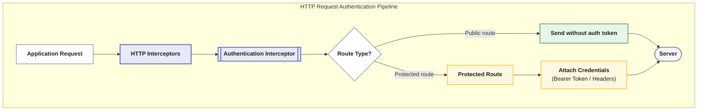

When the server reports that the authentication session is no longer valid, Averos can attempt token refresh according to the configured refresh policy.

If recovery succeeds, the original request can be retried.

If recovery fails, the authentication session is terminated and the application can redirect the user to its configured unauthorized route.

---

## Authorization

Authentication answers:

> **Who is the user?**

Authorization answers:

> **What is the user allowed to do?**

Averos provides several levels of authorization so applications can choose the appropriate model.

---

### Role-Based Access Control

Role-Based Access Control (RBAC) associates users with named roles.

Examples include:

* `admin`
* `editor`
* `manager`
* `user`
* `viewer`

Roles are useful when application access can be described through broad user categories.

Averos supports checking whether a user has:

* A particular role
* Any role from a collection
* All roles from a collection

For example:

```text
admin
admin OR editor
user AND verified
```

---

## Permission-Based Access Control

Permissions provide more granular authorization than roles.

Examples include:

```text
posts:read
posts:write
posts:delete
users:read
users:delete
```

This model allows applications to express specific capabilities rather than relying exclusively on broad roles.

Averos supports checking:

* A single permission
* Any permission from a collection
* All permissions from a collection

A wildcard permission can also be used where supported by the provider.

For example:

```text
posts:*
```

can represent all actions on the `posts` resource.

---

## Resource-Based Access Control

For more sophisticated authorization requirements, Averos provides resource-based access checks.

A resource can be combined with an action:

```text
resource + action
```

For example:

```text
posts + write
documents + approve
users + delete
```

This can be represented conceptually as:

```text
canAccess("posts", "write")
```

Resource-based authorization can also provide a foundation for more advanced policies.

Depending on the provider, access decisions may consider:

* Resource ownership
* User attributes
* Organization membership
* Department
* User context
* Resource state
* Dynamic policies

This allows Averos providers to integrate authorization models beyond simple RBAC.

---

## Declarative Authorization in the UI

Averos provides authorization directives that allow access rules to be expressed directly in Angular templates.

The principal authorization directives are:

* `hasRole`
* `hasPermission`
* `canAccess`

These directives allow UI elements to be displayed only when the current authentication state satisfies the required authorization rule.

For example, conceptually:

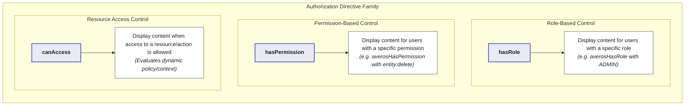

Because authentication state is reactive, authorization-aware UI can automatically respond when the current user changes.

>🔖 **Important:** UI authorization is a presentation mechanism, not a security boundary. Hiding a button does not prevent a user from manually invoking an API. Backend authorization remains mandatory.
{: .notice--success}

---

## Route Protection

Authentication and authorization can also be applied to Angular routes.

Averos authentication can be used to protect:

* Authenticated-only routes
* Role-restricted routes
* Permission-restricted routes
* Resource-restricted routes

A typical route-protection model is:

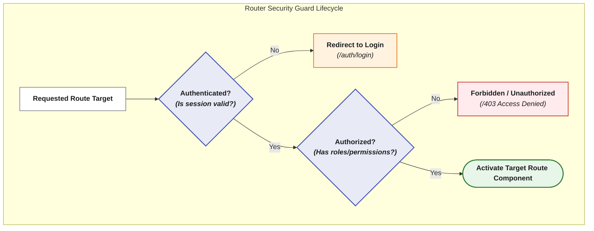

This provides a clean separation between:

* **Authentication** — whether the user is signed in
* **Authorization** — whether the user can access the requested feature

Again, route protection should be considered a client-side access-control layer. The server must enforce the same security requirements independently.

---

## Multi-Provider Authentication

Averos supports registering multiple authentication providers.

This can be useful in several scenarios.

### Development versus production

A dummy provider can be used during development while a production identity provider is used after deployment.

### Multiple authentication systems

An application can expose different authentication mechanisms depending on its environment or use case.

### Migration

Applications migrating from one authentication platform to another can temporarily support multiple providers.

### Provider switching

The active provider can be changed through the Averos authentication facade.

The application can also determine:

* Which providers are registered
* Which provider is currently active
* Whether a provider switch was successful

The important architectural property is that application features continue to communicate through `AverosAuthService`.

---

## Session Management

Authentication sessions have a lifecycle that extends beyond the initial login.

Averos provides APIs for managing and inspecting this lifecycle.

Applications can determine:

* Whether the current session is valid
* When authentication expires
* When authentication was issued
* Whether a token can be refreshed
* Whether the current session has expired

A typical lifecycle is:

```mermaid
flowchart TD
    classDef start fill:#ffffff,stroke:#86868b,stroke-width:1.5px,color:#1d1d1f
    classDef process fill:#e8eaf6,stroke:#3f51b5,stroke-width:2px,color:#1d1d1f,font-weight:bold
    classDef decision fill:#ffffff,stroke:#86868b,stroke-width:1.5px,color:#1d1d1f
    classDef auth fill:#e8f5e9,stroke:#2e7d32,stroke-width:2px,color:#1d1d1f,font-weight:bold
    classDef anon fill:#fff3e0,stroke:#ef6c00,stroke-width:1.5px,color:#1d1d1f
    classDef failure fill:#ffebee,stroke:#c62828,stroke-width:2px,color:#1d1d1f,font-weight:bold

    subgraph SessionLifecycle ["Application Session Initialization & Maintenance Lifecycle"]
        AS["<b>Application Startup</b>"]:::start
        IP[["<b>Initialize Provider</b><br/><i>(Configure identity endpoints & client settings)</i>"]]:::process
        RS[["<b>Restore / Validate Session</b><br/><i>(Check local storage / token validity)</i>"]]:::process
        
        VAL{"<b>Session Valid?</b>"}:::decision
        
        AUTH["<b>Authenticated State</b><br/><i>(Populate user & claims context)</i>"]:::auth
        ANON["<b>Anonymous State</b><br/><i>(Public route access only)</i>"]:::anon
        
        EXP["<b>Session Expiration</b><br/><i>(Access token TTL lapse)</i>"]:::process
        REF[["<b>Attempt Refresh Loop</b><br/><i>(Issue refresh_token)</i>"]]:::process
        
        RF{"<b>Refresh Result?</b>"}:::decision
        CONT(["<b>Continue Session</b><br/><i>(Update tokens seamlessly)</i>"]):::auth
        LOG(["<b>Logout / Re-authentication</b><br/><i>(Clear state & redirect)</i>"]):::failure

        AS --> IP
        IP --> RS
        RS --> VAL
        
        VAL -->|Valid| AUTH
        VAL -->|Invalid| ANON
        
        AUTH --> EXP
        EXP --> REF
        REF --> RF
        
        RF -->|Success| CONT
        RF -->|Failure| LOG
    end
```

The exact session behavior depends on the authentication provider.

---

## Email Verification

Averos can expose email verification state when the authentication provider supplies this information.

Applications can use this state to implement flows such as:

* Verification banners
* Restricted features
* Verification-required routes
* Account onboarding
* Email verification workflows

For example, an application may allow authenticated users to access the dashboard while requiring verified users to access administrative functionality.

Email verification should be treated as an authorization or account-state requirement rather than as authentication itself.

---

## Authentication Errors

Authentication operations can fail for different reasons.

Averos exposes authentication errors through its authentication state so applications can respond appropriately.

Common categories include:

| Error               | Meaning                                                        |
| ------------------- | -------------------------------------------------------------- |
| Invalid credentials | Authentication credentials were rejected                       |
| Unauthorized        | The current session does not authorize the requested operation |
| Session expired     | The authentication session can no longer be used               |
| Network error       | Communication with the authentication service failed           |

Applications should distinguish between authentication failures and transient infrastructure failures where possible.

For example:

```mermaid
flowchart TD
    classDef errorState fill:#ffebee,stroke:#c62828,stroke-width:2px,color:#1d1d1f,font-weight:bold
    classDef actionState fill:#e8f5e9,stroke:#2e7d32,stroke-width:2px,color:#1d1d1f,font-weight:bold
    classDef redirectState fill:#fff3e0,stroke:#ef6c00,stroke-width:2px,color:#1d1d1f,font-weight:bold
    classDef noticeState fill:#e8eaf6,stroke:#3f51b5,stroke-width:2px,color:#1d1d1f,font-weight:bold

    subgraph AuthErrorHandling ["Authentication & Network Error Handling Pipeline"]
        direction TB

        subgraph CredentialsBranch ["Authentication Failure"]
            E1["<b>Invalid Credentials</b><br/><i>(401 Bad Credentials)</i>"]:::errorState
            A1["<b>Ask user to retry</b><br/><i>(Show inline feedback)</i>"]:::actionState
            E1 --> A1
        end

        subgraph SessionBranch ["Token TTL Expiration"]
            E2["<b>Session Expired</b><br/><i>(401 Token Lapsed)</i>"]:::errorState
            A2["<b>Redirect to authentication</b><br/><i>(Route to /login)</i>"]:::redirectState
            E2 --> A2
        end

        subgraph NetworkBranch ["Transport Failure"]
            E3["<b>Network Error</b><br/><i>(0 / Gateway Timeout)</i>"]:::errorState
            A3["<b>Inform user & allow retry</b><br/><i>(Show retry toast/banner)</i>"]:::noticeState
            E3 --> A3
        end

        subgraph AuthorizationBranch ["Access Restriction"]
            E4["<b>Unauthorized</b><br/><i>(403 Forbidden)</i>"]:::errorState
            A4["<b>Display access-denied response</b><br/><i>(Render 403 screen)</i>"]:::actionState
            E4 --> A4
        end
    end
```

Authentication errors should never expose sensitive information such as passwords, tokens, or internal authentication-service details.

---

## Security Considerations

Averos provides authentication abstractions, but secure authentication ultimately depends on both the client and server implementation.

### Use HTTPS

Authentication credentials and tokens should never be transmitted over an unencrypted production connection.

Always use HTTPS for authentication and protected API communication.

### Prefer short-lived access tokens

When token-based authentication is used, short-lived access tokens reduce the impact of token compromise.

Longer-lived sessions can be implemented through an appropriate refresh mechanism.

### Protect refresh credentials

Refresh tokens and other long-lived credentials require stronger protection than ordinary application state.

Where possible, use secure, HTTP-only cookies or another storage mechanism appropriate to the application's threat model.

### Avoid exposing tokens unnecessarily

Tokens should not be:

* Included in URLs
* Written to application logs
* Exposed in error messages
* Stored in ordinary user profile data
* Sent to public endpoints unnecessarily

### Validate authentication on the server

Client-side authentication state is not a security boundary.

The backend must independently validate:

* Authentication credentials
* Token validity
* Token expiration
* Issuer and audience where applicable
* Required permissions
* Resource ownership
* Authorization policies

### Protect against CSRF

Cookie-based authentication requires appropriate CSRF protection.

The correct strategy depends on the authentication architecture and server framework.

### Configure CORS correctly

When cross-origin credentials are enabled, the server must use a compatible CORS policy.

Applications should never combine credentialed cross-origin requests with an unrestricted wildcard origin.

---

## Choosing an Authentication Strategy

Averos does not prescribe a single authentication mechanism.

The appropriate strategy depends on the application.

| Requirement                          | Possible approach                     |
| ------------------------------------ | ------------------------------------- |
| Traditional application login        | JWT or session-based authentication   |
| Enterprise SSO                       | OpenID Connect / OAuth 2.0            |
| Centralized identity management      | Keycloak or another identity platform |
| Social login                         | OAuth / OpenID Connect provider       |
| Existing custom backend              | Custom Averos authentication provider |
| Development/testing                  | Averos dummy provider                 |
| Multiple authentication environments | Multiple Averos providers             |

The important consideration is that the chosen authentication system should expose enough information for the provider to implement the Averos authentication contract.

---

## Recommended Architecture

For most applications, the following architecture provides a clean separation of responsibilities:

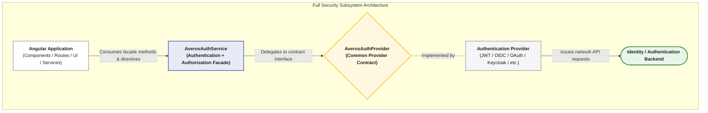

This architecture keeps authentication-specific concerns at the provider boundary and prevents them from spreading throughout the application.

---

## Best Practices

### Authentication

* Use a standards-based authentication protocol whenever possible.
* Prefer established identity providers for production applications.
* Use HTTPS everywhere.
* Use short-lived access tokens when appropriate.
* Protect refresh credentials carefully.
* Clear authentication state during logout.
* Handle expired sessions gracefully.

### Authorization

* Prefer permissions for fine-grained access control.
* Use roles for broad application responsibilities.
* Use resource-based authorization when access depends on context or ownership.
* Keep authorization rules consistent between the frontend and backend.
* Never rely exclusively on UI visibility for security.

### Provider Design

* Keep provider-specific behavior inside the provider implementation.
* Map external user claims into `AuthUser`.
* Avoid leaking provider-specific details into application components.
* Keep sensitive credentials outside the user model.
* Return meaningful authentication errors.
* Ensure initialization can recover or reject stale sessions cleanly.

### HTTP Configuration

* Prefer `Authorization: Bearer` for conventional token-based APIs.
* Explicitly define public routes when appropriate.
* Avoid sending credentials to endpoints that do not require them.
* Keep automatic refresh retries low.
* Configure `withCredentials` according to the authentication strategy.
* Ensure frontend and backend CORS policies agree.

---

## Migration from the Previous Authentication Architecture

Earlier Averos versions were centered around a built-in authentication service and required applications to bind the Averos authentication service to a specific authentication API.

The current architecture replaces that coupling with the **Bring Your Own Auth** model.

### Previous architecture

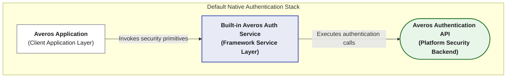

The application was therefore closely coupled to the authentication service supplied by Averos.

### Current architecture

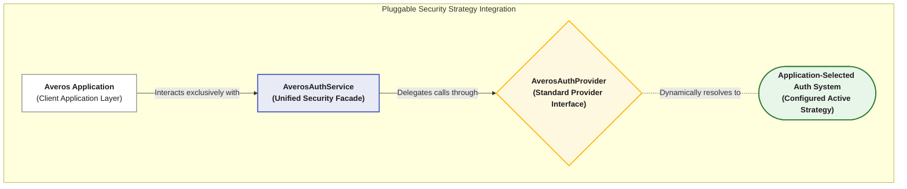

The authentication provider is now an explicit integration boundary.

This provides:

* Provider independence
* Better portability
* Easier testing
* Multiple-provider support
* Easier migration between identity platforms
* A consistent application-facing authentication API

Applications migrating from an earlier Averos release should therefore move provider-specific authentication logic behind an `AverosAuthProvider` implementation rather than binding the application directly to a fixed Averos authentication backend.

---

## Configuration Reference

### Averos Authentication Configuration

| Key                    | Default | Description                                       |
| ---------------------- | ------- | ------------------------------------------------- |
| `enableAuthentication` | `false` | Enables the Averos authentication subsystem       |
| `authProvidersConfig`  | —       | Registers and configures authentication providers |

#### `authProvidersConfig`

| Key                                  | Default | Description                                          |
| ------------------------------------ | ------- | ---------------------------------------------------- |
| `defaultProvider`                    | —       | Provider selected at application startup             |
| `providers`                          | —       | Registered authentication providers                  |
| `providers[].name`                   | —       | Unique provider identifier                           |
| `providers[].provider`               | —       | Authentication provider implementation               |
| `providers[].config`                 | —       | Provider-specific configuration                      |
| `config.debug`                       | `false` | Enables provider diagnostics                         |
| `config.persistState`                | —       | Controls authentication-state persistence            |
| `config.storageKey`                  | —       | Persistence storage key                              |
| `config.defaultTokenLifetimeMinutes` | `1440`  | Default token lifetime when not supplied by provider |

### HTTP Authentication Configuration

| Key                    | Default         | Description                                                      |
| ---------------------- | --------------- | ---------------------------------------------------------------- |
| `tokenHeader`          | `Authorization` | HTTP header used for authentication credentials                  |
| `tokenPrefix`          | `Bearer`        | Authentication scheme preceding the token                        |
| `publicRoutes`         | `[]`            | Routes that bypass authentication-token attachment               |
| `unauthorizedRedirect` | `/login`        | Route used after unrecoverable authentication failure            |
| `withCredentials`      | `true`          | Includes browser credentials in applicable cross-origin requests |
| `maxRefreshRetries`    | `1`             | Maximum automatic token-refresh attempts                         |

---

## Authentication API Overview

The `AverosAuthService` provides the application-facing authentication API.

### Authentication

| API              | Purpose                                       |
| ---------------- | --------------------------------------------- |
| `initialize()`   | Initializes authentication state              |
| `login()`        | Authenticates the user                        |
| `logout()`       | Terminates the current authentication session |
| `refreshToken()` | Refreshes the current authentication session  |

### Authentication state

| API               | Purpose                                               |
| ----------------- | ----------------------------------------------------- |
| `user`            | Current authenticated user                            |
| `isAuthenticated` | Indicates whether the user is authenticated           |
| `isLoading`       | Indicates an authentication operation is in progress  |
| `isInitialized`   | Indicates authentication initialization has completed |
| `lastError`       | Most recent authentication error                      |

### User information

| API                 | Purpose                                     |
| ------------------- | ------------------------------------------- |
| `userRoles`         | Current user's roles                        |
| `userPermissions`   | Current user's permissions                  |
| `userPicture`       | Current user's profile picture              |
| `userDisplayName`   | Current user's display name                 |
| `isEmailVerified()` | Returns the user's email verification state |

### Authorization

| API                   | Purpose                                            |
| --------------------- | -------------------------------------------------- |
| `hasRole()`           | Tests role membership                              |
| `hasAnyRole()`        | Tests whether any supplied role is present         |
| `hasAllRoles()`       | Tests whether all supplied roles are present       |
| `hasPermission()`     | Tests permission membership                        |
| `hasAnyPermission()`  | Tests whether any supplied permission is present   |
| `hasAllPermissions()` | Tests whether all supplied permissions are present |
| `canAccess()`         | Tests access to a resource and optional action     |

### Session

| API                       | Purpose                                          |
| ------------------------- | ------------------------------------------------ |
| `getToken()`              | Returns the current access token when applicable |
| `isSessionValid()`        | Checks the current session validity              |
| `getTokenExpiration()`    | Returns authentication expiration information    |
| `getActiveProvider()`     | Returns the active provider                      |
| `getAvailableProviders()` | Returns registered providers                     |
| `switchProvider()`        | Changes the active authentication provider       |

---

## Summary

Averos authentication is built around a simple architectural principle:

> **Authentication belongs to the application ecosystem; Averos provides the abstraction that makes it consistent.**

The **Bring Your Own Auth** architecture allows Averos applications to integrate JWT, OAuth 2.0, OpenID Connect, Keycloak, Auth0, social authentication, enterprise identity platforms, or custom authentication services without coupling application components to a particular provider.

The architecture is centered around four concepts:

1. **`AverosAuthService`** — the application-facing authentication facade.
2. **`AverosAuthProvider`** — the contract between Averos and an authentication system.
3. **`AuthUser`** — the canonical user representation.
4. **HTTP authentication configuration** — the rules governing how authentication is propagated through application requests.

Together, these concepts provide a flexible foundation for authentication and authorization while keeping provider-specific concerns isolated from the rest of the application.

The result is an authentication architecture that is **provider-agnostic, claims-oriented, reactive, extensible, and suitable for both simple applications and complex enterprise authentication environments**.