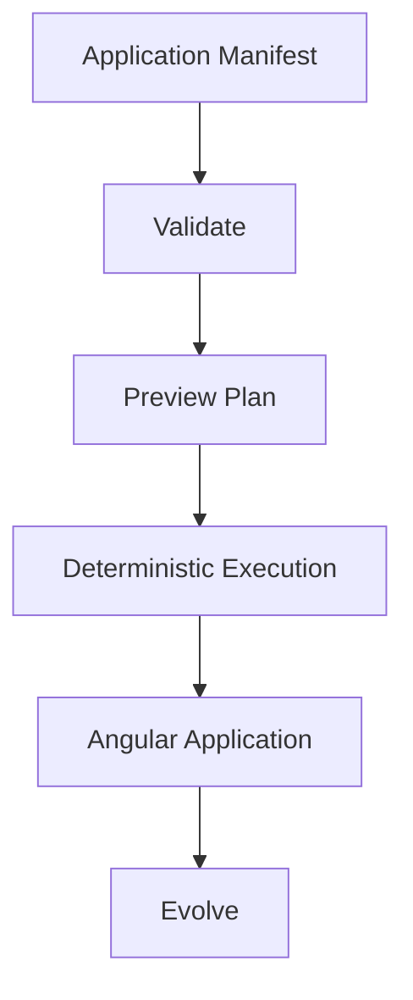

**_AI defines. Averos builds._**

    

        

     

     

          The fastest way to understand Averos is not to read about it. 
          <strong> Run it.</strong> 
          Averos takes a structured application manifest, turns it into an explicit execution plan, and applies that plan through its deterministic execution pipeline. 
          For your first experience, you don't need to design an application from scratch or configure an AI model. 
          In this guide, you will take a ready-made <strong>ToDo application manifest</strong>
          and follow it through the complete Averos workflow—from validation and planning to deterministic execution and application evolution.   
          <strong>One manifest. One deterministic workflow. A running application.</strong>
     

 

# Build your first application with Averos

We'll use a ready-to-run **ToDo application manifest** and take it all the way from:

## What you'll accomplish

By the end of this guide, you will have:

- Generated a real Angular application from an Averos manifest.
- Inspected the execution plan before making any changes.
- Experienced checkpointed execution, with each step tracked and reproducible.
- resumed an interrupted execution
- Evolved the application by changing its manifest and executing the new intent.
- Optionally used AI to generate a new manifest from natural-language requirements.

You don't need to design a manifest from scratch.

**The first example is ready to run**. Your job is simply to follow the workflow, see what Averos produces, and understand how intent becomes software.

>**The quickest way to understand Averos is to watch intent become software.**
>
>**Let's build. 🚀**

---

## The fastest path: generate a real application

Averos applications are defined by an Application Manifest.

For your first experience, we've prepared a complete ToDo application manifest that you can use immediately.

 <a href="/examples/todoapp-manifest.json" title="Download the ToDo Application Manifest" class="btn btn--green btn--small" download> Download the ToDo Manifest </a> 

You can also import this manifest into [Averos Designer](https://appbuilder.wiforge.com/averos-designer/averosdesigner){:target="_blank" rel="noopener noreferrer"} to explore the application definition visually.

This gives you two immediate ways to inspect the same application intent:

**Design it visually. Or execute it directly.**