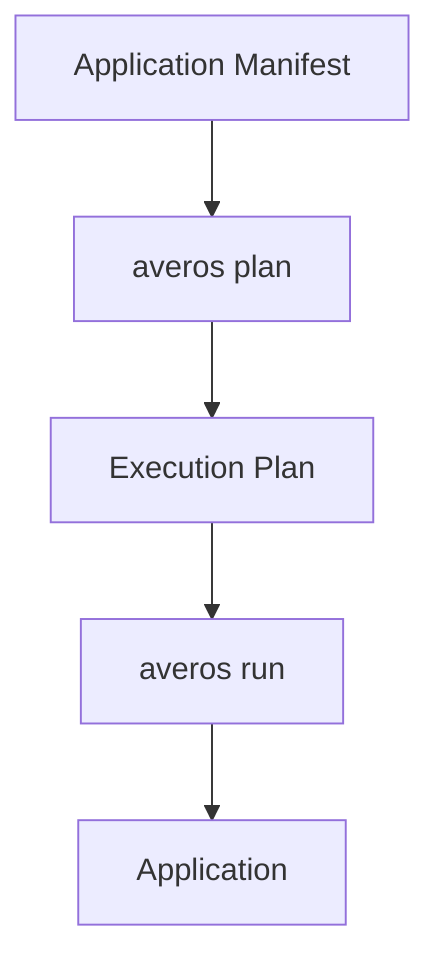

Averos CLI is cross-platform and runs on:

- Linux
- macOS
- Windows

You need [**Node.js**](https://nodejs.org/en/download){:target="_blank" rel="noopener noreferrer"} installed on your machine.

The application generation is orchestrated through `@averos/cli` and the Averos execution workflow.


## Install Averos CLI

Install the Averos command-line interface globally:

```bash
npm install -g @averos/cli
```

Verify the installation:

```bash
averos
```

You should see the Averos CLI help and its available commands.

The core commands are:

| Command           | Purpose                                   |
| ----------------- | ----------------------------------------- |
| `averos plan`     | Preview an application's execution plan   |
| `averos run`      | Execute a manifest                        |
| `averos status`   | Inspect the latest execution state        |
| `averos generate` | Generate a manifest from natural language |


This is the basic Averos workflow:




