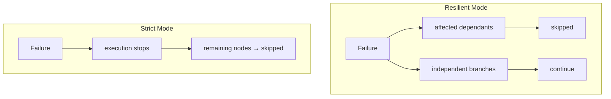

Now create an Averos configuration file `averos.config.json` in your working folder with the following content::

```json
{
  "mode": "resilient",
  "timeoutMs": 1800000,
  "maxAttempts": 1,
  "workspaceRoot": "./generated-app",
  "manifestPath": "../todoapp-manifest.json",
  "logsDir": "./generated-app/averos-logs",
  "statePath": "./generated-app/state.json",
  "checkpointPath": "./generated-app/checkpoints.json"
}
```

>🙋‍♂️ **This configuration tells Averos where the application is defined, where it should be generated, and where execution state should be persisted.**
{: .notice--info}


## Configuration at a glance

| Setting          | Purpose                                           |
| ---------------- | ------------------------------------------------- |
| `mode`           | Controls failure behaviour during execution       |
| `timeoutMs`      | Maximum duration of an execution session          |
| `maxAttempts`    | Number of attempts allowed for each node          |
| `workspaceRoot`  | Root directory where the application is generated |
| `manifestPath`   | Location of the application manifest              |
| `logsDir`        | Directory containing execution logs               |
| `statePath`      | Persistent execution state                        |
| `checkpointPath` | Checkpoint information used for resumability      |


## Execution modes

Averos supports two execution modes.

**Resilient** is the default:

>If a node fails, its transitive dependants are skipped while independent branches can continue executing.

This maximizes the amount of work completed before execution stops.

The objective is simple:

>Complete as much independent work as possible before stopping.

**Strict** takes the opposite approach:

>A failure immediately stops the execution and remaining nodes are skipped.



For the first example, keep:

```json
"mode": "resilient"
```

