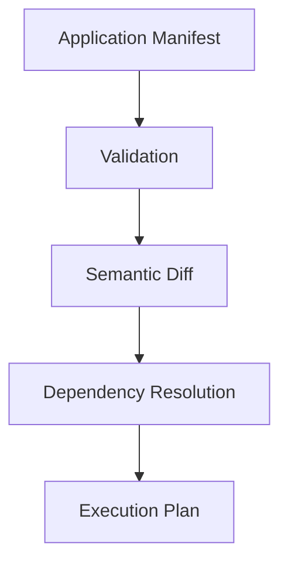
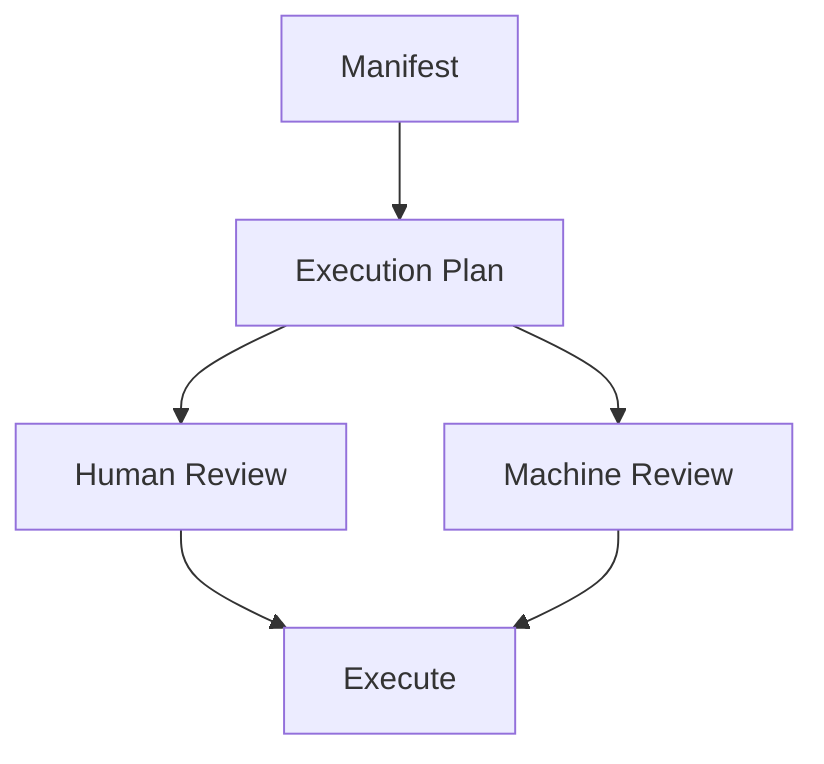

**Execution does not have to be a black box.**

Before Averos changes anything, you can inspect the execution plan that will be used to realize the manifest.

Run:

```bash
averos plan --config=averos.config.json
```

Averos takes the application manifest through the planning stages:



The result is an explicit representation of **what Averos intends to do, and in what order.**

Nothing is executed by the `plan` command.

This gives you an opportunity to inspect the proposed transition before any application changes are applied.

>**Plan first. Execute second.**

This separation is important because the execution plan is not simply a list of generated files.

It represents the operations required to move the application from its current state toward the state described by the manifest, together with the dependencies that determine their execution order.

You can therefore use the planning stage to answer questions such as:

- What changes does Averos detect?
- Which operations will be performed?
- In what order will they execute?
- Which operations depend on others?
- Is the resulting plan what you expected?


## Machine-readable plans

The plan can also be emitted as JSON:

```bash
averos plan ../todoapp-manifest.json --json
```

This makes the execution plan suitable not only for human inspection, but also for tooling, automation, CI workflows, and other programmatic consumers.

Conceptually:



The planning stage therefore establishes an explicit boundary between **deciding what should happen** and **making it happen.**

That boundary is one of the foundations of controlled execution in Averos.