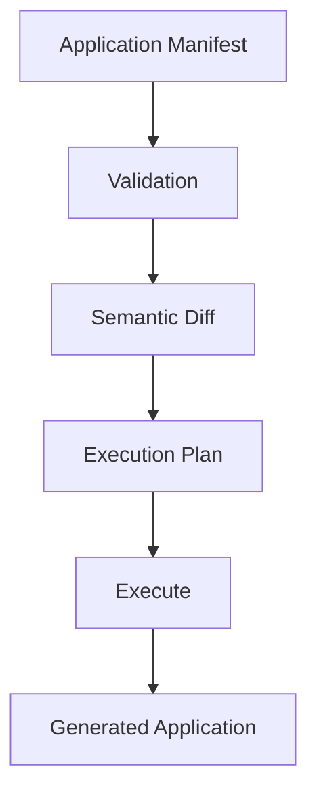

Once you have reviewed the execution plan and are ready to apply it, execute the manifest:

```bash
averos run --config=averos.config.json --verbose
```

This is the point at which the planned application changes are materialized in the target workspace.

The execution flow is:



Use `--verbose` when you want detailed execution tracing, including node names, paths, timings, and execution progress.

The ToDo application currently contains approximately **320 execution nodes.** Depending on your machine and environment, completing the full execution may therefore take some time and can exceed the configured **30-minute execution timeout.**

This is not a template copy operation.

Averos is executing a **dependency-aware application graph**, where individual operations are resolved and executed according to the plan produced by the orchestration layer.

Execution is also stateful. Progress is recorded through execution checkpoints, allowing an interrupted run to be resumed rather than requiring the entire execution to start again.

If the configured timeout is reached, or execution otherwise needs to be continued later, use:

```bash
averos run --config=averos.config.json --verbose --resume
```

>🙋‍♂️ **The plan describes the transition. Execution makes that transition real.**