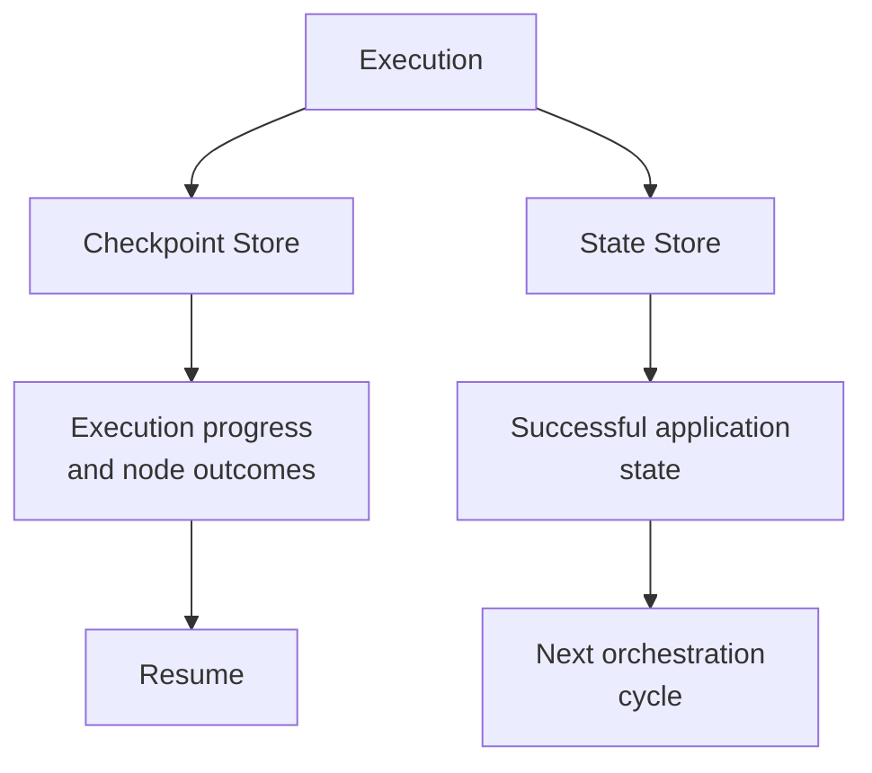

Long-running application generation should not have to start from zero because an execution was interrupted.

Averos treats execution as a **persistent, recoverable process**.

During execution, the executor maintains:

- **execution checkpoints** — the status of individual execution nodes;
- **application state** — the successfully established state used for subsequent incremental orchestration;
- **per-node logs** — detailed information for inspection and troubleshooting.

Checkpoints are persisted independently of the execution process. If a run reaches its timeout or is otherwise interrupted, the completed work is not simply forgotten.

You can resume the execution with:

```bash
averos run --config=averos.config.json --verbose --resume
```

Averos loads the persisted checkpoints and continues from the known execution state rather than unnecessarily repeating work that has already completed successfully.

Conceptually:

```text
Execution
    │
    ├── Node 1 ✓
    ├── Node 2 ✓
    ├── Node 3 ✓
    ├── Node 4 ...
    │
    ▼
Checkpoint Store
    │
    ▼
Interrupted / Timeout
    │
    ▼
      --resume
    │
    ▼
Load checkpoints
    │
    ▼
Continue execution
```

>**An interrupted execution is a recoverable state, not a lost run.**

## See resumability in action

You can deliberately shorten the execution timeout for the ToDo application to observe the recovery mechanism.

For example, change the configuration to:

```json
{
  "mode": "resilient",
  "timeoutMs": 180000,
  "maxAttempts": 1,
  "workspaceRoot": "./generated-app",
  "manifestPath": "../todoapp-manifest.json",
  "logsDir": "./generated-app/averos-logs",
  "statePath": "./generated-app/state.json",
  "checkpointPath": "./generated-app/checkpoints.json"
}
```

Here:`180000 ms = 3 minutes`

Run the application:

```bash
averos run --config=averos.config.json --verbose
```

After the timeout is reached, the execution will stop with its progress persisted.

Resume it with:

```bash
averos run --config=averos.config.json --verbose --resume
```

Averos uses the persisted checkpoint information to determine which execution nodes have already completed and which work remains to be performed.

This provides a concrete demonstration of Averos' checkpointed and resumable execution model.

## Checkpoints and application state are different

Averos deliberately separates execution progress from application state.

The **checkpoint store** answers:

>Where did this execution get to?

The **state store** answers:

>What application state was successfully established?

This distinction allows execution recovery and incremental application evolution to remain separate concerns.

```text
                 Execution
                     │
          ┌──────────┴──────────┐
          ▼                     ▼
   Checkpoint Store         State Store
          │                     │
          │                     │
   Execution progress    Successful application
   and node outcomes           state
          │                     │
          ▼                     ▼
       Resume              Next orchestration
                             cycle
```




Together, these capabilities allow Averos to handle both sides of application evolution:

**recover an interrupted execution and understand the established application state for the next change.**

