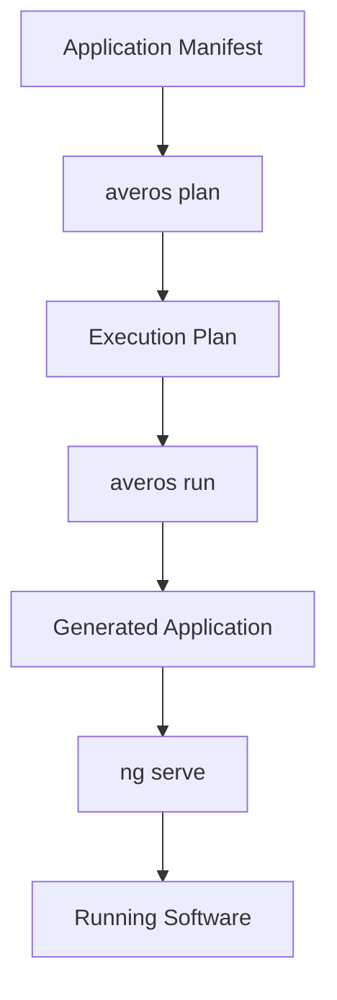

Once execution completes successfully, the application has been materialized in the configured workspace.

Navigate to the generated application:

```bash
cd generated-app/ToDoApp
```

Start the Angular development server:

```bash
npx ng serve
```

Then open:

[http://localhost:4200 ↗](http://localhost:4200){:target="_blank" rel="noopener noreferrer"}

You are now running a real application generated from an Averos Application Manifest.

The complete journey is:

```text
Application Manifest
        ↓
   averos plan
        ↓
 Execution Plan
        ↓
   averos run
        ↓
 Generated Application
        ↓
     ng serve
        ↓
  Running Software
```





What began as a structured description of desired application state has now become a working application.

And this is only the first cycle.

The same application can be **changed by revising its manifest, replanned, and evolved again** without treating the existing application as something that must simply be regenerated from scratch.

>**From manifest to running software — and ready for its next revision.**