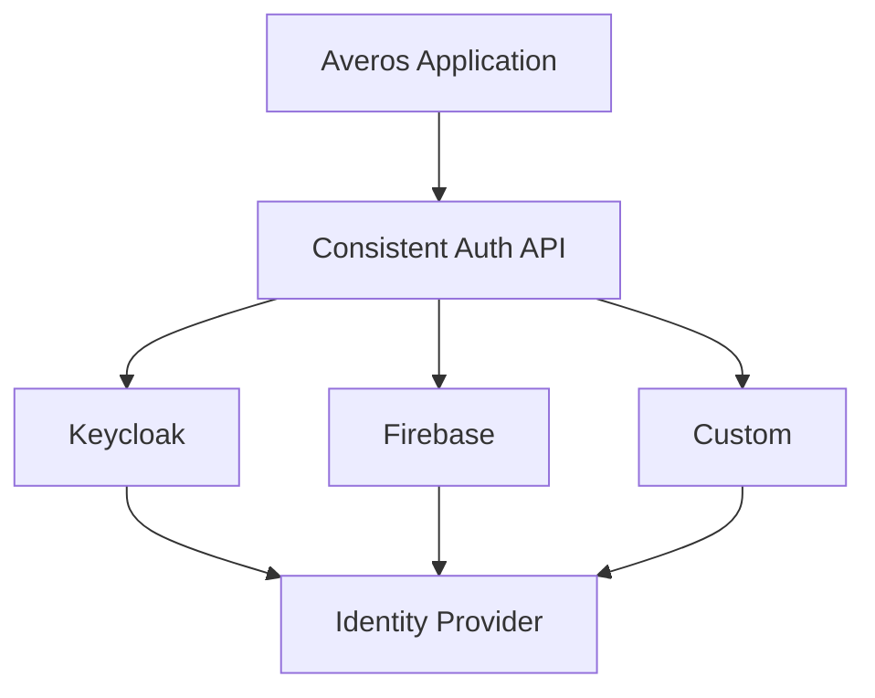

The generated ToDo application includes a **Dummy Authentication provider** so that you can explore authentication, roles, and permissions immediately without configuring an external identity provider.

### Sign in to the example application

Use any of the following test accounts:

| Username | Password | Roles |
|---|---|---|
| `admin` | `admin123` | `admin`, `user` |
| `admin@test.com` | `admin123` | `admin`, `user` |
| `user@test.com` | `user123` | `user` |
| `editor@test.com` | `editor123` | `editor`, `user` |
| `author@test.com` | `author123` | `author`, `user` |
| `viewer@test.com` | `viewer123` | `viewer` |
| `guest@test.com` | `guest123` | `guest` |

The different accounts allow you to explore how the application behaves with different roles and permission levels.

> **These credentials are provided exclusively for the example application and are not intended for production use.**

---

## Bring Your Own Auth

The Dummy Authentication provider is useful for getting started, but production applications generally need to integrate with an existing identity system.

Averos follows a **Bring Your Own Auth (BYOA)** approach.

The application interacts with a consistent authentication API while the underlying authentication provider can be selected according to the application's requirements.

Averos can integrate with authentication systems including:

- JWT-based authentication;
- OAuth 2.0;
- OpenID Connect;
- Keycloak;
- Auth0;
- Firebase Authentication;
- social identity providers;
- custom authentication systems.

Conceptually:

```text
                  Averos Application
                          │
                          ▼
                Consistent Auth API
                          │
             ┌────────────┼────────────┐
             │            │            │
             ▼            ▼            ▼
          Keycloak     Firebase      Custom
             │            │            │
             └────────────┼────────────┘
                          ▼
                  Identity Provider
```




The authentication implementation can therefore change without requiring the rest of the application to adopt a completely different authentication model.

## Built-in providers

Averos currently provides the following authentication implementations:

| Provider                     | Strategy                                                    |
| ---------------------------- | ----------------------------------------------------------- |
| `DummyAuthProvider`          | Development and testing                                     |
| `KeycloakAuthProvider`       | Keycloak OpenID Connect with PKCE                           |
| `AverosFirebaseAuthProvider` | Firebase Authentication and supported social providers      |
| `AverosAuthProvider`         | Interface for implementing a custom authentication provider |


The `AverosAuthProvider` interface provides the extension point for integrating authentication systems that are not covered by the built-in providers.

For production applications, configure an appropriate authentication provider rather than the Dummy provider.

See the **Authentication** documentation for complete configuration details.
