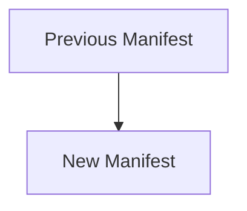
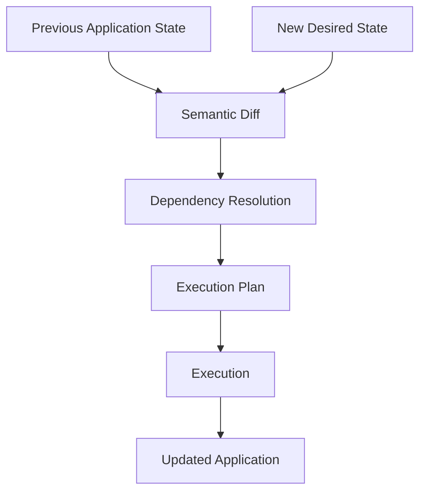
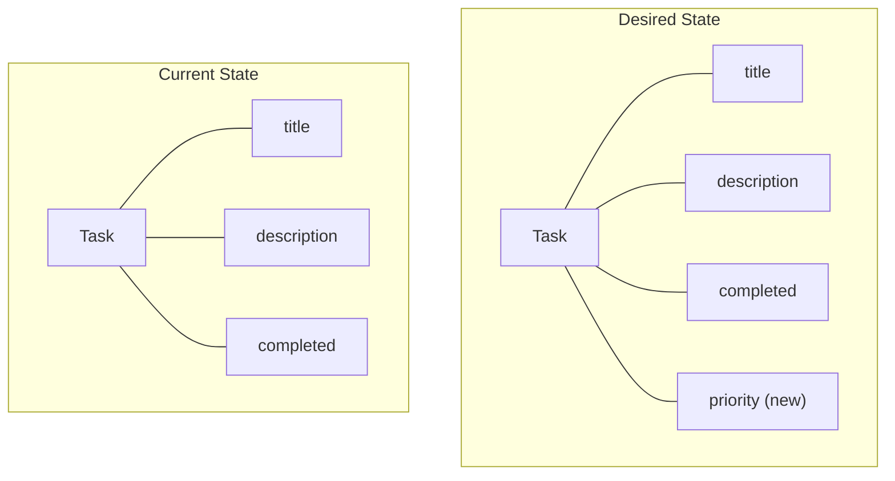
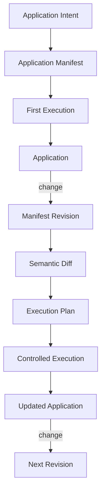
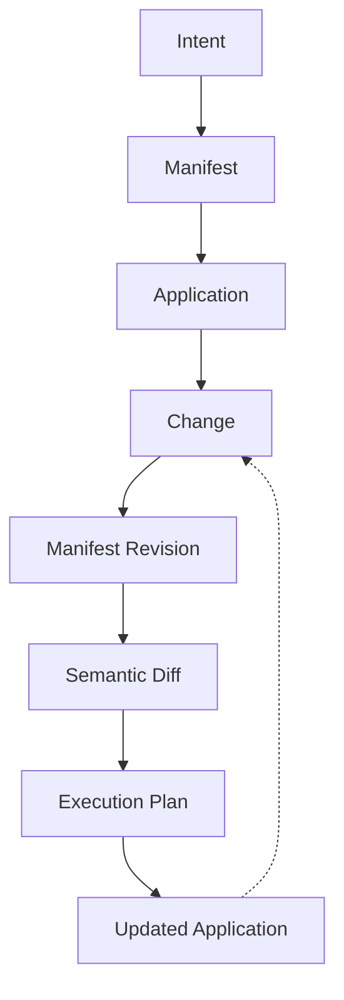

**_Change the desired state. Let Averos determine the transition._**

Generating an application once is only the beginning.

The real purpose of Averos is to make the application **evolvable**.

Instead of treating generated source code as a disposable output, Averos maintains a structured representation of the application's desired state through the **Application Manifest**.

When that state changes, the application can be revised accordingly.

---

## Make a change

Open the ToDo manifest in
[Averos Designer ↗](https://appbuilder.wiforge.com/averos-designer/averosdesigner){:target="_blank" rel="noopener noreferrer"}.

Make a small change to the application.

For example:

> **Add a `priority` field to the `Task` entity.**

Export the updated manifest and replace the previous manifest in your working directory.

You now have two application states:



The important point is that you do not need to describe the entire application again.

The new manifest describes the **desired application state**.

Averos determines what needs to change to reach it.

---

## Run the revised manifest

Execute the application again:

```bash
averos run --config=averos.config.json --verbose
```


Averos compares the newly desired state with the state previously established in the workspace.

Conceptually:



The important distinction is that Averos is **not simply starting the generation process over**.

It is determining the transition between two application states.

For a change such as adding `Task.priority`, the resulting change may be expressed conceptually as:



The orchestration layer identifies the semantic change and determines the operations required to materialize it.

The execution layer then applies those operations through the configured execution adapter.

---

## From generation to revision

This creates a fundamentally different development cycle:



The application is therefore not the end product of a one-time generation process.

It becomes a system that can be **revised repeatedly from an explicit description of its desired state.**

If the generated application is already running with Angular's development server, you can inspect the resulting changes through the normal development workflow.

---

## The evolution loop

This is where the central idea behind Averos becomes tangible.

You start with intent.

That intent becomes a manifest.

The manifest becomes an application.

Then the application can evolve by changing the manifest and running the lifecycle again.



>🙋‍♂️ **You don't regenerate the idea. You evolve the application state.**

