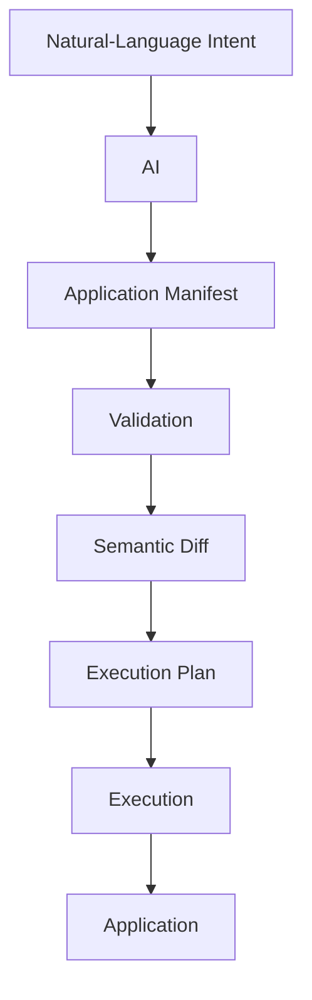
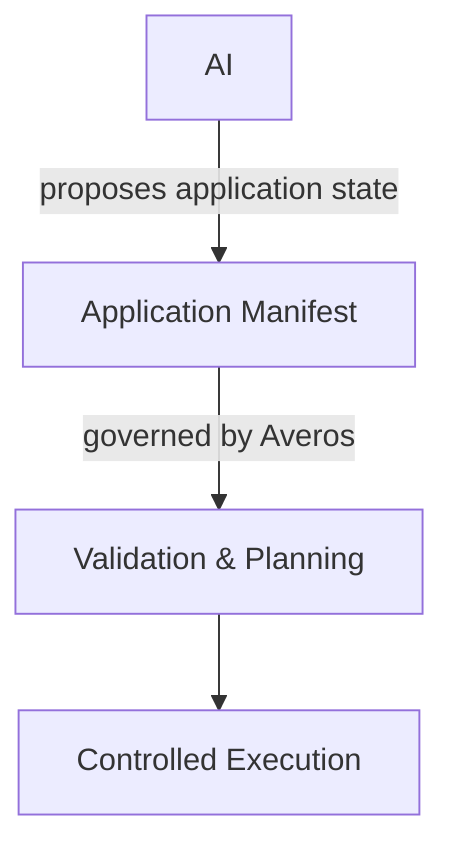
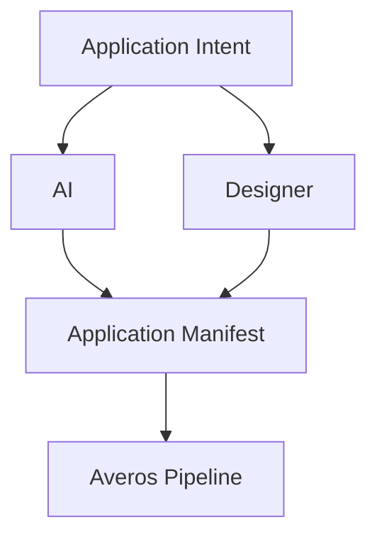

**_Let AI express the intent. Let Averos govern what happens next._**

The Application Manifest does not have to be authored manually.

Averos can use AI to transform natural-language application intent into a structured **Application Manifest**.

This provides a natural way to begin building an application:

> Describe what you want to build. Let AI translate that intent into an application model. Then let Averos take it from there.

---

## From natural language to an application manifest

Install the AI package alongside the Averos CLI:

```bash
npm install -g @averos/cli @averos/ai
```

The `@averos/ai` package provides the AI-driven intent layer.

It works with an LLM to interpret natural-language requirements and produce a structured Application Manifest.

The resulting manifest is not a special AI artifact.

It is the **same application representation used by the rest of the Averos framework.**



This is important because the AI-generated manifest enters the same governed pipeline as a manifest created through any other entry point.

---

## AI defines intent — Averos controls execution

The AI does not need to directly manipulate the generated application.

Instead, it produces a structured representation of what the application should be.

Averos can then:

- validate the manifest;
- determine what differs from the current application state;
- resolve dependencies;
- build an execution plan;
- allow that plan to be inspected;
- and execute the resulting operations through the deterministic execution layer.

The boundary is therefore explicit:



>**AI proposes the application. Averos decides how that proposal becomes real.**

---

## Using AI through the Averos CLI

One entry point to `@averos/ai` is the averos generate command provided by `@averos/cli`.

For example:

```bash
averos generate "Build a CRM with contacts and deals" \
  --output=averos-application-manifest.json
```

The command asks the configured LLM to produce an Application Manifest from the supplied intent.

The generated manifest can then be inspected and processed like any other Averos manifest.

For example, preview the resulting plan:

```bash
averos plan averos-application-manifest.json --json
```

And execute it when you are ready:

```bash
averos run averos-application-manifest.json
```

---

## AI is an entry point, not the execution engine

This distinction is central to the Averos architecture.

AI is one way to enter the system.

The manifest is the structured representation that enters the deterministic pipeline.



The AI model can change.

The interface used to interact with it can change.

The source of the intent can change.

The execution architecture does not need to change.

The next section demonstrates this workflow using a **local LLM**.

>**The model may be intelligent and probabilistic. The execution pipeline remains structured and governed.**

