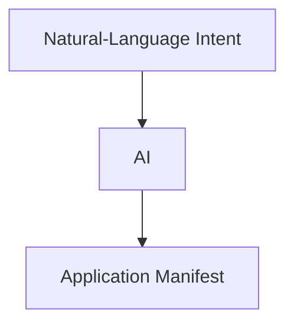
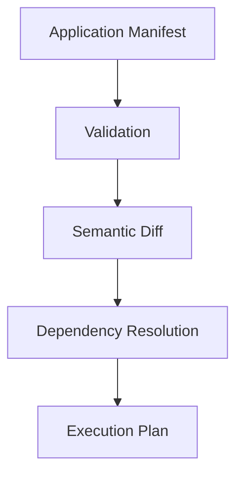
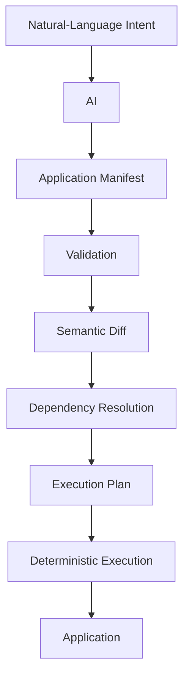
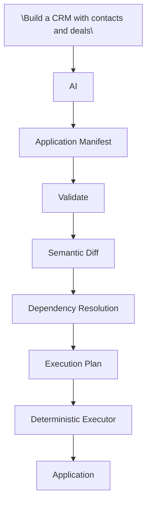

**_Turn natural-language intent into an application manifest — locally._**


The Averos AI workflow does not require a hosted AI service.

You can configure `@averos/ai` to use a **local LLM**, allowing the manifest-generation step to run against a model hosted in your own environment.

This section demonstrates the complete flow using **Ollama** and the `qwen2.5-coder:7b` model.

---

## 1. Run a local LLM

Install and run Ollama, then make the model you want to use available locally.

For example: `qwen2.5-coder:7b`

Make sure the model is running and that its Ollama endpoint is reachable from the environment where the Averos CLI is running.

---

## 2. Configure the AI provider

Create a configuration file named: `averos.config.ollama.json`

Place it in your working directory.

For example:

```json
{
  "timeoutMs": 600000,
  "llmTimeoutMs": 600000,
  "llmProvider": "ollama",
  "ollamaBaseUrl": "http://localhost:11434",
  "ollamaModel": "qwen2.5-coder:7b",
  "maxAttempts": 5
}
```

Update `ollamaBaseUrl` if your Ollama server is running at a different address.

The important settings are:

| Setting         | Purpose                                   |
| --------------- | ----------------------------------------- |
| `llmProvider`   | Selects the LLM provider                  |
| `ollamaBaseUrl` | URL of the Ollama server                  |
| `ollamaModel`   | Model used to generate the manifest       |
| `llmTimeoutMs`  | Maximum time allowed for an LLM operation |
| `timeoutMs`     | Overall operation timeout                 |
| `maxAttempts`   | Maximum number of generation attempts     |

---

## 3. Generate the manifest

Now provide Averos with a natural-language description of the application you want to build.

For example:

```bash
averos generate "Build a CRM with contacts and deals" \
  --output=/tmp/averos-application-manifest.json \
  --config=averos.config.ollama.json
```

The LLM interprets the request and produces an Application Manifest.

The generated manifest will be written to: `/tmp/averos-application-manifest.json`

At this point, the AI portion of the workflow is complete.

You have a structured application representation that can now enter the normal Averos lifecycle.

---

## 4. Inspect the generated manifest

Before executing the generated application, you can inspect the manifest itself.

The important transition is:



The manifest is now the artifact that Averos reasons about.

You can therefore review it, modify it, store it under version control, or pass it through other tools before execution.

---

## 5. Preview the execution plan

As with a manually authored or Designer-created manifest, you can preview the execution plan before applying anything:

```bash
averos plan /tmp/averos-application-manifest.json --json
```

This takes the generated manifest through the normal Averos planning lifecycle:



The AI does not bypass these stages.

---

## 6. Execute the generated application

When you are ready, execute the manifest:

```bash
averos run /tmp/averos-application-manifest.json
```

The generated application is now created through the same deterministic execution pipeline used for manifests originating from other entry points.



The important architectural boundary remains unchanged:

>**AI generates the manifest. Averos validates, plans, and executes it.**

---

## The complete AI-to-application workflow

You have now gone from a sentence describing an application to a real application without making the AI responsible for direct source-code execution:



And because the result is an Application Manifest, this is not a one-time generation workflow.

The manifest can be **reviewed, versioned, revised, replanned, and evolved** using the same Averos lifecycle described throughout this guide.

>**The AI creates the starting point. The manifest makes the application governable.**