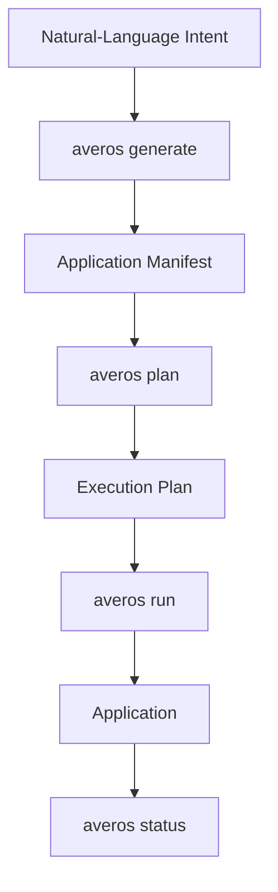
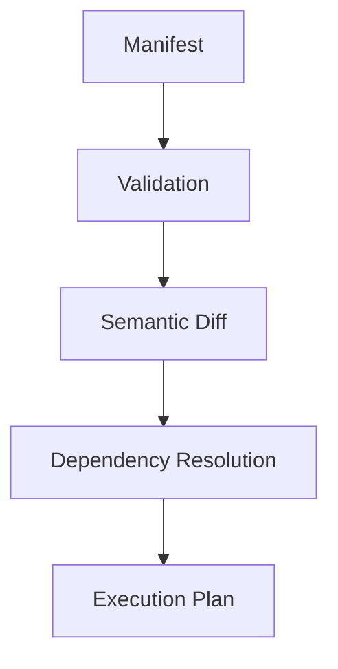
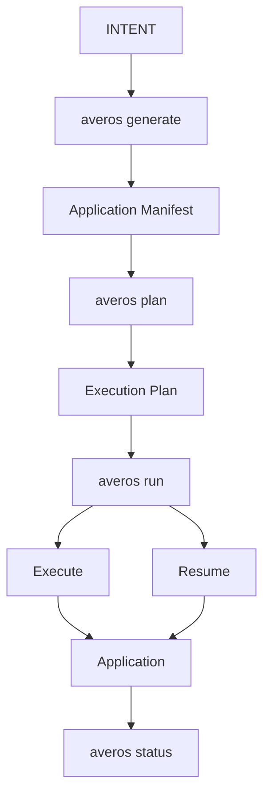

**_One CLI. From application intent to controlled execution._**

Once installed, the Averos CLI provides a compact interface to the main stages of the Averos application lifecycle.

The four primary commands are:

| Command | Purpose |
|---|---|
| `averos generate` | Generate an Application Manifest from natural-language intent |
| `averos plan` | Validate and preview the execution plan |
| `averos run` | Execute a manifest against a workspace |
| `averos status` | Inspect the last known application state |

The typical workflow is:



---

## `averos generate`

Generate an Application Manifest from natural-language intent.

```bash
averos generate "A CRM with contacts" --output=manifest.json
```

The generated manifest can then be inspected, planned, and executed independently.

This preserves the boundary between **AI-assisted intent generation and deterministic application execution.**

You can also ask Averos to execute the generated manifest immediately:

```bash
averos generate "A CRM with contacts" \
  --output=manifest.json \
  --run
```

For a more controlled workflow, generate the manifest first and review the resulting plan before executing it.

---

## `averos plan`

Preview the execution plan without executing it.

```bash
averos plan app.json --workspace=/tmp/myapp
```

The planning stage resolves the manifest into an explicit execution plan.



Nothing is executed by `averos plan`.

### Output the plan as JSON

For automation, inspection, or other tooling, request machine-readable output:

```bash
averos plan app.json \
  --workspace=/tmp/myapp \
  --json
```

>**Plan first. Execute second.**

---

## `averos run`

Execute an Application Manifest against a workspace.

```bash
averos run app.json --workspace=/tmp/myapp
```

You can also provide the execution configuration through a configuration file:

```bash
averos run --config=averos.config.json
```

### Dry run

Preview execution without applying the operations:

```bash
averos run app.json \
  --workspace=/tmp/myapp \
  --dry-run
```

A dry run is useful when you want to inspect the execution behavior while keeping the target workspace unchanged.

### Resume an interrupted execution

If an execution was interrupted or reached its configured timeout, resume it from its persisted checkpoints:

```bash
averos run --config=averos.config.json --resume
```

### Enable detailed execution tracing

Use `--verbose` for detailed execution information:

```bash
averos run --config=averos.config.json --verbose
```

This provides additional visibility into execution progress, including node-level information, paths, and timings.

---

## `averos status`

Inspect the last known application state for a workspace:

```bash
averos status --workspace=/tmp/myapp
```
This provides a way to inspect the persisted state of the most recent build.

For more detailed information:
```bash
averos status \
  --workspace=/tmp/myapp \
  --verbose
```

This is particularly useful when working with incremental application changes, where the previously established state is used as the basis for subsequent orchestration.

---

## Common workflows

### Generate → Plan → Run

The recommended workflow when using AI-generated intent is:

```bash
averos generate "A CRM with contacts" \
  --output=manifest.json

averos plan manifest.json \
  --workspace=/tmp/myapp

averos run manifest.json \
  --workspace=/tmp/myapp
```

### Plan → Review → Run

When the manifest already exists:

```bash
averos plan app.json \
  --workspace=/tmp/myapp

averos run app.json \
  --workspace=/tmp/myapp
```

### Dry run

To inspect execution behavior without applying changes:

```bash
averos run app.json \
  --workspace=/tmp/myapp \
  --dry-run
```

### Resume

To continue an interrupted execution:

```bash
averos run --config=averos.config.json --resume
```

### Inspect application state

```bash
averos status --workspace=/tmp/myapp
```

--- 

## The CLI in one picture

The commands map directly to the main stages of the Averos lifecycle:



The CLI is intentionally small.

Each command corresponds to a distinct responsibility in the framework rather than exposing one opaque command that performs the entire lifecycle.

>**Generate the intent. Plan the transition. Execute with control. Inspect the result.**