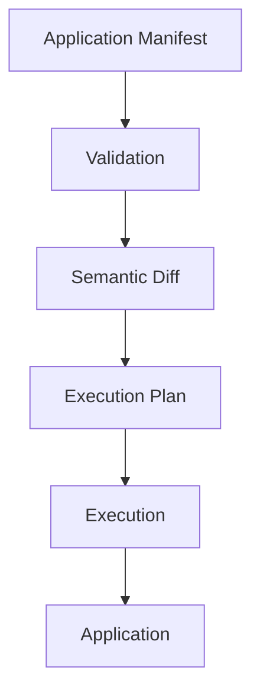
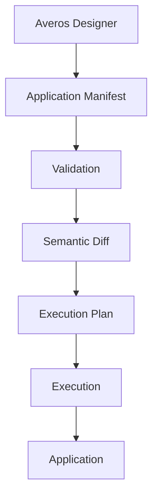
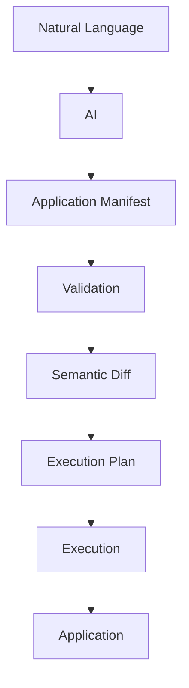
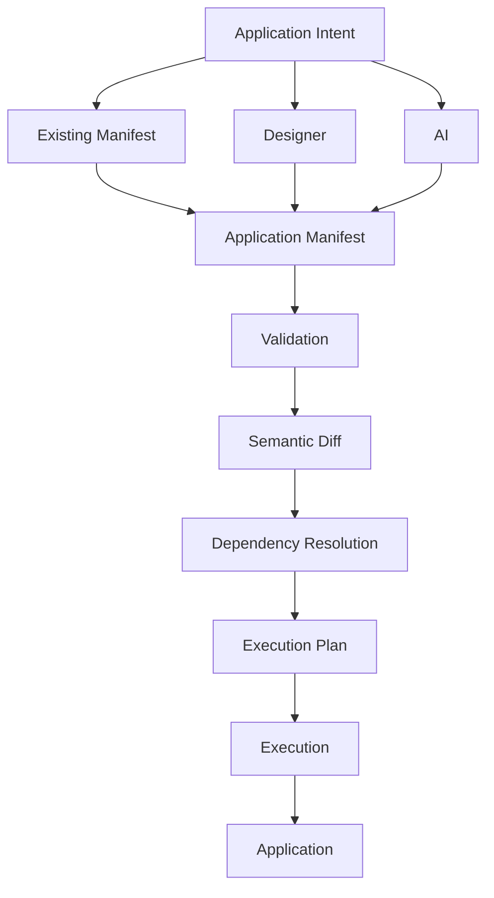

**_Different ways to express intent. One governed path to execution._**

By now, you have seen several ways to work with Averos.

You can start with an existing Application Manifest, design an application visually, or describe what you want in natural language and let AI produce the manifest.

These are different **entry points into the same system**.

---

## Start from an existing manifest

If you already have an Application Manifest, you can take it directly into the Averos lifecycle:



For example:

```bash
averos plan app.json --workspace=/tmp/myapp
averos run app.json --workspace=/tmp/myapp
```

This is the most direct path when the application model already exists.

---

## Design visually

With [**Averos Designer**](https://appbuilder.wiforge.com/averos-designer/averosdesigner){:target="_blank" rel="noopener noreferrer"}, application intent can be expressed visually rather than through natural language or manual manifest authoring.



The Designer is therefore an entry point into the application model—not a separate execution system.

The resulting manifest enters the same Averos pipeline.

---

## Start from natural language

AI provides another entry point.

You can describe the application in natural language and use `@averos/ai` to transform that intent into an Application Manifest.



For example:

```bash
averos generate "Build a CRM with contacts and deals" \
  --output=manifest.json
```

The generated manifest can then be inspected, planned, and executed like any other manifest.

---

## The convergence point

The important architectural property is that these entry points converge on the same artifact:



The interface can change.

The source of the intent can change.

The tools used to express that intent can change.

**The governed application lifecycle remains the same.**

---

## One system, not three workflows

This distinction matters.

Averos Designer does not create a special kind of application.

AI does not create a special execution path.

An existing manifest does not bypass the framework.

They all produce or provide the same structured representation: **the Application Manifest.**

From that point onward, Averos applies the same principles:

- validate the desired state;
- determine the semantic change;
- resolve dependencies;
- build an explicit execution plan;
- execute through the appropriate adapter;
- persist execution and application state;
- and make subsequent changes evolvable through the same lifecycle.

This gives Averos a simple architectural property:

>**Different ways in. One manifest. One pipeline. One execution model.**

The entry point changes.

>**The deterministic execution pipeline does not.**

