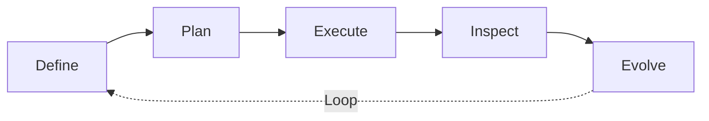
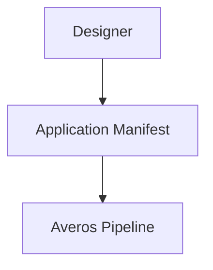
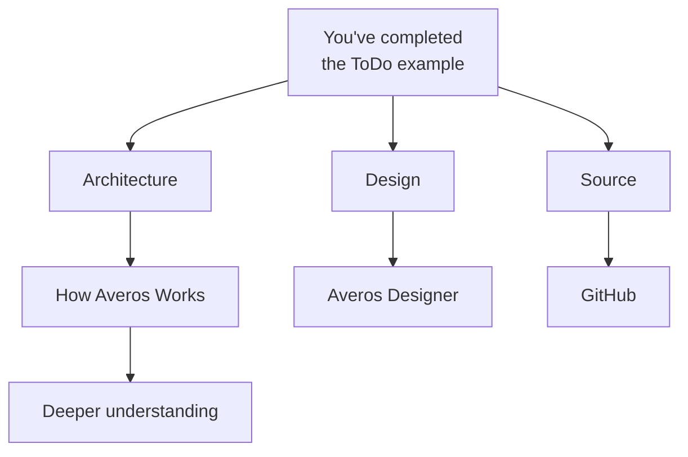

**_You've seen Averos in action. Now explore what makes it work._**

If you've completed the ToDo example, you've already experienced the core Averos lifecycle:

You've started with an application model, previewed the work Averos intended to perform, executed it, inspected the resulting application, and then evolved it through a change.

That's the core idea.

From here, you can explore the architecture behind that workflow, try different ways of expressing application intent, or dive into the framework and its ecosystem.

---

## Understand how Averos works

You've used the pipeline.

Now explore what happens inside it.

<a href="/averos/how-averos-works/introduction/" title="How Averos Works" class="btn btn--success btn--small" target="_blank"> How Averos Works → </a>

Explore the architecture behind the workflow, including:

- the Application Manifest;
- validation;
- semantic change detection;
- orchestration;
- dependency resolution;
- execution planning;
- the DAG engine;
- execution;
- checkpoints and state;
- execution adapters;
- and the evolution cycle.

The goal is to understand not just **what Averos does**, but **why the architecture is designed this way.**

---

## Understand what makes Averos different

Averos is not simply another way to generate source code.

<a href="/averos/how-averos-works/how-is-averos-different" title="What Makes Averos Different" class="btn btn--success btn--small" target="_blank"> What Makes Averos Different? → </a>

Compare the Averos approach with direct AI coding workflows and see how the architectural model changes the role of:

- AI;
- application intent;
- validation;
- planning;
- execution;
- technology-specific adapters;
- and application evolution.

The key distinction is simple:

>**Averos gives AI a structured system to operate on.**

---

## Design instead of describing

AI is not the only way to express application intent.

<a href="https://appbuilder.wiforge.com/averos-designer/averosdesigner" title="Open Averos Designer" class="btn btn--info btn--small" target="_blank" rel="noopener noreferrer"> Open Averos Designer ↗ </a>

Use **Averos Designer** to explore and modify application manifests visually.

The resulting manifest enters the same Averos pipeline as a manifest produced through AI or authored through another workflow.

This is a useful next step if you want to understand the application model directly rather than starting from natural-language intent.

---

## Explore the source and ecosystem

If you want to go deeper, explore the open-source Averos ecosystem.

<a href="https://github.com/wiforge/averos" title="GitHub & Community" class="btn btn--blue btn--small" target="_blank" rel="noopener noreferrer"> GitHub & Community → </a>

Explore the available open-source packages, inspect the implementation, follow the project, and contribute where appropriate.

The framework is designed around explicit boundaries and extensible components, making the ecosystem an important part of its evolution.

---

## Where to go next

There is no single required path from here.

Choose the direction that matches what you want to understand:

If you want to understand the **system**, continue with **How Averos Works.**

If you want to explore the **application model**, open **Averos Designer**.

If you want to explore the **implementation and ecosystem**, visit **GitHub**.

>**You've built your first application. Now explore the system that makes it evolvable.**
