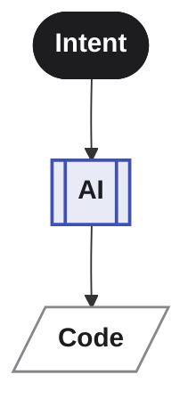
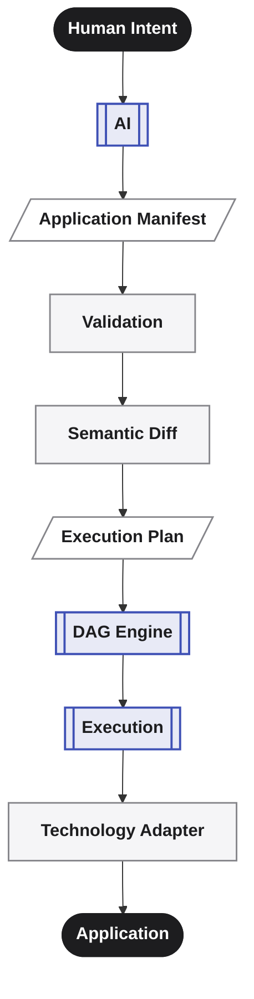
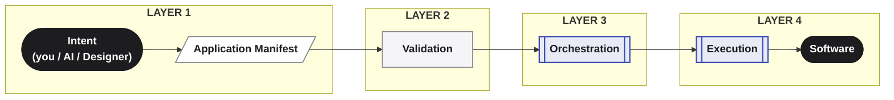

      

**_AI defines. Averos builds._**

Here's exactly what happens between those two words.

## From Intent To Software — Through a Deterministic Pipeline

Most AI coding workflows have a remarkably **short** path:

Averos deliberately inserts **structure** between those two ends.

Instead of asking an AI to directly produce and modify source code, Averos gives it a **structured representation** of the application and a **controlled execution environment**.

The resulting pipeline is:

Every application built with Averos passes through the same four layers, in the same order, every time. Nothing skips ahead. Nothing executes until the layer before it has signed off.

> **AI determines what should exist. Averos determines how that state is validated, planned, and executed.**
