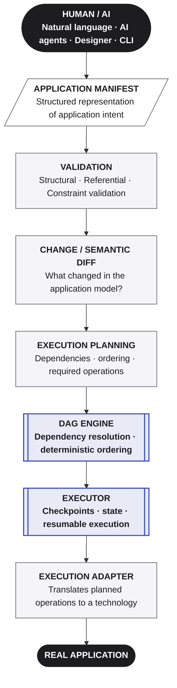

Averos can be understood as a set of cooperating layers.

```mermaid
flowchart TD
    classDef boundary fill:#1d1d1f,stroke:#1d1d1f,stroke-width:2px,color:#ffffff,font-weight:bold
    classDef artifact fill:#ffffff,stroke:#86868b,stroke-width:1.5px,color:#1d1d1f
    classDef process fill:#f5f5f7,stroke:#86868b,stroke-width:1.5px,color:#1d1d1f
    classDef engine fill:#e8eaf6,stroke:#3f51b5,stroke-width:2px,color:#1d1d1f,font-weight:bold

    A(["`**HUMAN / AI**
    Natural language · AI agents · Designer · CLI`"]):::boundary

    B[/"`**APPLICATION MANIFEST**
    Structured representation of application intent`"/]:::artifact

    C["`**VALIDATION**
    Structural · Referential · Constraint validation`"]:::process

    D["`**CHANGE / SEMANTIC DIFF**
    What changed in the application model?`"]:::process

    E["`**EXECUTION PLANNING**
    Dependencies · ordering · required operations`"]:::process

    F[["`**DAG ENGINE**
    Dependency resolution · deterministic ordering`"]]:::engine

    G[["`**EXECUTOR**
    Checkpoints · state · resumable execution`"]]:::engine

    H["`**EXECUTION ADAPTER**
    Translates planned operations to a technology`"]:::process

    I(["`**REAL APPLICATION**`"]):::boundary

    A --> B --> C --> D --> E --> F --> G --> H --> I
```

Each layer has a different responsibility.

That separation is fundamental to Averos.

