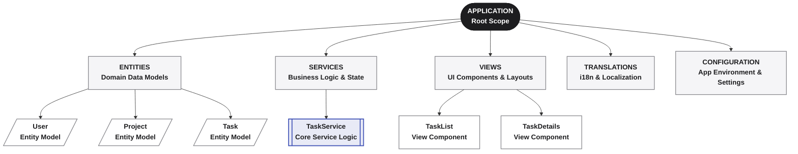

**_The one artifact everything else depends on._**


The Application Manifest is the central artifact of Averos: a structured, typed representation of an application's desired state.

It describes the application at a higher level than its generated source code — its entities, fields, relationships, services, authentication, use cases, pages, translations, and configuration.

It is not a description of how the application is implemented. It is a description of **what the application is**.

The Application Manifest is governed by the **Averos DAG Rules Specification V1.6**, which is part of the **Averos Framework Specifications**.

>T**he manifest is the normalized representation of the application's intended state.**

---

## The application, expressed as a manifest

Conceptually:



A Simplified Example:

```json
// simplified for illustration
{
  "entity": "Task",
  "fields": [
    { "name": "title", "type": "string", "required": true },
    { "name": "dueDate", "type": "date" }
  ],
  "service": { "name": "TaskService", "endpoint": "/api/tasks" }
}
```
The example is intentionally simplified. A real Application Manifest is governed by the Manifest Description and can represent the broader structure and behavior of the application.

---

## The Source of Truth

The manifest is the contract between intent and execution.

It is not:

- a transcript of an AI conversation;
- a snapshot of generated source files;
- an implementation detail;
- an informal description of the application.

It is the **structured source of truth** from which other layers can derive, validate, generate, and evolve the application.

>**The manifest is the contract between intent and execution.**

This separation is fundamental to Averos:

>**Use conversation to capture intent, and use a manifest to capture the resulting, precise state.**

---

## Why not use the conversation as the source of truth?

A conversation is an excellent interface for expressing intent, but it is a poor long-term representation of application state.

A conversation can be ambiguous. The same intent can be expressed in different ways, assumptions can remain implicit, and meaning can depend on context.

A manifest makes that intent explicit and machine-readable.

| **Dimension**           | **Conversation**                                                         | **Manifest**                                                          |
| ------------------- | -------------------------------------------------------------------- | ----------------------------------------------------------------- |
| **Representation**  | Natural language and context                                         | Structured and typed                                              |
| **Ambiguity**       | Meaning can depend on context and interpretation                     | State is expressed explicitly                                     |
| **Validation**      | Difficult to validate formally                                       | Can be validated against the Manifest Description                 |
| **Structure**       | Often implicit                                                       | Explicit and machine-readable                                     |
| **Change tracking** | Semantic changes are difficult to identify                           | Changes can be represented explicitly                             |
| **Diffability**     | Difficult to diff meaningfully                                       | Versions can be semantically compared                             |
| **Versioning**      | History can be retained, but state is difficult to version precisely | Each version can represent a precise application state            |
| **Reproducibility** | Regeneration may depend on conversational context                    | A specific manifest version provides a stable input to generation |
| **Auditability**    | Requires reconstructing context                                      | Changes can be traced through manifest versions                   |


The distinction is therefore not **conversation versus manifest** as competing artifacts.

They serve different purposes:

**Conversation captures intent.**
**Manifest captures state.**

---

## A stable boundary between intent and execution

This separation gives Averos a stable architectural boundary.

The conversation layer can evolve independently — different prompts, different interactions, different ways of expressing the same requirement.

The manifest remains the normalized representation of the resulting application state.

That makes the manifest suitable for:

- validation;
- version control;
- semantic diffing;
- reproducible generation;
- auditing;
- migration;
- collaboration;
- tooling and automation.

The manifest is therefore more than a configuration file.

**It is the application's declarative contract.**

>**Conversation is the interface for intent. The manifest is the durable, validated representation of application state.**

---