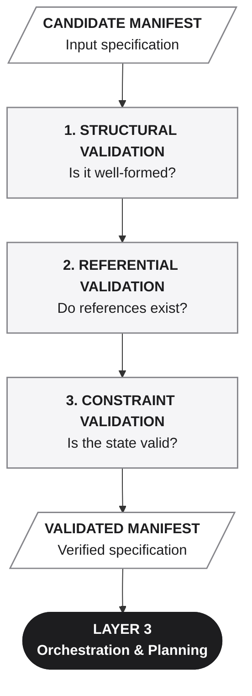
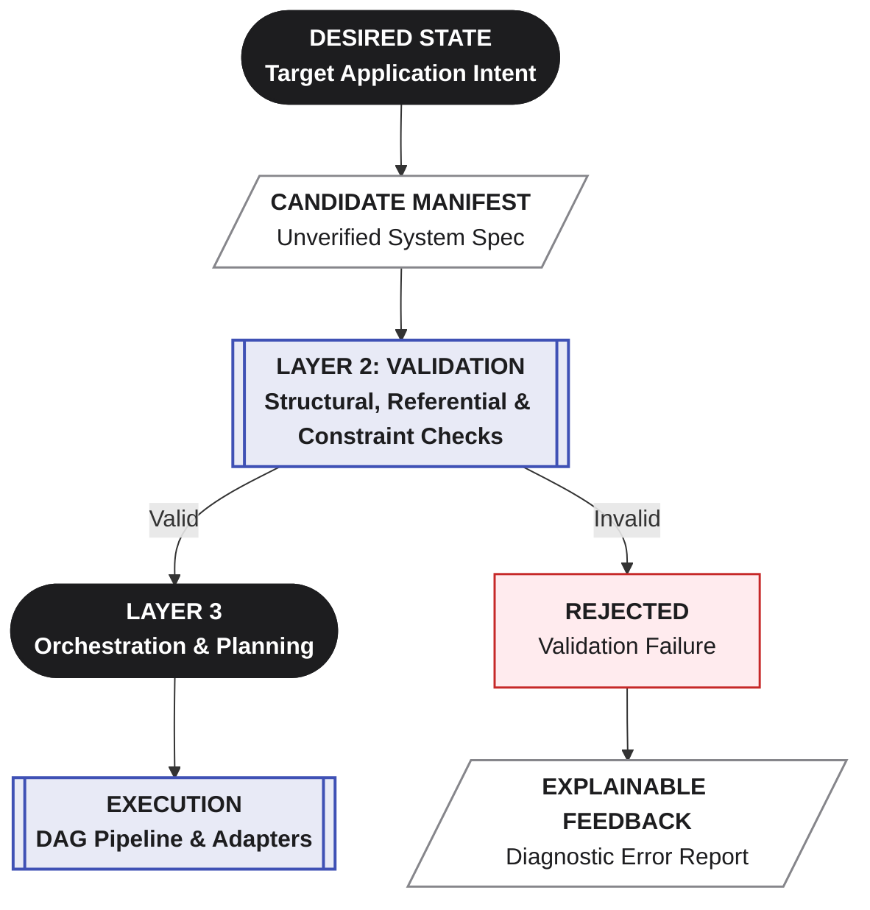

**_Nothing proceeds on a hope._**

Layer 2 is the **validation boundary** between a proposed application state and the systems that may act on it.

Every candidate manifest must pass three validation tiers before it is allowed to influence anything real:

## 1. Structural validation

Structural validation determines whether the manifest is well-formed according to the manifest definition.

It checks things such as:

- required elements are present;
- values have the expected types;
- structures follow the required shape;
- declarations conform to the manifest specification.

In other words:

>**Is this a valid manifest?**

---

## 2. Referential validation

A structurally valid manifest can still describe something that does not exist.

Referential validation checks the relationships between the elements declared in the manifest.

For example:

- a field references an entity that is not defined;
- a relationship points to a missing entity;
- a service references an undeclared resource;
- a dependency points to an unavailable application element.

In other words:

>**Do the things this manifest refers to actually exist?**

---

## 3. Constraint validation

A manifest can be structurally correct and all of its references can exist, while the resulting application state is still invalid.

Constraint validation checks the rules governing the application model.

This can include:

- valid relationships;
- prohibited or duplicate declarations;
- incompatible combinations of features;
- dependency constraints;
- consistency of the application model;
- domain-level rules.

In other words:

>**Even if the manifest is well-formed and internally connected, is the described application state allowed?**

---

## Validation is a gate, not a repair mechanism

Validation is governed by the **Averos DAG Rules Specification V1.6**, which is part of the **Averos Framework Specifications**.

A manifest that fails validation is not silently patched, partially accepted, or interpreted on a best-effort basis.

It is **rejected with an explainable reason** and returned to whoever — human or AI — proposed it.

Only a manifest that clears Layer 2 is allowed to proceed to Layer 3.

>**Invalid state does not cross the validation boundary.**

This distinction is fundamental.

Layer 2 does not decide what the application *should be*. That intent comes from upstream.

Layer 2 determines whether the proposed state is **structurally valid, internally coherent, and permitted by the rules of the system.**

The purpose is simple:

>**Do not execute an invalid application state.**

---

# The validation boundary

Layer 2 therefore establishes a hard boundary between **describing a desired system** and **changing a real system.**

>**Layer 3 never sees anything Layer 2 hasn't cleared.**

---