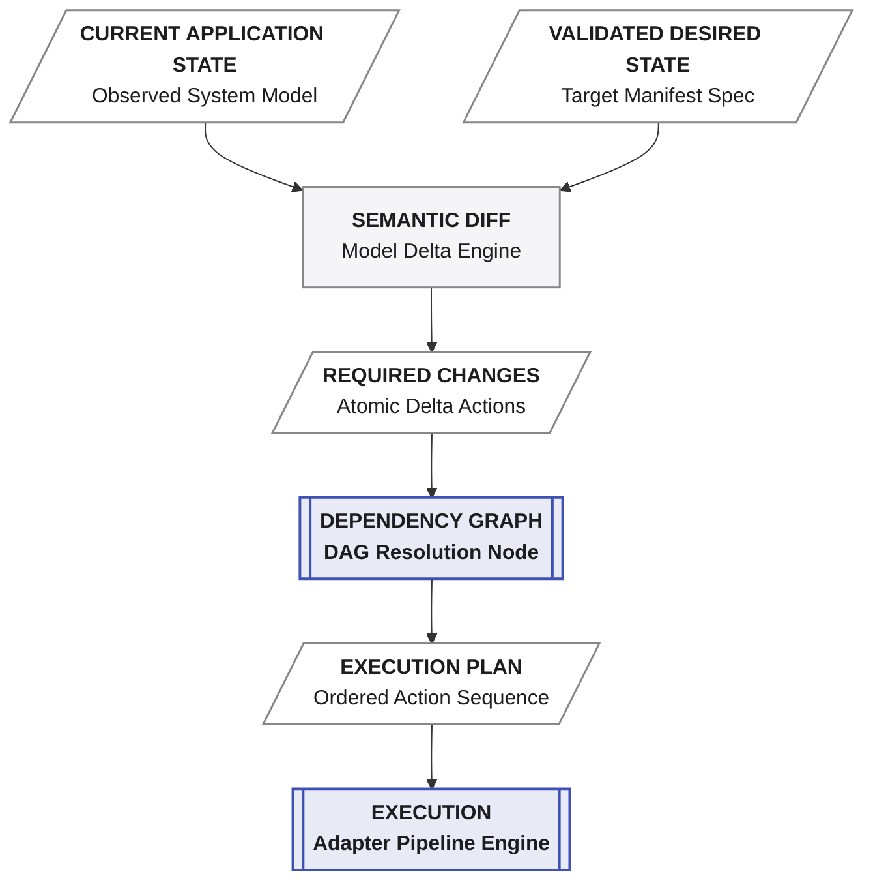
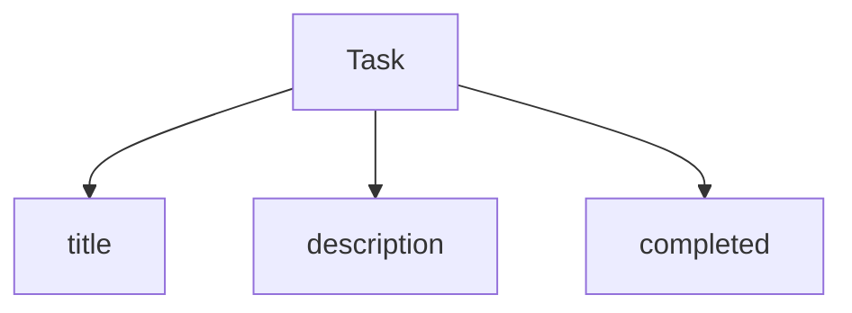
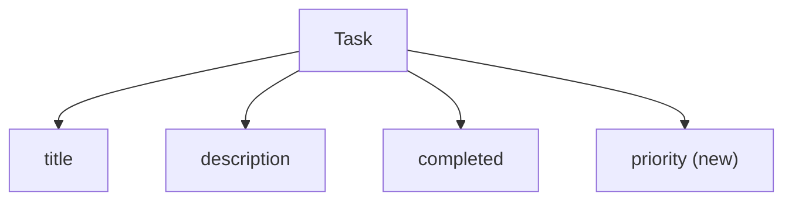
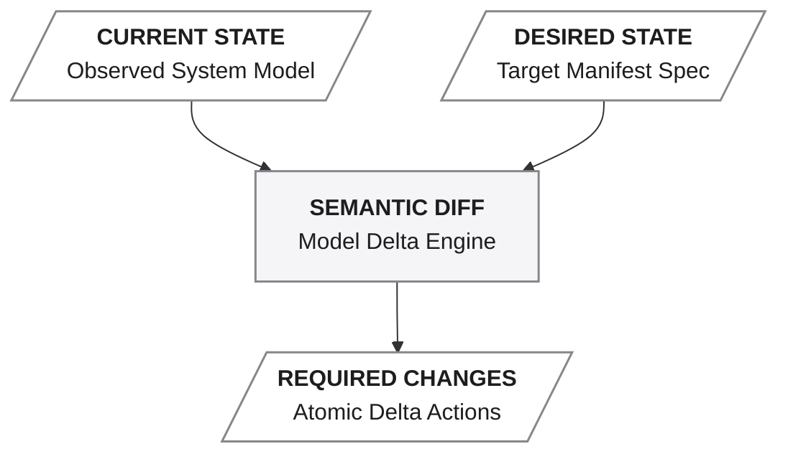
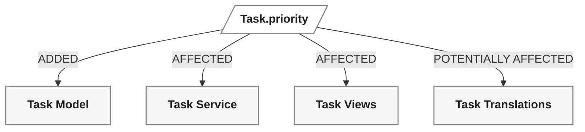
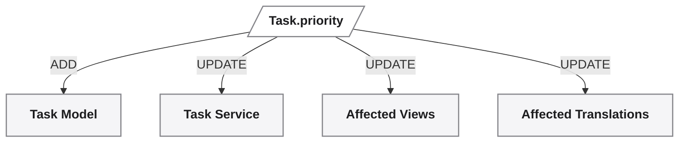
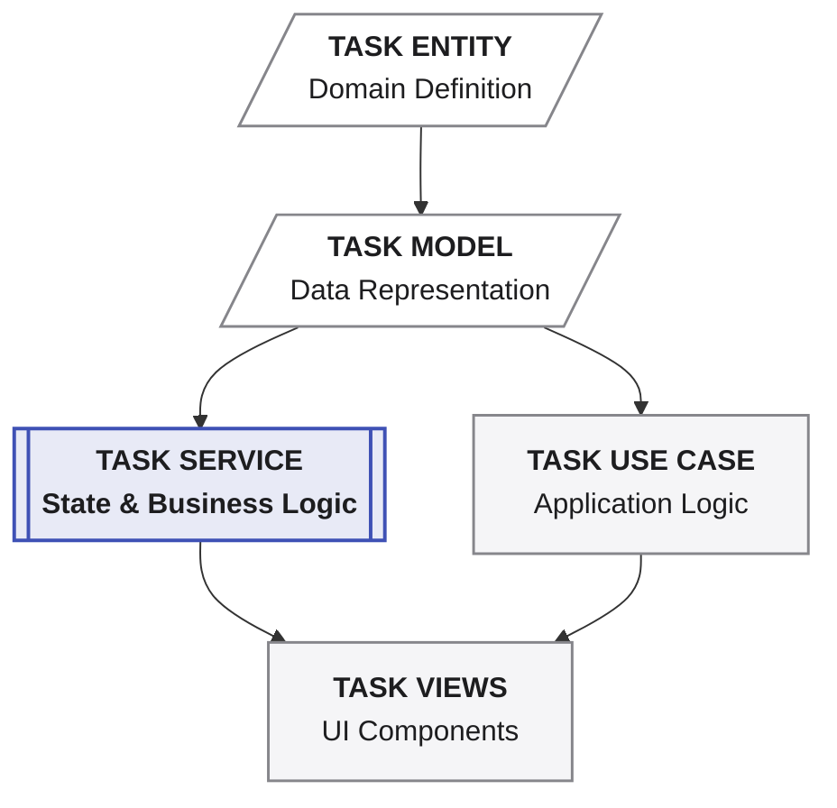
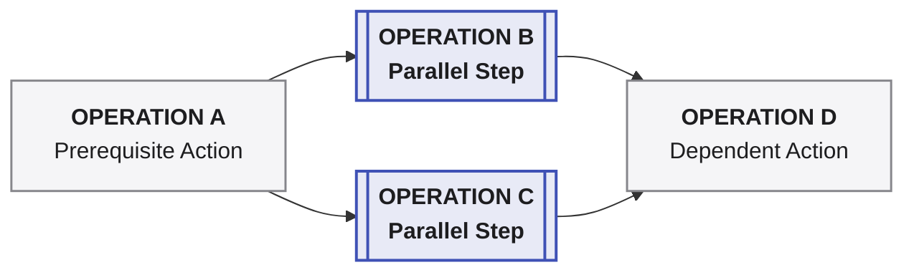
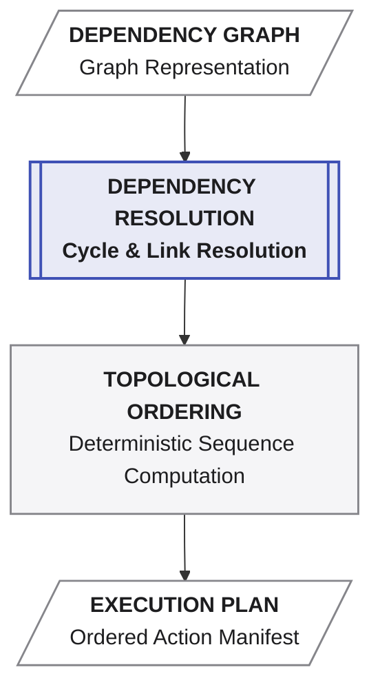
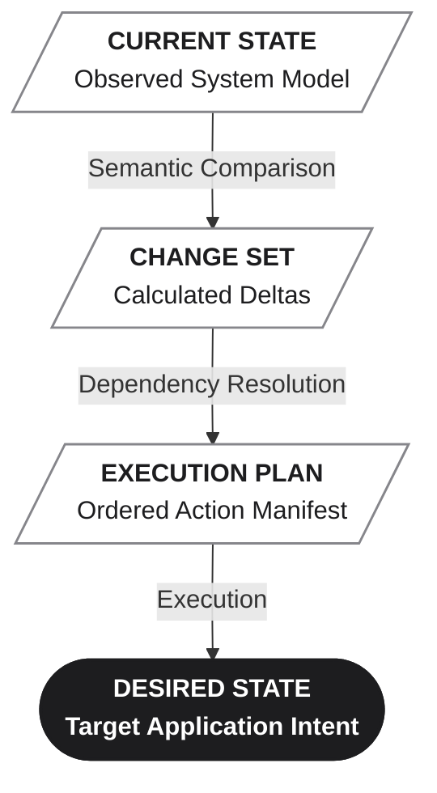

**_Deciding what actually needs to change, and in what order._**

Layer 3 takes a **validated desired state** and determines how the current application can be brought to that state.

It does not regenerate the application from scratch.

It does not guess what changed.

It determines the **semantic difference between the current and desired application states**, resolves the dependencies between the resulting operations, and produces an explicit **execution plan** before anything is applied.

Conceptually:



The result is a plan that can be inspected, reviewed, and — when desired — executed.

> **Layer 3 does not decide what the application should be. It determines how to move from the current state to the validated desired state.**

---

# Semantic Change Detection

Applications evolve.

The important question is therefore not:

> **What files should be regenerated?**

It is:

> **What has actually changed in the application?**

Suppose the application currently contains:



The new requirement is:

> "Add priority to tasks."

The desired application model becomes:



A conventional AI coding workflow may respond by generating or modifying source files directly.

Averos approaches the change at the application-model level.

It compares:



The difference is not primarily a difference between files.

It is a difference between **application states**.

A change to one manifest element can have consequences across multiple generated or dependent components. The purpose of semantic change detection is therefore to identify the relevant change set and its downstream effects without treating unrelated source code as changed simply because it was regenerated.

For example:



The objective is not to regenerate everything.

It is to determine:

> **What must change, and what does that change affect?**

# From Change Set to Operations

Once the semantic differences are known, Averos translates them into operations.

For example:



These operations are not necessarily independent.

An operation may depend on another operation being completed first.

For example:



The orchestration layer makes these dependencies explicit.

This creates an important distinction:

* The **manifest** describes the desired application state.
* The **semantic diff** describes what changed between application states.
* The **dependency graph** describes how the required changes depend on one another.
* The **execution plan** describes the ordered operations required to apply those changes.

# Dependency Resolution

Real applications contain dependencies.

A service may depend on an entity.

A use case may depend on a service.

A page may depend on a use case.

A generated component may depend on several other application elements.

These relationships determine the order in which changes can safely be applied.

Averos represents these dependencies as a **Directed Acyclic Graph (DAG)**.

**Averos DAG** is governed by the **Averos DAG Rules Specification V1.6**, which is part of the **Averos Framework Specifications**.

For example:



Here, Operation D cannot be performed until both B and C have been completed.

The DAG engine resolves these relationships and derives a valid execution order using **topological ordering**.

Conceptually:



The graph is therefore not simply a list of tasks.

It represents the **constraints between tasks**.

This matters because software changes are rarely isolated.

A change to an entity can affect:

* services;
* relationships;
* use cases;
* views;
* generated files;
* configuration;
* translations;
* other application components.

The dependency graph provides the structure required to account for those effects and establish a controlled execution order.

# The Execution Plan

The output of orchestration is an **execution plan**: an explicit, ordered, inspectable representation of the operations required to reconcile the current application with the validated desired state.

For example:

```text
Execution Plan

1. Add Task.priority
2. Update Task model
3. Update Task service
4. Update affected use case
5. Update affected views
6. Update affected translations
```

The actual plan may contain more detailed operations and dependencies, but the principle is the same:

> **The work is determined before the work is performed.**

This separation is important.

Averos can reason about the consequences of a manifest change without immediately applying them.

The plan can therefore be:

* inspected;
* reviewed;
* compared;
* logged;
* validated;
* executed;
* or discarded.

# Planning Without Execution

Planning and execution are separate operations.

A plan can be generated without changing the application:

```bash
averos plan --config=averos.config.js
```

A dry run can also be requested through the execution command:

```bash
averos run --config=averos.config.js --dry-run
```

A dry run produces the planned operations without applying them.

This provides a true separation between:

```text
"What would Averos do?"
```

and:

```text
"Do it."
```

The plan is therefore not merely an internal implementation detail.

It is an inspectable artifact of the orchestration process.

# Orchestration as a Controlled Transition

Layer 3 establishes a controlled transition between two application states:



The important property is that **execution is derived from state differences and dependencies**, rather than from an unconstrained sequence of generated code changes.

Layer 2 answers:

> **Is the desired state valid?**

Layer 3 answers:

> **What must happen to reach it?**

Only after those questions have been answered does the system move toward execution.

> **Layer 3 turns a validated application state into a deterministic, inspectable plan for reaching it.**

| Layer       | Core question                           | Primary artifact   |
| ----------- | --------------------------------------- | ------------------ |
| **Layer 1** | What does the application intend to be? | Manifest           |
| **Layer 2** | Is that desired state valid?            | Validated Manifest |
| **Layer 3** | What must change to reach it?           | Execution Plan     |


---
