**_The plan becomes real, one operation at a time._***

Layer 4 is where the execution plan produced by orchestration is applied to the real application.

The previous layers determine **what the application should be**, **whether that state is valid**, and **what needs to change to reach it**.

Layer 4 performs those changes.

It does so through a technology-specific **Execution Adapter** that translates Averos operations into concrete actions for the target technology.

Conceptually:

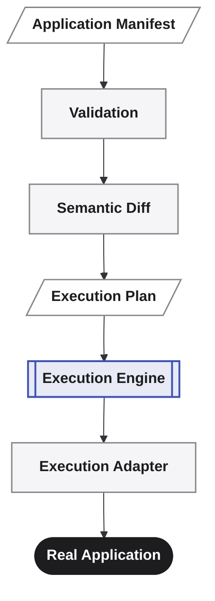

The deterministic execution model does not need to understand the implementation details of every technology.

It operates on abstract application operations.

The adapter is responsible for turning those operations into technology-specific actions.

> **Layer 4 turns an approved execution plan into changes in the real application.**

---

## Controlled execution

A plan is not the same thing as execution.

Averos deliberately separates the two.

Conceptually:

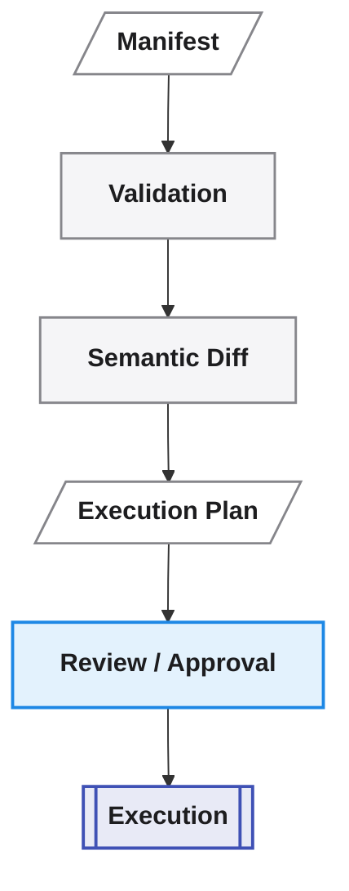

This separation is particularly important when an AI agent is involved.

An agent may propose a change.

The manifest captures the resulting desired state.

Layer 2 validates that state.

Layer 3 determines the required operations and produces an execution plan.

A human, policy, or governing process can then inspect that plan before anything is applied.

Only after execution is authorized does Layer 4 act on the application.

> **The agent proposes. The engine validates and plans. You control execution.**

This creates a clear boundary between **deciding what should happen** and **allowing it to happen**.

Execution is therefore not an implicit side effect of conversation, interpretation, or code generation.

It is an explicit stage.

---

## Executing operations

Layer 4 consumes the execution plan produced by Layer 3.

The plan may contain operations such as:

```text
Create entity
Add property
Create service
Modify view
Update configuration
Update translations
```

The execution engine processes those operations according to the ordering and dependency constraints established by the plan.

For example:

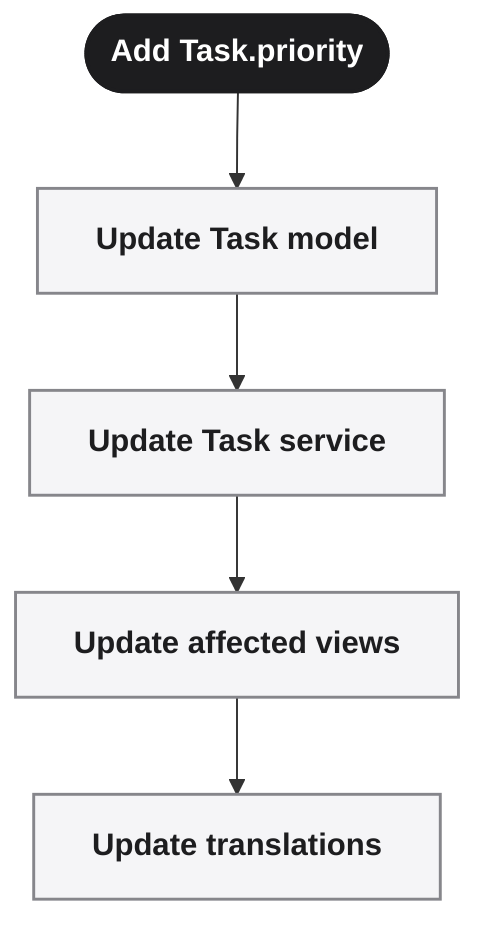

Each operation has an explicit place in the execution process.

This is fundamentally different from asking an AI agent to modify a collection of files and hoping that the resulting application reaches the intended state.

The execution layer does not decide what should be changed.

That decision has already been made by the manifest, validation, semantic diff, and orchestration stages.

Layer 4 is responsible for **applying the plan**.

---

## Execution as a stateful process

Execution is not treated as a single opaque command.

Averos tracks execution as a sequence of operations with explicit state.

Each execution node can produce an **ExecutionCheckpoint** recording what happened.

Conceptually:

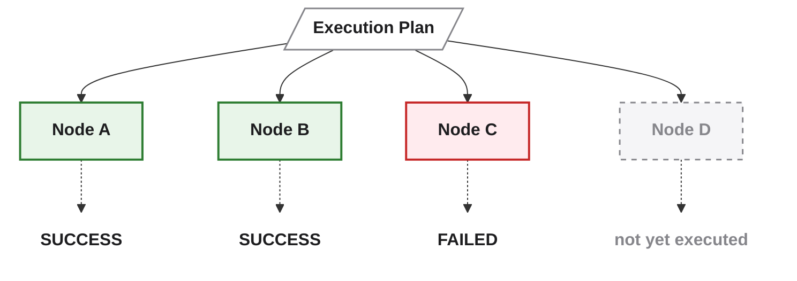

A checkpoint contains information such as:

* the execution node identifier;
* the operation status;
* failure information, when applicable;
* runtime mutation information, when applicable;
* the time at which the checkpoint was updated.

The resulting checkpoint state allows the executor to distinguish between work that has already completed, work that failed, and work that has not yet been completed.

This is the foundation for **resumable execution and crash recovery**.

---

## Execution checkpoints

The executor represents the outcome of an execution node with an `ExecutionCheckpoint`:

```typescript
type ExecutionCheckpoint = {
  nodeId: string
  status: 'SUCCESS' | 'FAILED' | 'SKIPPED'
  failure?: ExecutionFailure
  runtimeMutation?: RuntimeMutation
  updatedAt: string
}
```

The checkpoint is deliberately focused on **execution progress**, rather than describing the complete application state.

For example, a checkpoint can answer:

```text
Was this operation executed?
Did it succeed?
Did it fail?
Was it skipped?
When was its status recorded?
Did execution produce a runtime mutation?
```

This distinction is important because execution progress and application state are related, but they are not the same thing.

> **A checkpoint records what happened during execution. It does not replace the application state.**

---

## Checkpoint stores

Execution checkpoints are persisted through a **CheckpointStore** abstraction.

The store is responsible for loading known checkpoints, persisting checkpoint updates, and clearing them after successful completion.

Conceptually:

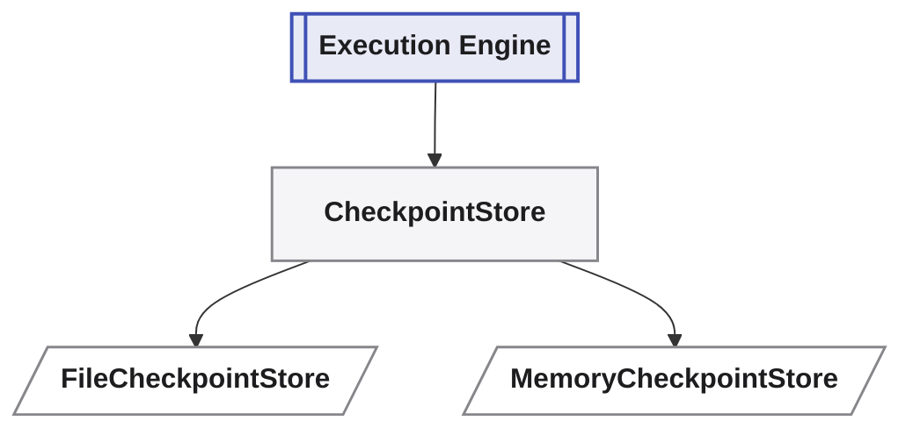

The interface is intentionally small:

```typescript
interface CheckpointStore {

  load(): Promise<Map<string, ExecutionCheckpoint>>

  save(checkpoint: ExecutionCheckpoint): Promise<void>

  clear(): Promise<void>
}
```

The default production implementation is file-backed:

```typescript
new FileCheckpointStore('.averos/checkpoints.json')
```

A memory-backed implementation is also available for testing:

```typescript
new MemoryCheckpointStore()
```

The persistence mechanism is therefore separated from the execution engine itself.

The executor knows how to work with checkpoints.

The checkpoint store determines **where those checkpoints are persisted**.

This separation allows the execution infrastructure to evolve without coupling the orchestration or execution model to a particular persistence mechanism.

---

## Resumability and recovery

Because execution checkpoints are persisted, an interrupted execution does not have to be treated as an entirely new execution.

For example:

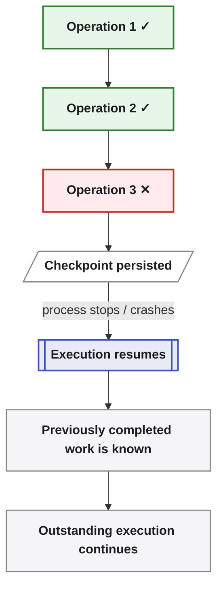

On recovery, the executor can load the persisted checkpoint information and determine the execution state that has already been recorded.

This provides the foundation for:

* crash recovery;
* resumable execution;
* operation-level status tracking;
* failure inspection;
* avoiding unnecessary re-execution of completed work.

The exact behavior of a retry or resumed operation remains dependent on the operation's semantics and the capabilities of the relevant execution adapter.

Resumability should therefore not be confused with automatic transactional rollback.

> **Averos can remember where execution stopped. Whether a particular operation can be safely retried or reversed depends on that operation.**

---

## Application state is different from execution state

Averos maintains another important persistence concept: the **StateStore**.

The distinction is:

| Store               | Answers                                                |
| ------------------- | ------------------------------------------------------ |
| **CheckpointStore** | *What happened during the current execution?*          |
| **StateStore**      | *What application state was successfully established?* |

The CheckpointStore is concerned with **execution progress**.

The StateStore is concerned with **the resulting application state**.

This distinction is essential for incremental application evolution.

After a successful run, Averos persists the complete build state.

The orchestration process can then use that state as the basis for computing incremental differences during a subsequent run.

Conceptually:

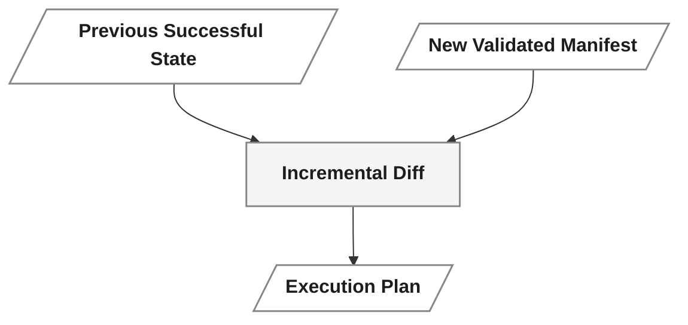

The StateStore therefore connects successful execution back to future orchestration.

---

## StateStore

The `StateStore` provides the persistence boundary for the successfully established application state.

A file-backed implementation is used by default:

```typescript
new FileStateStore('.averos/state.json')
```

A memory-backed implementation is also available for testing:

```typescript
new MemoryStateStore()
```

Conceptually:

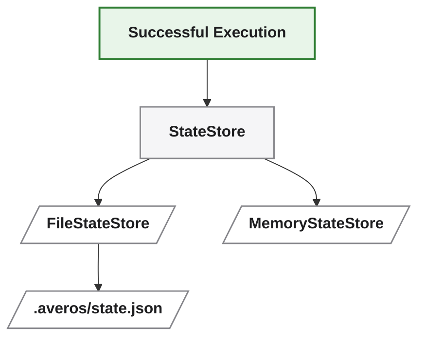

The persisted state is subsequently available to orchestration when determining what has changed.

This is what allows Averos to reason incrementally across runs rather than treating every invocation as an entirely new application generation.

> **Checkpoints remember execution progress. State remembers the successfully established application.**

---

## Persistence is configurable

The persistence mechanisms are not hardcoded into the CLI workflow.

They can be configured through the Averos configuration supplied to the CLI.

For example:

```json
{
  "mode": "resilient",
  "timeoutMs": 1800000,
  "development": "true",
  "maxAttempts": 1,
  "workspaceRoot": "./generated-app",
  "manifestPath": "../todoapp-manifest.json",
  "logsDir": "./generated-app/averos-logs",
  "statePath": "./generated-app/state.json",
  "checkpointPath": "./generated-app/checkpoints.json"
}
```

The CLI can use this configuration when invoking the executor:

```bash
averos run --config=averos.config.json
```

By default, the executor uses file-backed persistence for both execution checkpoints and successful application state.

The relevant persistence locations can be overridden through configuration.

This keeps execution behavior explicit and environment-dependent details outside the deterministic application model.

---

## Execution Adapters

Averos intentionally separates its deterministic execution model from technology-specific implementation.

This is the role of the **Execution Adapter**.

The core execution model can express application-level operations such as:

- Create entity
- Add property
- Create service
- Modify view
- Update configuration
- Update translations


The execution engine does not need to know how those operations are implemented in Angular, another framework, or another execution environment.

Instead, the execution adapter translates the abstract operations into technology-specific actions.

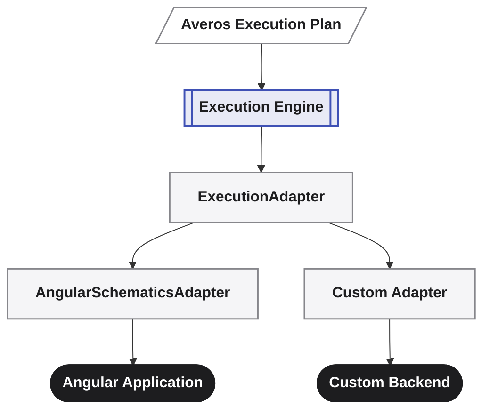

The adapter therefore forms the boundary between:

**Averos application semantics**

and

**technology-specific execution.**

This separation is fundamental to the architecture.

The deterministic core can reason in terms of application concepts without knowing the implementation details of a particular framework, runtime, or execution environment.

> **The execution model describes what must be done. The adapter knows how to do it.**

---

## The ExecutionAdapter extension point

The executor exposes an `ExecutionAdapter` interface as the extension point for custom execution backends.

An adapter receives the execution node, the execution context, and the current execution state, and returns an execution result.

This makes the execution mechanism replaceable without changing the manifest, validation, semantic diff, or orchestration layers.

For example, a custom adapter can implement the interface directly:

```typescript
import type {
  ExecutionAdapter,
  ExecutionContext,
  ExecutionNode,
  ExecutionResult,
  ExecutionState,
} from '@averos/executor'

class MyAdapter implements ExecutionAdapter {
  async execute(
    node: ExecutionNode,
    context: ExecutionContext,
    state: ExecutionState,
  ): Promise<ExecutionResult> {
    // state.cwd is the current working directory
    // context.dryRun is true when running in dry-run mode

    return {
      success: true,
      durationMs: 0,
    }
  }
}
```

The interface deliberately exposes execution context and state to the adapter.

For example:

* `state.cwd` identifies the current working directory available to the operation;
* `context.dryRun` indicates that execution is being planned or simulated without applying changes;
* the execution node identifies the operation being performed;
* the execution result reports the outcome of that operation.

The adapter therefore owns the technology-specific mechanics while remaining subject to the execution lifecycle defined by Averos.

---

## AngularSchematicsAdapter

The currently implemented execution adapter is **AngularSchematicsAdapter**.

It is fully open sourced and provides the concrete implementation required to translate Averos execution operations into changes to an Angular application through Angular Schematics.

Conceptually:

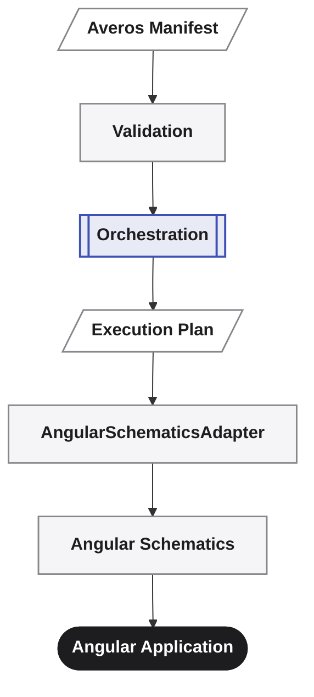

**AngularSchematicsAdapter** demonstrates the complete path from the Averos application model to a real technology implementation.

Importantly, the adapter is not part of the deterministic application model itself.

It is an implementation of the execution boundary.

That distinction allows Averos to keep its application semantics and orchestration model independent from Angular-specific execution details.

---

## Custom execution backends

Because `ExecutionAdapter` is an explicit extension point, Averos can be extended with other execution backends.

Potential implementations include:

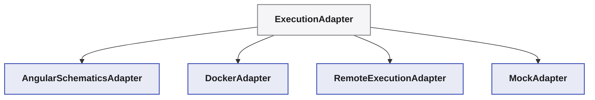

These adapters do not need to change the upstream application model.

The manifest remains the description of the desired application state.

Validation remains responsible for determining whether that state is valid.

Orchestration remains responsible for determining the required operations and their dependencies.

The adapter only changes **how those operations are materialized**.

This makes the execution boundary an explicit extension mechanism rather than an implementation detail hidden inside the executor.

> **Extend the execution backend without changing the application model.**

---

## Technology independence

The adapter boundary allows Averos to support different implementation technologies and execution environments without changing the fundamental application model.

For example:

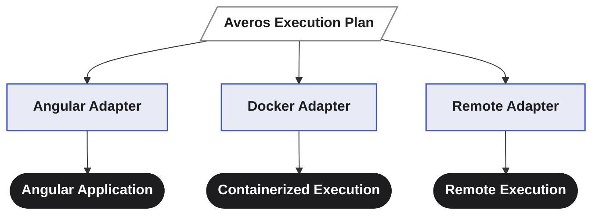

Each adapter is responsible for translating the same high-level execution concepts into the mechanisms appropriate for its target environment.

Adding another execution backend therefore does not require redefining the manifest, validation model, semantic diff, or orchestration model.

It requires an implementation of the `ExecutionAdapter` contract.

This is also one of the main areas where the Averos community can contribute.

New adapters can extend the range of environments in which Averos execution plans can be materialized while preserving the same deterministic application model.

> **The core remains stable. The execution backend is replaceable.**

---

## Observability

Execution is not a black box.

The executor exposes a typed event stream that allows consumers to observe the lifecycle of an execution as it happens.

The runner emits `RunnerEvent` events to all registered `RunnerEventListener` instances.

Conceptually:

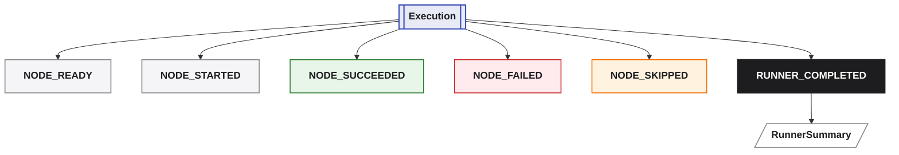

This provides a programmatic observation boundary around execution.

The event system is deliberately independent from presentation.

The same events can be consumed by:

* the CLI;
* logging infrastructure;
* CI/CD integrations;
* monitoring tools;
* development tooling;
* audit or reporting systems;
* custom execution observers.

> **Execution events describe what is happening. Checkpoints preserve what has happened. The runner summary describes the final outcome.**

---

## Typed execution events

The runner emits strongly typed events throughout the execution lifecycle.

A simplified event model is:

```typescript
type RunnerEvent =
  | { type: 'NODE_READY';     nodeId: string }
  | { type: 'NODE_STARTED';   nodeId: string; node: ExecutionNode }
  | { type: 'NODE_SUCCEEDED'; nodeId: string; durationMs: number }
  | { type: 'NODE_FAILED';    nodeId: string; failure: ExecutionFailure; durationMs: number }
  | { type: 'NODE_SKIPPED';   nodeId: string; reason: SkipReason }
  | { type: 'RUNNER_COMPLETED'; success: boolean; /* ... */ }
```

The event types represent meaningful stages in the lifecycle of an execution node.

For example:

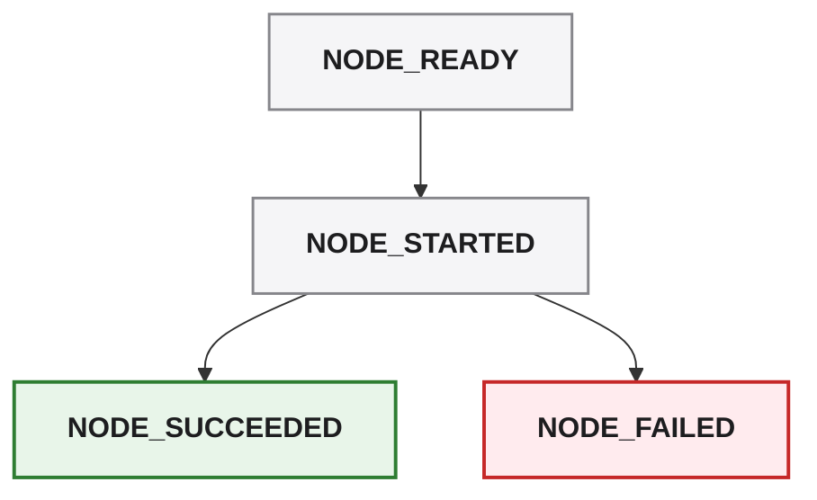

An operation may also be skipped when execution rules determine that it should not run:

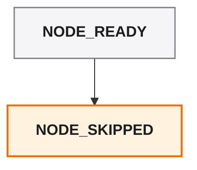

This makes execution progress observable without requiring consumers to inspect internal executor state.

---

## Event listeners

Consumers can register `RunnerEventListener` instances through the orchestration configuration.

For example:

```typescript
const config = {
  // ...
  listeners: [{
    onEvent(event: RunnerEvent) {
      if (event.type === 'NODE_FAILED') {
        console.error(`Failed: ${event.nodeId}`)
      }
    }
  }],
}
```

The listener mechanism provides an extension point without coupling the executor to a particular output or monitoring system.

An application can therefore react to execution events without modifying the executor itself.

For example, one listener might produce human-readable CLI output while another sends structured events to an external monitoring system.

The executor remains responsible for producing the events.

Consumers remain responsible for deciding what to do with them.

> **The executor emits execution facts. Consumers decide how those facts are presented or consumed.**

---

## Runner summary

At the end of execution, the runner produces an aggregate **RunnerSummary**.

The summary provides a concise representation of the overall execution result:

```typescript
type RunnerSummary = {
  total:      number
  succeeded:  number
  failed:     number
  skipped:    number
  cancelled:  number
  durationMs: number
  mode:       'strict' | 'resilient'
  success:    boolean
  failures:   ExecutionFailure[]
}
```

The summary answers questions such as:

* How many operations were planned?
* How many succeeded?
* How many failed?
* How many were skipped?
* Was execution cancelled?
* How long did execution take?
* Which execution mode was used?
* Did the overall run succeed?
* What failures occurred?

This gives consumers both **fine-grained execution events** and a **coarse-grained final result**.

Conceptually:

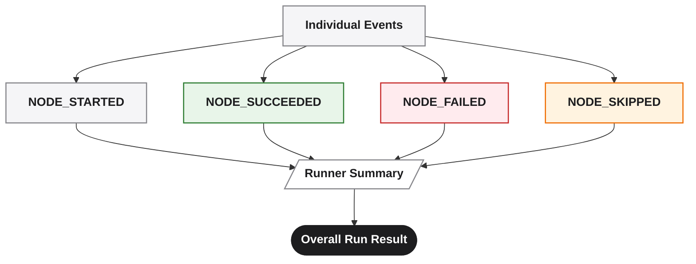

The two mechanisms serve different purposes.

**Events provide execution telemetry as it happens.**

**The summary provides the final aggregate result.**

---

## Observability across the execution lifecycle

Together with checkpoints and persisted application state, these mechanisms provide several complementary views of execution:

| Mechanism                 | Primary question                                     |
| ------------------------- | ---------------------------------------------------- |
| **Runner Events**         | What is happening or what just happened?             |
| **Execution Checkpoints** | What execution state has been persisted?             |
| **Runner Summary**        | What was the overall result of the run?              |
| **StateStore**            | What application state was successfully established? |
| **ExecutionFailure**      | Why did an operation fail?                           |

These should not be treated as competing representations.

They describe different dimensions of the same execution lifecycle.

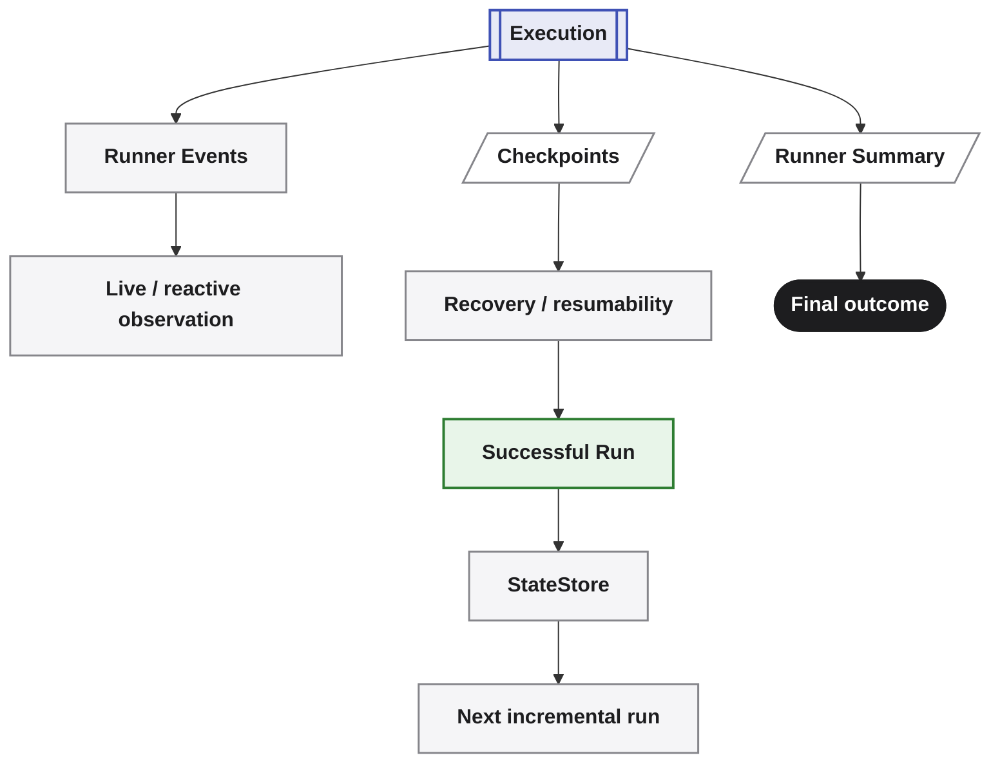

This layered approach means that execution can be observed in real time, recovered after interruption, summarized after completion, and connected to future incremental orchestration.

---

## Observability as an execution contract

Observability is therefore part of the execution architecture rather than an afterthought.

The executor exposes structured information about:

* execution lifecycle;
* operation status;
* timing;
* failures;
* skipped operations;
* cancellation;
* overall success;
* execution mode.

Because this information is exposed through typed interfaces, consumers do not need to parse human-readable console output to understand what happened.

This is an important architectural distinction.

> **Logs are a presentation of execution. Events are an interface to execution.**

The CLI may display those events as human-readable output.

Another consumer may turn them into structured telemetry.

A CI system may use the final `RunnerSummary` to determine whether a run succeeded.

A development tool may use node-level events to display live execution progress.

The executor itself remains independent of those presentation concerns.

---

## The complete execution lifecycle

Layer 4 is the final stage in a larger application lifecycle.

The four layers form a controlled progression from **desired state** to **validated transition** to **realized application state**:

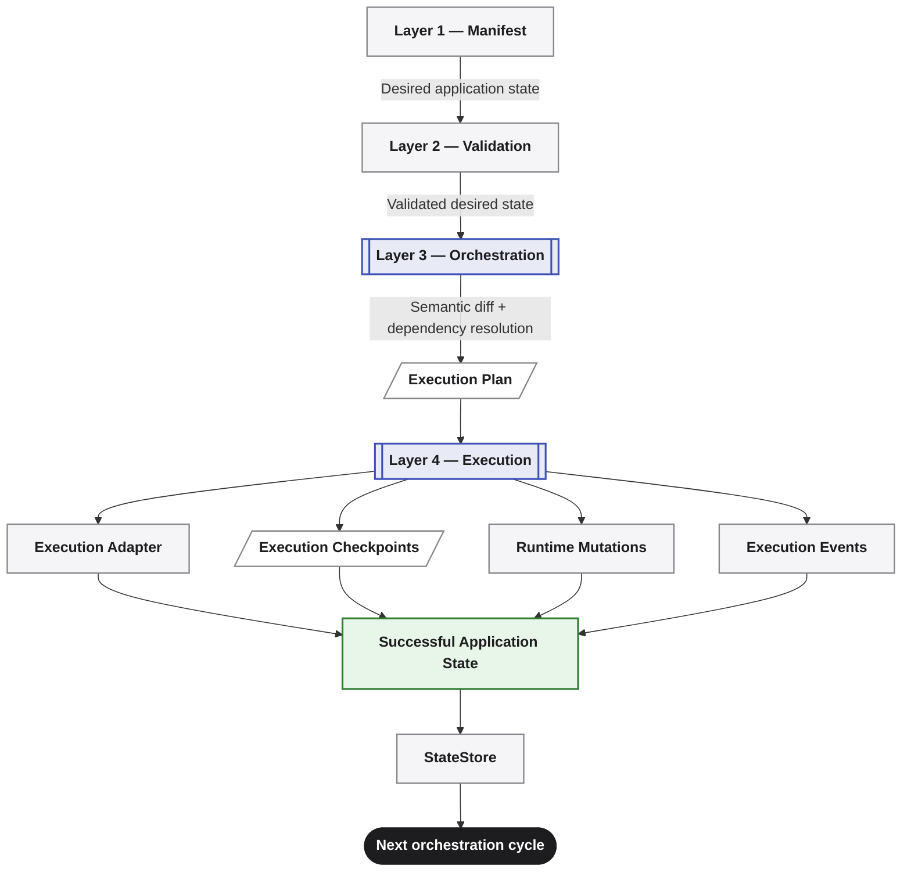

Each layer has a distinct responsibility:

| Layer                       | Responsibility                               | Primary result             |
| --------------------------- | -------------------------------------------- | -------------------------- |
| **Layer 1 — Manifest**      | Describe the desired application             | Application Manifest       |
| **Layer 2 — Validation**    | Establish that the desired state is valid    | Validated Manifest         |
| **Layer 3 — Orchestration** | Determine what must change and in what order | Execution Plan             |
| **Layer 4 — Execution**     | Apply the planned operations                 | Realized Application State |

The execution infrastructure then records different aspects of what happened.

**Execution events** expose the lifecycle as it happens.

**Execution checkpoints** persist operation-level progress and support resumability.

**Runtime mutations** capture relevant changes produced during execution.

**Runner summaries** provide the aggregate outcome of the run.

**StateStore** persists the successfully established application state for use by subsequent orchestration.

This creates an important distinction between **execution progress** and **application state**:

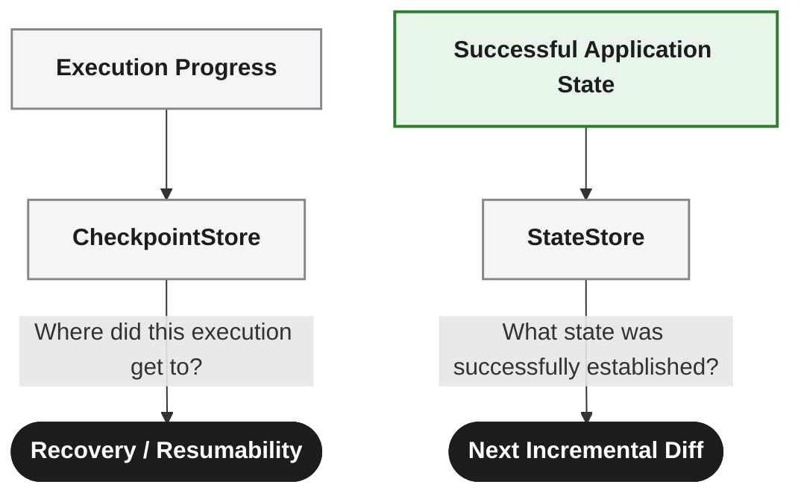

The two stores therefore serve different purposes.

A checkpoint tells Averos about the **execution that is in progress or being recovered**.

The state store tells Averos about the **application state that was successfully established**.

After a successful execution, that state becomes the baseline against which the next desired state can be compared.

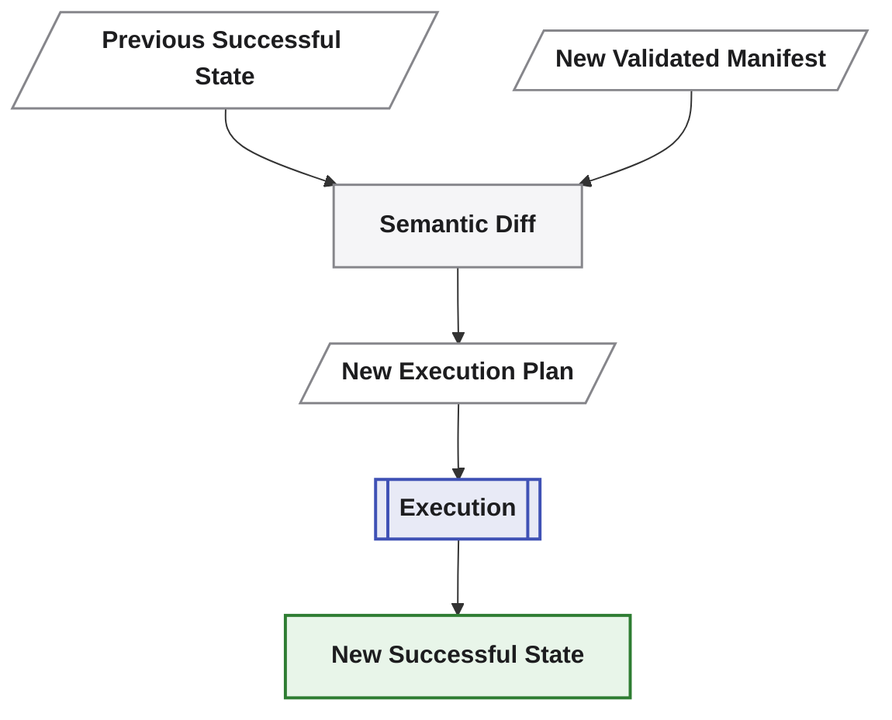

This is what allows Averos to evolve an application incrementally across multiple runs rather than treating each run as an independent generation process.

> **The manifest defines the desired state. Validation establishes that it is admissible. Orchestration defines the transition. Execution realizes it. The resulting state becomes the baseline for what comes next.**

The architecture is therefore not simply a pipeline that ends when files are generated.

It is an **incremental application lifecycle** in which each successful execution establishes the state from which the next change can be reasoned about.


---

## The execution principle

Layer 4 therefore provides more than a mechanism for applying operations.

It provides a **controlled, observable, recoverable, and technology-aware execution environment**.

The deterministic core decides **what needs to happen**.

The execution adapter determines **how the operation is implemented**.

The event system exposes **what is happening**.

The checkpoint system preserves **execution progress**.

The runner summary reports **the final outcome**.

The state store records **the successfully established application state**.

Together, these establish the final boundary between the declarative application model and the real application.

> **The manifest defines the state.<br/>
> The plan defines the transition.<br/>
> The adapter defines the implementation.<br/>
> Events expose the execution.<br/>
> Checkpoints preserve progress.<br/>
> The summary reports the outcome.<br/>
> State records the result.<br/>
> Execution makes it real.**


---
