**_Change becomes a revision — not a rewrite._**

The purpose of the Averos architecture is not simply to generate an application once.

It is to establish a system in which an application can be **described, validated, compared, planned, executed, and evolved repeatedly**.

That makes the complete pipeline an **evolution pipeline**, not merely a generation pipeline.

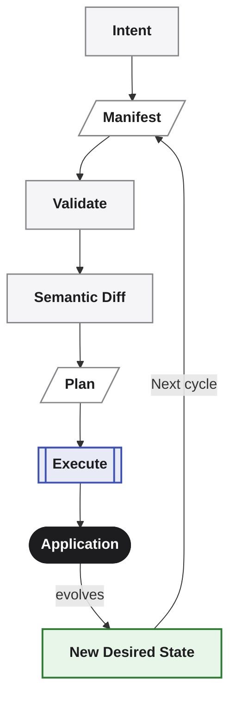

The important property is not that Averos can generate an application.

It is that the same application can become the input to the **next controlled change**.

The application therefore does not have to be treated as a disposable output of a generation process.

It becomes a system with a persistent, structured model that can be evolved over time.

---

## From change request to application change

Consider a simple evolution:

> **Add `priority` to tasks.**

The desired change is represented in the application manifest.

The Averos pipeline then determines how that desired state differs from the current application state and what must be done to realize the difference.

Conceptually:

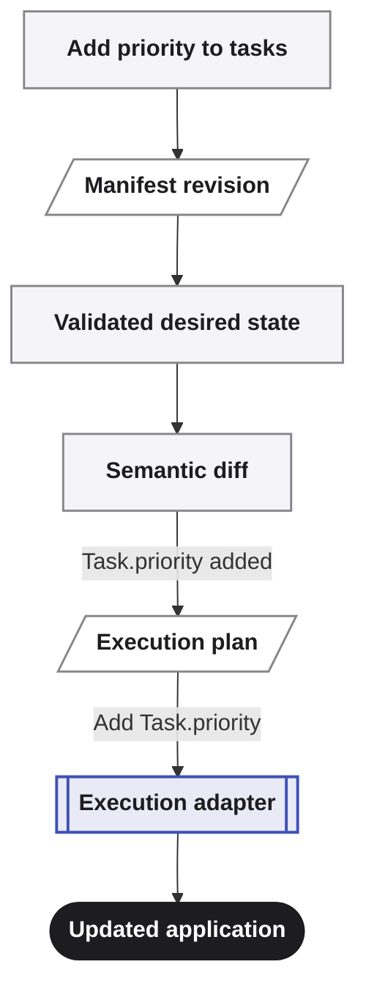

The important point is that the system is reasoning about the **application change**, rather than treating the entire application as something that must be generated again.

A small semantic change can therefore produce a correspondingly small execution plan.

For example:

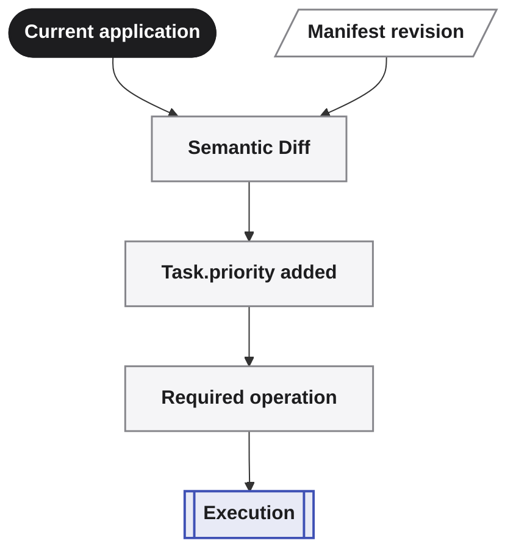

This is the architectural consequence of having a structured application manifest, semantic diffing, dependency-aware orchestration, and controlled execution.

> **The objective is not to regenerate the application. It is to determine and apply the changes required to reach the desired state.**

---

## Evolution rather than regeneration

Traditional code generation is often naturally expressed as:

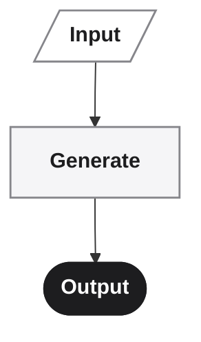

Averos is designed around a different lifecycle:

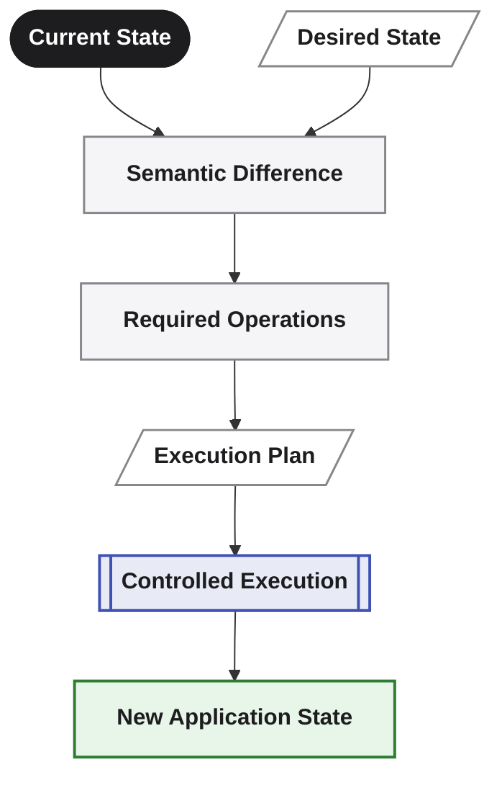

The distinction is important.

The application is not merely the output of the previous run.

Its established state becomes the **baseline for the next evolution**.

This enables a repeated lifecycle:

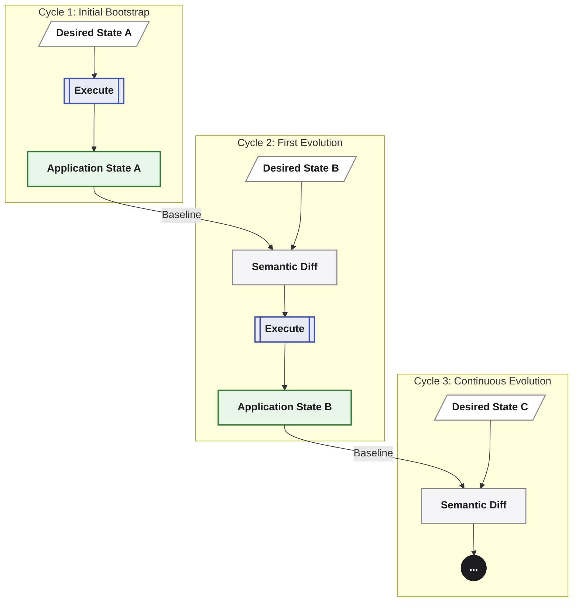

Each iteration can be reasoned about independently while remaining connected to the application's persisted state.

This is what makes the model suitable for applications that are expected to change continuously rather than be generated once and discarded.

---

## A governed evolution loop

The same architecture also provides a natural boundary for AI-driven development.

When an AI agent is involved, the agent does not need to operate directly on the application's files.

Instead, it can participate in the same governed lifecycle:

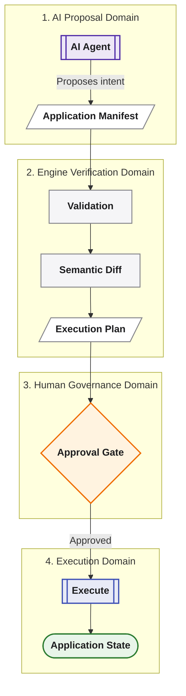

The important distinction is between **proposal** and **execution**.

An AI agent can propose a change.

The Averos engine can validate the resulting manifest.

Orchestration can determine the semantic difference and construct the execution plan.

A human or governing process can inspect or approve that plan.

Only then does execution modify the application.

> **The agent proposes. The engine validates and plans. You control what executes.**

---

## MCP-driven evolution

When an AI agent interacts with Averos through `@averos/mcp`, this lifecycle can be exposed as an explicit sequence of governed tool calls.

Conceptually:

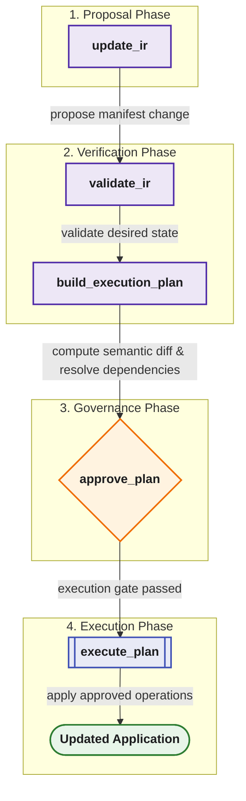

Each step has a distinct responsibility.

The agent is not silently editing arbitrary files and then asking whether the result looks correct.

Instead, the agent participates in the same structured lifecycle used by the rest of the system.

This makes the interaction **observable, inspectable, and governable**.

The exact authorization policy can vary by environment, but the architectural boundary remains the same:

**proposal does not imply execution.**

---

## The application as an evolving system

This leads to a different way of thinking about generated software.

A generated application is often treated as a final artifact:

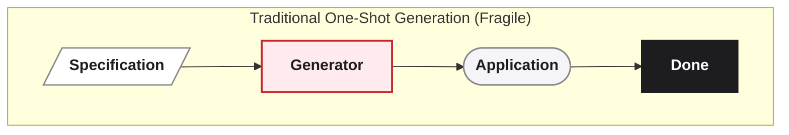

Averos treats the application as an evolving system:

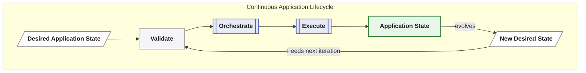

The application can therefore be:

- described;
- validated;
- versioned;
- compared;
- planned;
- executed;
- inspected;
- changed;
- and evolved again.

That is the central consequence of the architecture.

> **Averos is not only a system for creating software. It is a system for managing the controlled evolution of software.**

---

## The result

The result is not simply a generated codebase.

It is a repeatable mechanism for moving an application from one well-defined state to another.

```mermaid
flowchart TD
    classDef boundary fill:#1d1d1f,stroke:#1d1d1f,stroke-width:2px,color:#ffffff,font-weight:bold
    classDef artifact fill:#ffffff,stroke:#86868b,stroke-width:1.5px,color:#1d1d1f
    classDef process fill:#f5f5f7,stroke:#86868b,stroke-width:1.5px,color:#1d1d1f
    classDef engine fill:#e8eaf6,stroke:#3f51b5,stroke-width:2px,color:#1d1d1f,font-weight:bold
    classDef success fill:#e8f5e9,stroke:#2e7d32,stroke-width:2px,color:#1d1d1f,font-weight:bold

    subgraph CorePipeline ["State Transition Pipeline"]
        M[/"`**Manifest**`"/]:::artifact
        V["`**Valid State**`"]:::process
        D["`**Semantic Difference**`"]:::process
        P[/"`**Execution Plan**`"/]:::artifact
        E[["`**Controlled Execution**`"]]:::engine
        S["`**New Application State**`"]:::success
        N(["`**Next Evolution**`"]):::boundary

        M -->|1. Validation establishes admissibility| V
        V -->|2. Orchestration determines transition| D
        D -->|3. Resolves operations| P
        P -->|4. Adapter executes with checkpoints & events| E
        E -->|5. Persists baseline| S
        S -->|6. Continuous loop| N
        N -->|Feeds next manifest update| M
    end
```

The manifest provides the durable representation of intent.

Validation establishes that the desired state is admissible.

Orchestration determines the transition.

Execution applies it through an adapter.

Checkpoints make execution recoverable.

Events make execution observable.

State persistence provides the baseline for the next change.

Together, these layers turn application generation into **application evolution**.

> **The goal is not to generate software once. The goal is to make software that can evolve.**
