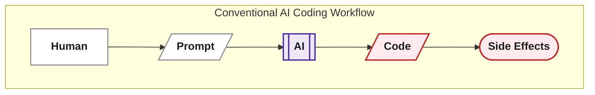
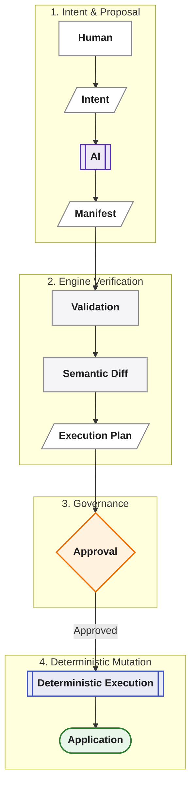
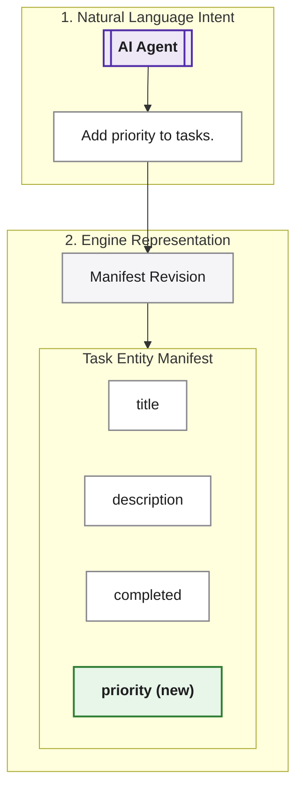
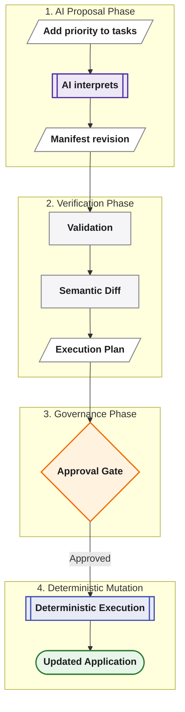
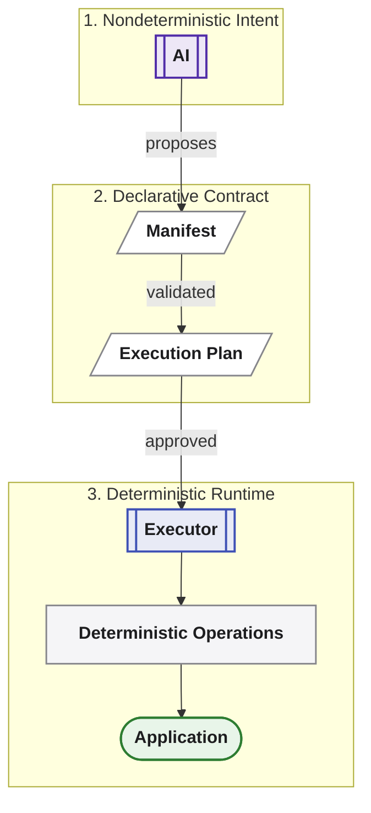
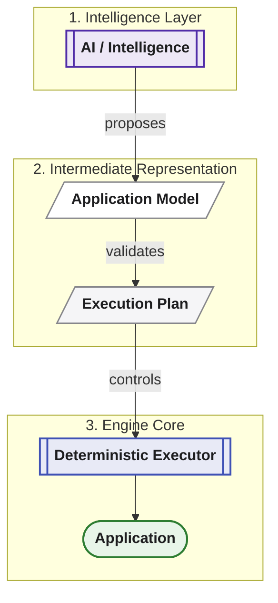
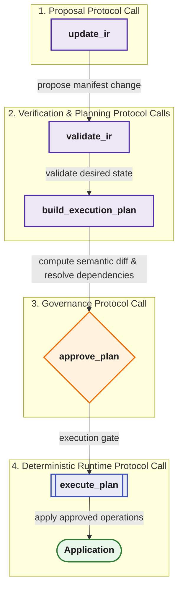
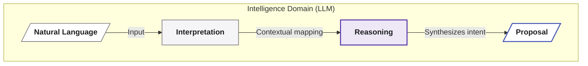
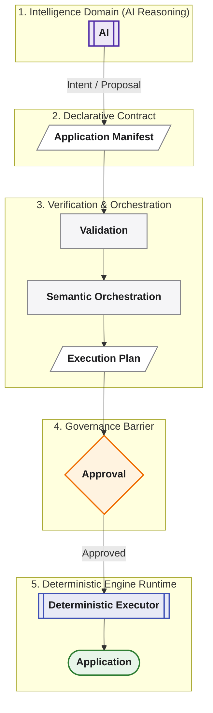

**_AI provides intelligence. Averos provides control._**

This distinction is at the heart of Averos.

Averos does not treat an AI model as the execution engine of the application.

AI is exceptionally useful at interpreting intent, reasoning about requirements, and proposing changes. But those capabilities do not require unrestricted authority over the application.

Averos therefore separates **intelligence from execution**.

> **AI provides intelligence. Averos provides control.**

---

## The conventional AI coding loop

A conventional AI coding workflow can look roughly like this:



The model interprets a natural-language request and may directly modify files, invoke tools, install dependencies, execute commands, or otherwise affect the development environment.

The problem is not that AI can perform these actions.

The problem is that **interpretation and execution are often collapsed into the same step**.

When that happens, it becomes difficult to establish a precise boundary between:

- what the human intended;
- what the AI inferred;
- what the AI changed;
- why those changes were necessary;
- whether the resulting state is valid;
- and what will happen if the same request is made again.

Averos introduces explicit architectural boundaries between those concerns.

---

## The Averos model

In Averos, AI can participate in the process without becoming the authority that directly executes arbitrary changes.



Each stage has a distinct responsibility.

| Stage | Responsibility |
|---|---|
| **Human** | Establish intent and governance |
| **AI** | Interpret intent and propose a desired state |
| **Manifest** | Represent that desired state explicitly |
| **Validation** | Determine whether the proposed state is admissible |
| **Semantic Diff** | Determine what has changed |
| **Execution Plan** | Determine what operations are required and in what order |
| **Approval** | Authorize the planned transition |
| **Deterministic Execution** | Apply the approved operations |
| **Application** | Become the resulting realized state |

This separation is the foundation of **governed AI-assisted development**.

---

## AI is a proposer, not the executor

The AI remains extremely important.

It can:

- understand natural language;
- interpret requirements;
- propose application structures;
- reason about application changes;
- translate intent into manifest changes;
- interact with Averos through MCP;
- help humans explore alternatives;
- explain proposed changes.

But none of these capabilities require the model itself to own the final execution mechanism.

The AI can propose:

```text
"Add priority to tasks."
```

The system can turn that intent into a manifest revision:



Validation then determines whether that desired state is valid.

Orchestration determines the semantic difference and builds the execution plan.

Only after the appropriate execution gate is cleared does the executor apply the change.

> **The AI can propose the destination without being given unrestricted control over the road.**

---

## From intent to controlled execution

Consider a simple request:

> "Add priority to tasks."

A conventional workflow might allow the model to interpret the request and immediately edit the application.

Averos separates the journey:



The key change is not that AI becomes less capable.

It is that **AI no longer has to be the mechanism that materializes its own decisions**.

This makes the proposed change inspectable before it becomes an application change.

---

## Why the manifest matters

The manifest creates a durable boundary between **what was requested** and **what will be executed**.

Natural language can be ambiguous.

A manifest can be validated.

A conversation can contain context, assumptions, and interpretation.

A manifest represents an explicit application state.

This gives the system an intermediate artifact that can be:

- inspected;
- validated;
- versioned;
- compared;
- reviewed;
- approved;
- reproduced.

The AI therefore does not need to be the source of truth.

The manifest becomes the precise representation of the desired application state.

> **Conversation captures intent. The manifest captures the resulting state.**

---

## Why deterministic execution matters

Once a validated manifest has been transformed into an execution plan, the execution stage does not need an AI model to decide what to do next.

The executor follows the plan.

Its behavior is governed by explicit operations, dependencies, execution state, adapters, checkpoints, and execution policies.

Conceptually:



This creates a critical separation:



The executor does not need to "think" about whether a different implementation might be better.

That reasoning can happen upstream.

At execution time, the system has an explicit plan to apply.

---

## AI through MCP

Averos can expose the same governed lifecycle to AI agents through `@averos/mcp`.

The interaction can therefore remain structured:



The important property is that MCP does not have to collapse proposal and execution into a single opaque action.

The agent can participate in the same lifecycle as a human-driven workflow.

This means the system can preserve explicit boundaries even when the primary interface is an AI agent.

> **AI can operate the workflow without becoming the workflow's execution authority.**

---

## Governance without removing AI

This architecture is not about removing AI from software development.

It is about giving AI a better place in the system.

AI is particularly well suited to:



Deterministic infrastructure is particularly well suited to:

```mermaid
flowchart TD
    classDef process fill:#f5f5f7,stroke:#86868b,stroke-width:1.5px,color:#1d1d1f
    classDef artifact fill:#ffffff,stroke:#86868b,stroke-width:1.5px,color:#1d1d1f
    classDef engine fill:#e8eaf6,stroke:#3f51b5,stroke-width:2px,color:#1d1d1f,font-weight:bold
    classDef state fill:#e8f5e9,stroke:#2e7d32,stroke-width:2px,color:#1d1d1f,font-weight:bold

    subgraph RuntimeDomain ["Deterministic Infrastructure Engine"]
        V["`**Validation**`"]:::process
        D["`**Diff**`"]:::process
        P[/"`**Planning**`"/]:::artifact
        E[["`**Execution**`"]]:::engine
        S(["`**State / Recovery**`"]):::state

        V -->|Ensures admissibility| D
        D -->|Computes structural delta| P
        P -->|Schedules ordered DAG| E
        E -->|Applies side effects & checkpoints| S
    end
```



Averos connects the two:



The result is not less automation.

It is **automation with explicit boundaries**.

---

## The architectural principle

The distinction can be summarized simply:

> **AI provides intelligence. Averos provides control.**

AI can understand.

AI can reason.

AI can propose.

Averos validates.

Averos plans.

Averos governs.

Averos executes.

This separation allows increasingly capable AI systems to participate in application development without making the AI model itself the system of record or the final execution authority.

The model may change.

The AI provider may change.

The interface may change.

The application model, validation rules, execution plan, and deterministic execution boundary can remain explicit.

> **The intelligence can evolve without surrendering control of execution.**

---