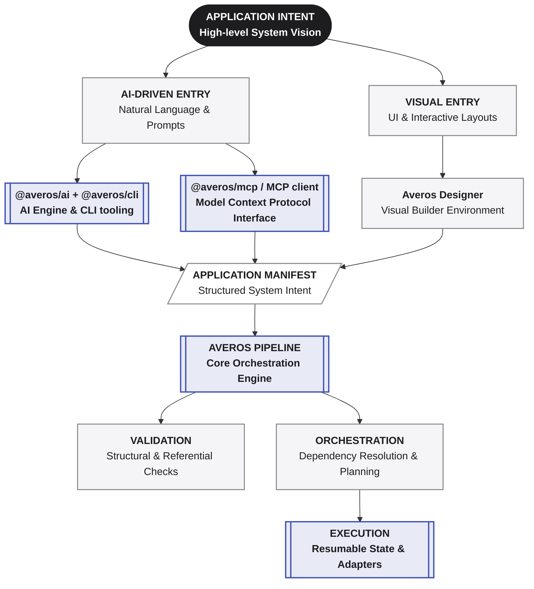
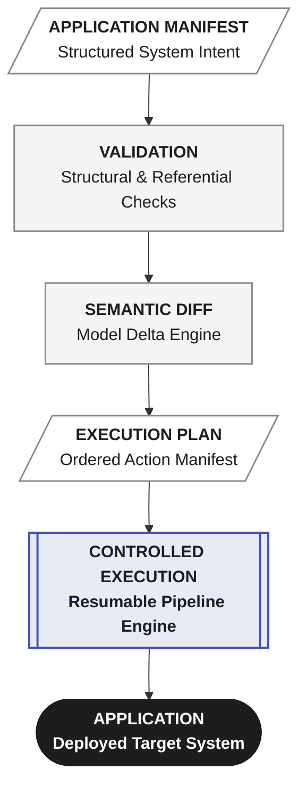
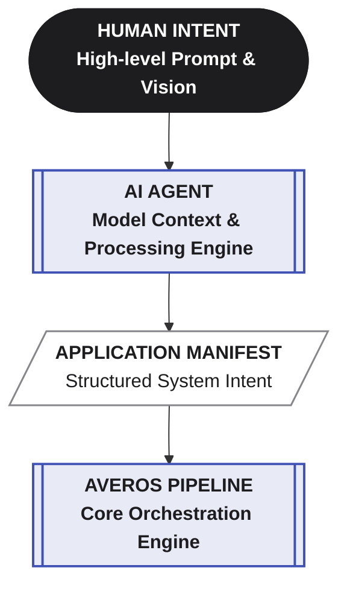
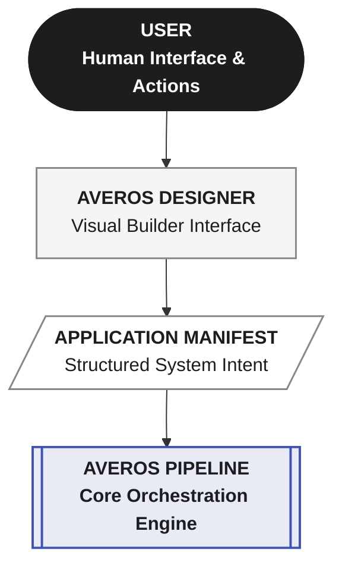
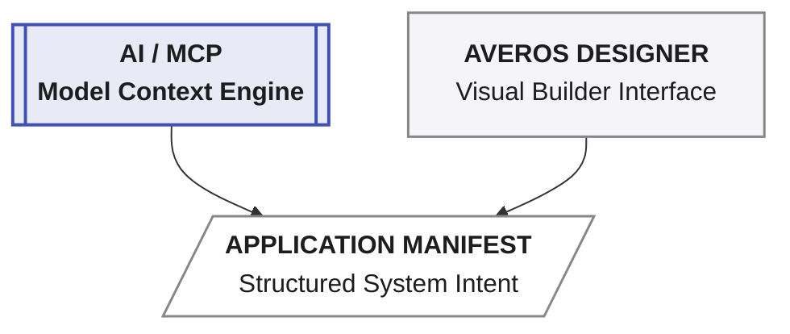
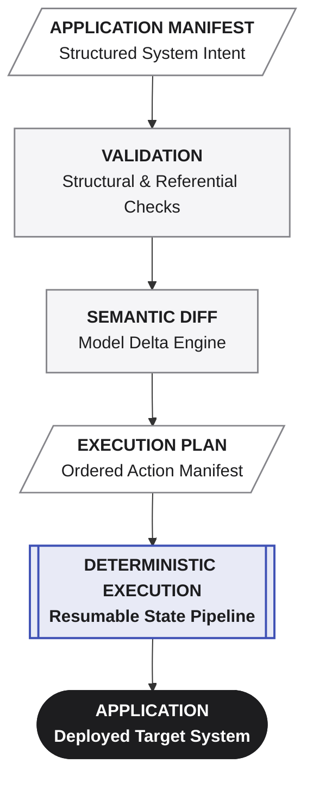
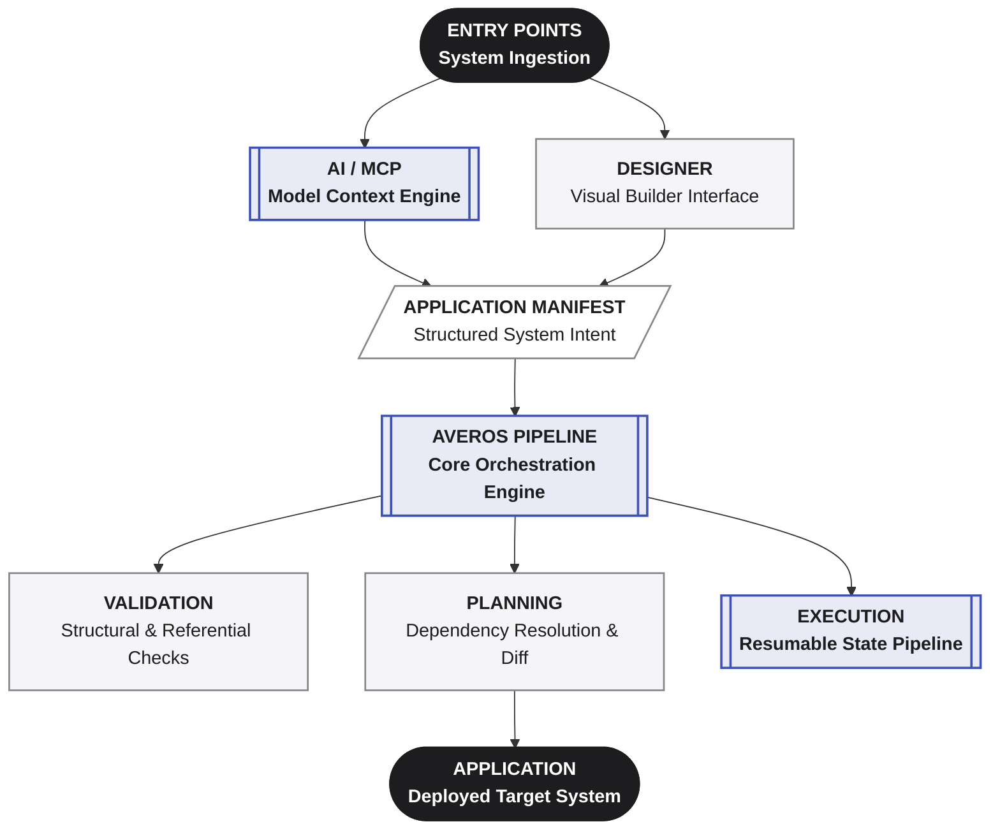
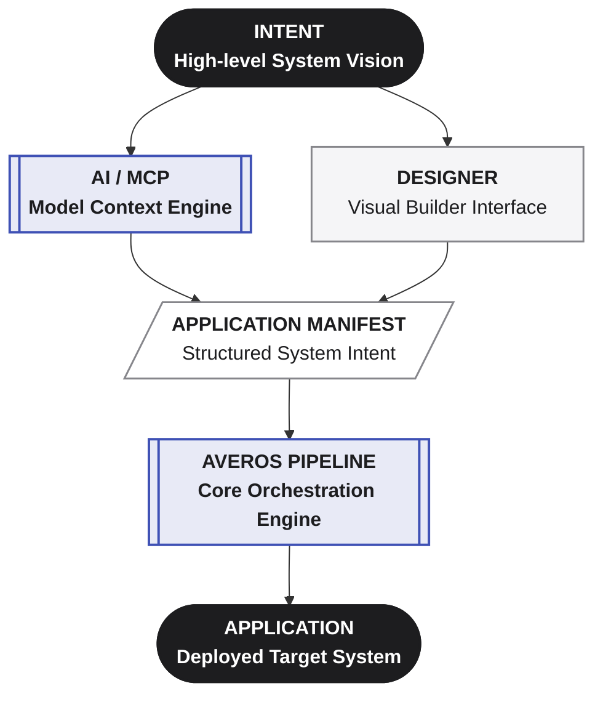

**_Different ways to express intent. One application model. One deterministic pipeline._**

Averos does not require AI to be the only way of expressing application intent.

An application can enter the Averos system through different interfaces, depending on how the user wants to work.

Today, there are two primary entry points:

1. **AI-driven** — application intent can be expressed through an AI agent using `@averos/ai` with the Averos CLI (`@averos/cli`), or through an MCP-compatible client using `@averos/mcp`.
2. **Visual** — application intent can be designed visually by the user through [**Averos Designer**](https://appbuilder.wiforge.com/averos-designer/averosdesigner){:target="_blank" rel="noopener noreferrer"}.

These are different interfaces to the same underlying application model.

The important architectural property is what happens after the entry point.

The interface used to express intent does not determine the execution architecture.

Once intent has been represented as an Application Manifest, it enters the same governed pipeline:

The same manifest can therefore be produced through different experiences while preserving the same validation, orchestration, and execution semantics.

## AI-driven application modeling

For AI-driven development, intent can enter Averos through the AI tooling layer.

With @averos/ai, an AI agent can interpret natural-language requirements and work with the Averos application model through the Averos CLI (@averos/cli).

Alternatively, @averos/mcp can expose Averos capabilities to an MCP-compatible AI client.

Conceptually:

The AI is therefore an entry mechanism for application intent, not a replacement for the deterministic pipeline.

The manifest remains the boundary between conversational intent and structured application state.

This preserves the separation established elsewhere in the architecture:

>**AI can express intent. The Averos pipeline determines how that intent becomes an application.**

---

## Visual application modeling

AI is not the only way to create an application model.

Users can also design application intent visually through Averos Designer{:target="_blank" rel="noopener noreferrer"}.

The visual interface provides a different way to express the same kinds of application concepts represented by the manifest.

Conceptually:

This means that a user does not need to formulate application requirements as a conversation with an AI agent in order to use the Averos application model.

The visual interface and the AI interface serve different interaction styles.

They converge on the same underlying representation.

---

## One application model

The key architectural decision is that these entry points do not create separate application models.

They converge:

From that point onward, the application follows the same path.

This convergence is important.

It means that validation rules do not need to change depending on whether the manifest came from an AI agent or a visual designer.

The semantic diff does not need to know where the intent originated.

The execution engine does not need to know whether a human designed the application visually or an AI agent proposed it conversationally.

The downstream system operates on the **application model**, not on the interface that produced it.

---

## Different experiences, shared guarantees

The two entry points provide different user experiences:

| Entry point         | Primary interaction                                 | Result               |
| ------------------- | --------------------------------------------------- | -------------------- |
| **AI**              | Natural-language conversation and agent interaction | Application Manifest |
| **Averos Designer** | Visual application modeling                         | Application Manifest |

What they share is more important than how they differ.

Both ultimately produce the same kind of structured application state.

Both enter the same validation boundary.

Both are subject to the same semantic modeling and orchestration process.

Both can ultimately produce the same kind of execution plan.

The interface can therefore evolve independently from the deterministic core.

>**Different ways to express intent. The same application model. The same guarantees downstream.**

---

## The interface is not the architecture

This distinction is central to Averos.

Averos is not fundamentally an AI interface.

It is not fundamentally a visual designer either.

Both are **interfaces into an application modeling and execution system.**

The architecture can therefore be represented as:

This separation gives Averos room to evolve.

New interfaces can be introduced without redefining the application model.

The AI experience can evolve independently.

The visual designer can evolve independently.

Other tools can potentially become entry points as well.

As long as they can produce or modify the application model, they can participate in the same downstream lifecycle.

>**The interface can change. The application model remains the common language.**

---

## One system, multiple ways in

The result is deliberately simple:

The entry point determines **how intent is expressed.**

The manifest determines **what application state is intended.**

The pipeline determines **whether that state is valid, what must change, and how those changes are executed.**

That is why Averos can support multiple ways of building applications without fragmenting the underlying architecture.

>**Many ways in. One application model. One deterministic system.**

---