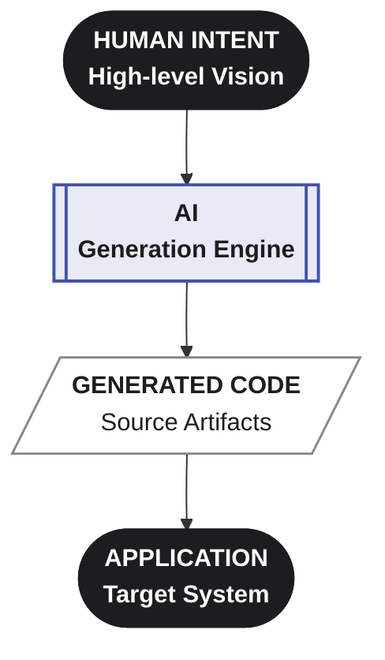
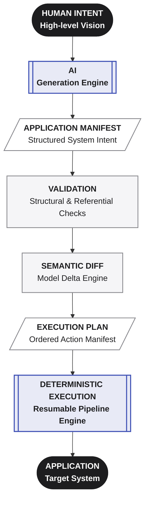
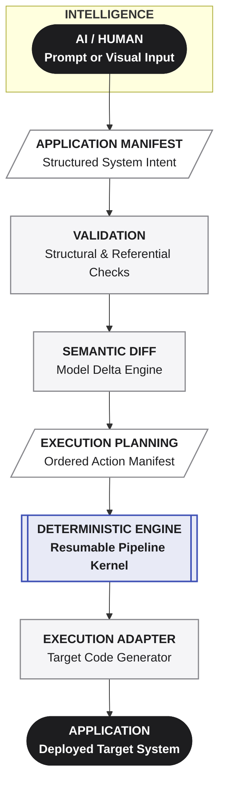
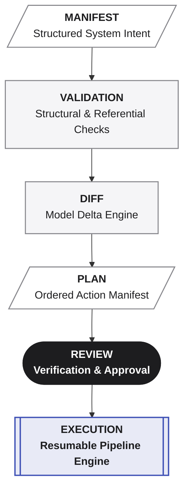
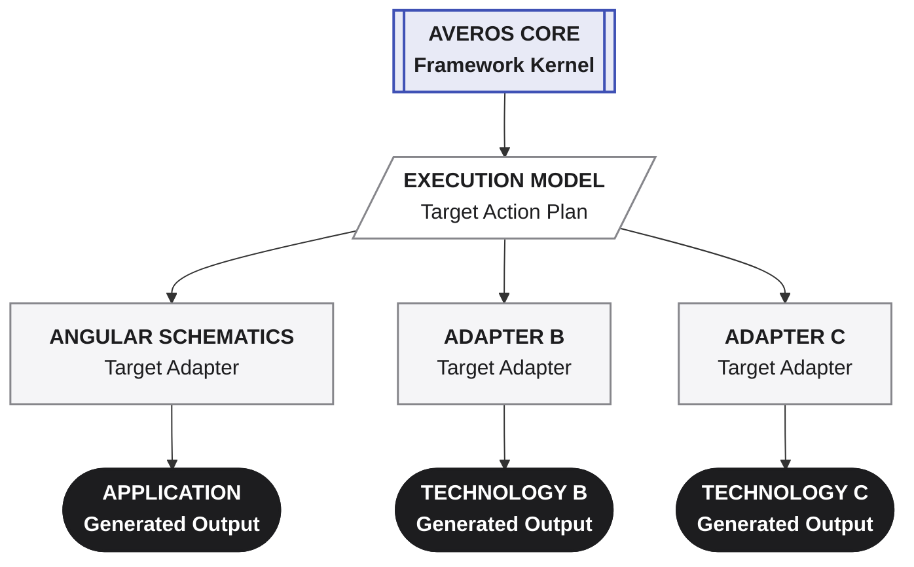
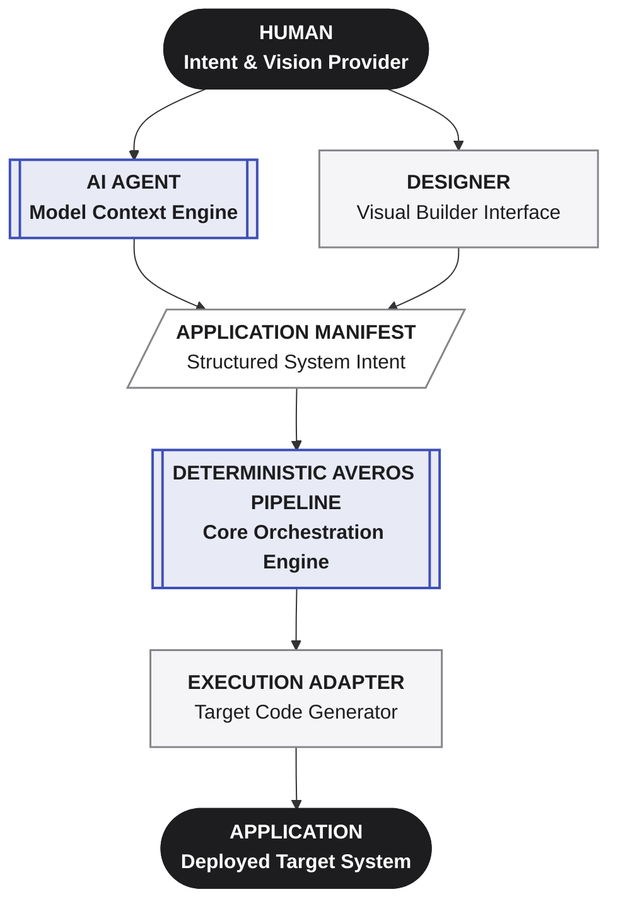

AI can generate code remarkably well.

But generating code is not the same thing as managing software.

The fundamental difference with Averos is **where AI stops and deterministic engineering begins**.

Most AI coding workflows ask an AI system to produce or modify source code directly.

Averos gives AI a structured application model instead.

The AI helps define **what the software should become**. Averos determines **how that change is validated, planned, and executed**.

> **Averos does not remove AI from software development.  
> It gives AI a structured system to operate on.**

---

## The architectural difference

The distinction can be summarized simply:

| | Direct AI Coding | Averos |
|---|---|---|
| **Primary artifact** | Generated source code | Application Manifest |
| **AI output** | Code / edits | Structured application intent |
| **Source of truth** | Prompt + code | Application Manifest |
| **Validation** | Usually around generated changes | Manifest validated before execution |
| **Change model** | Code generation / editing | Semantic application change |
| **Planning** | Often implicit in the agent | Explicit execution plan |
| **Dependencies** | Often inferred during generation | Explicitly modeled and planned |
| **Execution** | Agent / tool driven | Controlled execution pipeline |
| **Technology coupling** | Often embedded in generation | Isolated through execution adapters |
| **Review** | Primarily code diff | Manifest → diff → plan → execution |
| **Evolution** | Regeneration / editing | Explicit application revisions |
| **AI dependency** | Often coupled to the coding agent | Deterministic core is LLM-agnostic |

The important difference is not that one approach uses AI and the other does not.

**Both can use AI.**

The difference is the **role AI plays in the architecture**.

---

## AI generates code vs. AI defines software

In a conventional AI coding workflow:



The AI is directly involved in producing the implementation.

Averos introduces an explicit intermediate representation:



The distinction may look small.

Architecturally, it is significant.

The Application Manifest becomes the durable representation of application intent.

The AI can help create or modify that representation, but it does not have to be responsible for every downstream transformation.

---

## A boundary between intelligence and execution

Averos deliberately separates two fundamentally different responsibilities.

**AI is good at:**

- understanding natural language
- interpreting requirements
- reasoning about intent
- proposing changes
- exploring alternatives
- helping users define applications

**Deterministic systems are good at:**

- validating structure
- resolving dependencies
- calculating changes
- building execution plans
- enforcing constraints
- executing defined operations
- tracking execution state
- reproducing defined transformations

Averos puts a boundary between the two.




This means the system does not have to trust an AI model with the entire software transformation process.

>**AI provides intelligence. Averos provides control.**

---

## The manifest changes the unit of change

One of the most important consequences of this architecture is the way software changes are represented.

Consider a simple requirement:

>"Add a priority field to tasks."

In a direct AI coding workflow, this may result in the AI inspecting and modifying several source files.

The scope of the resulting changes depends on the agent, its reasoning, the tools it uses, and the current state of the codebase.

With Averos, the requested change can instead become a change to the application's defined state:

 ```mermaid
 flowchart TD
    classDef boundary fill:#1d1d1f,stroke:#1d1d1f,stroke-width:2px,color:#ffffff,font-weight:bold
    classDef artifact fill:#ffffff,stroke:#86868b,stroke-width:1.5px,color:#1d1d1f
    classDef process fill:#f5f5f7,stroke:#86868b,stroke-width:1.5px,color:#1d1d1f
    classDef engine fill:#e8eaf6,stroke:#3f51b5,stroke-width:2px,color:#1d1d1f,font-weight:bold

    A[/"`**CURRENT MANIFEST**
    Existing System Baseline`"/]:::artifact

    B(["`**CHANGE INTENT**
    Target Modifications`"]):::boundary

    C[/"`**UPDATED MANIFEST**
    New System State`"/]:::artifact

    D["`**SEMANTIC DIFF**
    Model Delta Engine`"]:::process

    E[/"`**AFFECTED OPERATIONS**
    Identified Structural Impacts`"/]:::artifact

    F[/"`**EXECUTION PLAN**
    Ordered Action Manifest`"/]:::artifact

    G[["`**DETERMINISTIC EXECUTION**
    Resumable Pipeline Engine`"]]:::engine

    A & B --> C
    C --> D
    D --> E
    E --> F
    F --> G
```


 The application is therefore treated as a **living system**, rather than something that must be regenerated whenever its requirements change.

---

## From code diff to semantic change

A source-code diff tells you **what files changed.**

A manifest diff can tell you **what the application changed.**

For example:

```text
- Task
    fields:
      title
      description

+ Task
    fields:
      title
      description
      priority
```

The meaningful change is not:

>`task.model.ts changed`

or:

>`task.component.ts changed`

The meaningful change is:

>**The Task entity now has a priority field.**

The execution system can then determine which implementation changes are required to realize that application-level change.

This creates a higher-level layer of reasoning above source code.

----

## Planning becomes explicit

AI agents often combine reasoning, tool selection, and execution into one continuous process.

Averos separates these stages.




The execution plan becomes an inspectable artifact.

Instead of asking:

>"What did the AI decide to do?"

you can ask:

>"What does Averos plan to do, and why?"

That distinction becomes increasingly important as applications and AI-driven workflows become more complex.

---

## Technology is isolated behind adapters

Averos does not intend to hard-code every technology into its core.

The execution model is designed around Execution Adapters.




The Angular Schematics adapter is the first production implementation of this model.

It demonstrates the complete path from application intent to generated and evolved Angular applications.

But the architecture is intentionally broader than Angular.

**The core defines the execution model.**<br/>
**Adapters bring that model to technologies.**

This is also an important area where the community can contribute: building new execution adapters for additional frameworks, runtimes, infrastructure systems, or application technologies.

---

## AI becomes replaceable

Because the deterministic execution layer operates on the Application Manifest rather than directly on a particular AI model, the architecture does not need to be tied to one LLM.

Different systems can potentially produce or modify the same structured application representation.




This separation means that AI becomes one way of expressing intent rather than the foundation upon which the entire execution system depends.

---

## The real difference

Averos is not simply another AI code generator.

It is not trying to win by generating more lines of code, producing larger prompts, or making an AI agent write software faster.

Its architectural bet is different.

**The important artifact is not the code generated by AI.**

It is the **structured definition of the software that should exist.**

Once that definition exists, it can become something that can be:

- **validated**
- **versioned**
- **diffed**
- **planned**
- **reviewed**
- **executed**
- **evolved**
- **reproduced**

That changes the relationship between AI and software engineering.

Instead of:	

>AI → Code

Averos is designed around:

>AI → Intent → Model → Plan → Execution → Software

And that leads to the central idea behind Averos:

>**AI should not have to be responsible for everything that happens after it understands what you want.**

---

## In one sentence

>**Averos gives AI a structured application model to operate on, then puts deterministic engineering between intent and execution.**