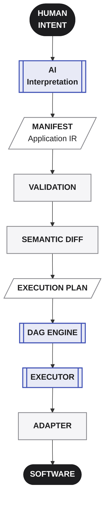
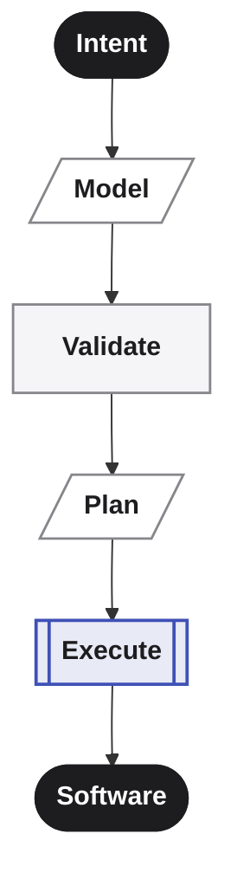
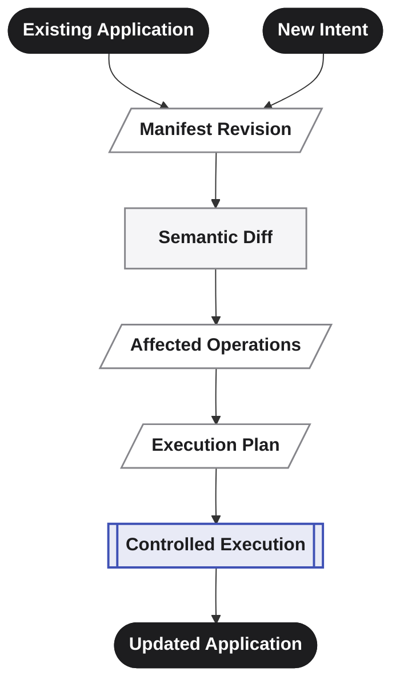
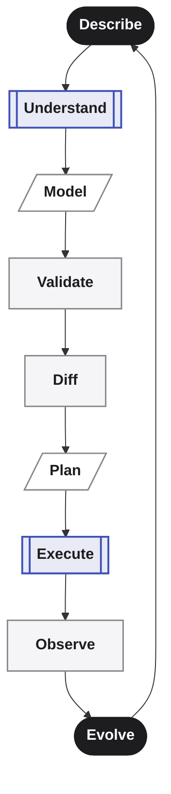
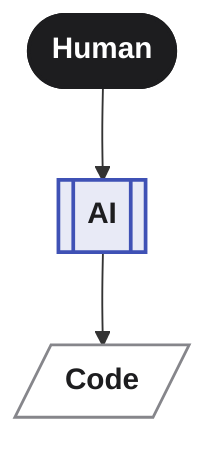
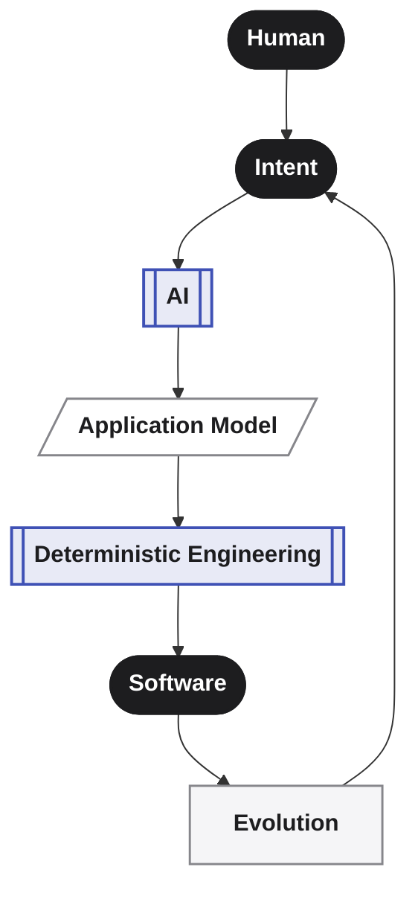

**_AI defines. Averos builds._**

Everything described throughout this section comes together in one architectural idea:

> **Averos separates the intelligence required to understand software from the deterministic infrastructure required to build and evolve it.**

The human expresses intent.

AI helps interpret and structure that intent.

The resulting application model becomes the contract.

Averos then validates the model, determines what has changed, constructs an explicit execution plan, resolves dependencies, and executes the required operations through technology-specific adapters.

The code is no longer the starting point of the process.

**It becomes the consequence of a defined system state and a controlled execution process.**

---

## The Averos pipeline

At its highest level, Averos can be understood as:

Each stage has a distinct responsibility.

**Intent** expresses what should exist.

**AI** helps transform human intent into a structured representation.

**The Manifest** provides a durable representation of the application's desired state.

**Validation** determines whether that state is structurally and semantically acceptable.

**Semantic Diff** identifies what has changed.

**The Execution Plan** determines which operations are required and in what dependency-aware order.

**The DAG Engine** resolves the relationships between those operations.

**The Executor** manages their controlled execution and execution state.

**The Execution Adapter** translates the abstract operations into technology-specific transformations.

And finally:

**Software is produced or evolved.**

---

## One architecture, two directions

This model is important because software development is not a one-time generation process.

There are two complementary directions.

**From intent to software**

This is the construction path.

But once the application exists, the process does not stop.

**From software change to software evolution**

The second path is arguably the more important one.

**Software is continuously changing.**

Requirements change.
Business rules change.
Data models change.
Interfaces change.
Dependencies change.

A development system therefore needs to understand not only how to create software, but how to **change it deliberately.**

That is why evolution is a first-class concept in Averos.

---

## From generation to a development loop

The complete model can therefore be expressed as a continuous loop:

This is the development model Averos is designed to enable.

The objective is not simply to make the first generation faster.

**It is to make the entire lifecycle of software more structured, inspectable, and controllable.**

---

## The deeper idea

The individual components of Averos are useful on their own.

**The CLI** provides an interface.

**The AI** layer provides intent interpretation.

**The manifest** provides the application model.

**Validation** provides constraints.

**Semantic diff** provides change detection.

**The DAG engine** provides dependency-aware planning.

**The executor** provides controlled execution.

**Adapters** connect the abstract execution model to real technologies.

But the real value emerges from **the separation between these responsibilities.**

AI does not need to own execution.

Execution does not need to understand natural language.

The application model does not need to be tied to one AI provider.

The deterministic core does not need to know the implementation details of every technology.

Each layer has a defined responsibility, and the boundaries between those layers make the system composable and extensible.

---

## The result

This creates a fundamentally different relationship between humans, AI, and software.

Instead of:

Averos is designed around:

The AI can become better without requiring the deterministic execution model to change.

New execution technologies can be introduced through adapters without redefining the application model.

Applications can evolve without requiring the entire system to be regenerated.

And humans can inspect the system at multiple levels: **intent, model, change, plan, and execution.**

That separation is the foundation of Averos.

---

## In one sentence

>**AI defines. Averos builds. Software evolves.**