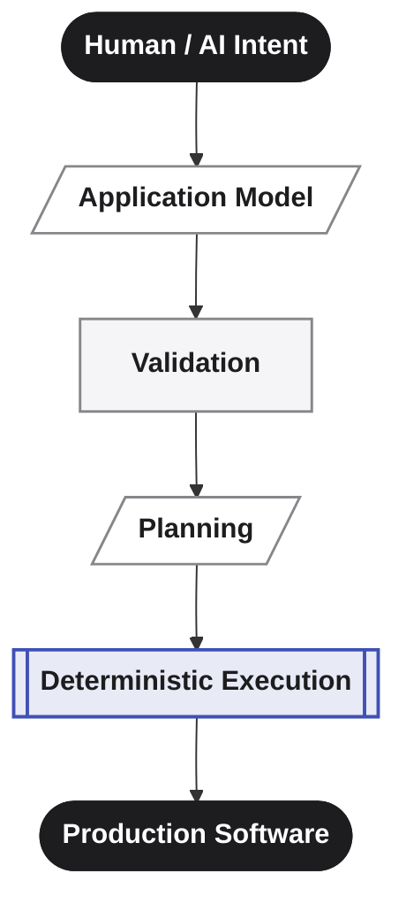

      

 

# Software should be built from intent — not regenerated from prompts.

**Averos** is a deterministic execution and evolution layer between AI intent and production software.

It provides a structured path from **what should exist** to **what gets built** — using an explicit application model, validation, semantic change detection, execution planning, and controlled execution.

The goal is simple:

> **AI defines. Averos builds.**

Averos is being developed as an open-source platform for building and continuously evolving structured applications from intent — whether that intent comes from an AI agent, a visual designer, or a developer working directly with the application manifest.

[Why Averos? →]({{ "/averos/why-averos/" | relative_url }})  
[How Averos Works →]({{ "averos/how-averos-works/introduction/" | relative_url }})

---

# Why Averos exists

Software is rarely built once.
Applications evolve continuously: requirements change, entities grow, workflows change, interfaces evolve, and new integrations appear.

AI makes software creation dramatically more accessible, but direct prompt-to-code generation leaves an important problem unsolved: **how do we control and evolve the resulting software over time?**

Averos explores a different model.

Instead of treating generated source code as the primary artifact, Averos treats **structured application intent as the source of truth** and places a deterministic execution layer between that intent and the resulting software.

The result is an approach designed around:

- **Reproducibility**
- **Explicit application state**
- **Reviewable changes**
- **Incremental evolution**
- **Controlled execution**
- **AI independence**
- **Extensibility through adapters**

For the complete architectural argument, see [Why Averos?]({{ "/averos/why-averos/" | relative_url }}).

---

# Where Averos fits

Averos sits at the intersection of **AI-assisted development, application modeling, and deterministic software generation**.

It is designed primarily for structured applications where architecture, repeatability, validation, and controlled evolution matter — particularly enterprise and business applications.

Averos is not intended to replace general-purpose frameworks, conventional development, or AI coding assistants.

Instead, It introduces a layer between intent and implementation that can work alongside them.

The deterministic core is deliberately separated from technology-specific implementation through Execution Adapters.

The first adapter is based on Angular Schematics. The architecture is intended to allow the community to bring Averos to additional technologies without changing the core execution model.

---

# From Design First to AI-Native

Averos did not begin as an AI platform.
It started as a **Design First**, low-code approach to building Angular applications. Developers could define entities, services, views, translations, and other application structures and generate a real application without repeatedly writing the surrounding scaffolding.

That foundation remains.

What changed was the question:

> **What if application design itself could become structured intent understood by AI?**

That led Averos beyond a framework for generating applications toward a platform for **defining, executing, and evolving application state**.

Today, Averos supports multiple ways of expressing that intent:

- **Describe it**: Use an AI agent through the Averos CLI or MCP-compatible tooling to create and evolve the application manifest.

- **Design it**: Use [Averos Designer↗](https://appbuilder.wiforge.com/averos-designer/averosdesigner){:target="_blank" rel="noopener noreferrer"} to visually author and edit application intent.

- **Define it**: Work directly with the structured application manifest.

Different interfaces.
**One underlying application model.**

---

# Applications built with Averos

The following interfaces are examples of applications generated through the Angular execution adapter.



These applications represent the concrete output of the execution pipeline — from structured application intent to a working Angular application.

[Get Started]({{ "/averos/get-started/introduction" | relative_url }} "Get Started"){: .btn .btn--success .btn--small}

---

# Open source by design

Averos is now being developed in the open.

The project is intended not only to make the implementation visible, but to give developers a place to experiment, contribute, build adapters, improve the tooling, and help shape where the platform goes next.

The community can contribute at several levels:

- Extend the application model
- Improve the existing execution adapters
- Build New Execution Adapters
- Improve AI and MCP integration
- Improve averos CLI
- Build developer tooling
- Improve documentation and examples
- Experiment with new ways of defining application intent

The Averos [GitHub repository↗](https://github.com/wiforge/averos){:target="_blank" rel="noopener noreferrer"} is the starting point for the project.

---

# About the creator

Averos is currently an independent open-source project built by one person.

Architecture, implementation, UI design, documentation, branding, and this website have all grown from the same underlying idea: software development can become more structured without becoming less creative.

Hello 🤝 — I'm [Houssem LAOUITI](https://github.com/houcemlaw){:target="_blank" rel="noopener noreferrer"}, the person behind Averos and Wiforge.

I'm a builder and a follower of emerging technologies. I enjoy exploring ideas at the intersection of software engineering, architecture, and AI — and, most importantly, turning those ideas into things that actually work.

Averos is an ongoing experiment as much as it is a software platform. The architecture is evolving, the ecosystem is young, and there is plenty of room for other developers to influence what comes next.

If you have a question, an idea, a criticism, or simply want to talk about the project, [send me a message↗](mailto:averos.tech@gmail.com).

I'd be glad to hear from you.

---

# License

Copyright © 2020-2026 [Houssemeddine LAOUITI](https://github.com/houcemlaw){:target="_blank" rel="noopener noreferrer"} (Wiforge).

Released under the [MIT LICENSE]({{ "/averos/license/" | relative_url }} "Averos License"). 

---

# Explore Averos

- [Why Averos?]({{ "/averos/why-averos/" | relative_url }}) — the case for a deterministic layer
- [How Averos Works]({{ "/averos/how-averos-works/introduction/" | relative_url }}) — the four-layer pipeline
- [Averos Designer↗](https://appbuilder.wiforge.com/averos-designer/averosdesigner){:target="_blank" rel="noopener noreferrer"} — the visual way to author intent
- [Vision]({{ "/averos/vision/" | relative_url }}) — why this matters, and where it's going
- [Github & Community↗](https://github.com/wiforge/averos){:target="_blank" rel="noopener noreferrer"} — contribute, ask, suggest

---

  Built solo, with care, by <a href="https://github.com/wiforge">Wiforge</a>.

