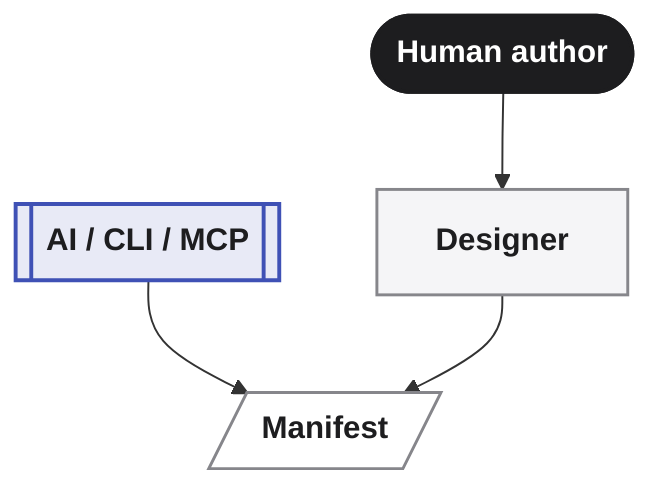

If you've been here before, some of this page will look familiar, and some of it won't. That's not an accident — it's the point of this post.

**"Only what matters the most."** That line has been on this site since the beginning. It described a framework that let you focus on application design instead of technical plumbing. It still describes what we're building. What's changed is how far that idea now goes.

---

## Where Averos started

Averos began as a rapid, low-code, Angular-powered framework built around a **Design First** approach.
You could define entities, services, views, authentication, translation and field key mapping and generate a real application without repeatedly hand-writing the surrounding scaffolding.

That foundtaion still matter. The entity model, services, view, translation capabilities, authentication capabilities, configurations and Angular application generation remain part of what Averos can build.

**What's changed is what sits upstream of them**

---

## Why we kept going

"Design First" was always a bet that *intent* should drive software, not the other way around. AI made it possible to take that bet much further than a form-based designer alone ever could — but it introduced a new problem the moment we tried.

Prompt-based AI coding is fast, but the prompt is the only source of truth, which means there effectively *is* no source of truth. Ask for the same thing twice and you may not get the same thing twice. Ask for one small change and the model may quietly rewrite what it wasn't asked to touch. Nothing is reviewable before it runs. Nothing is guaranteed reproducible.

**That's not a framework problem. That's a missing layer.**

---

## What Averos is now

Averos has grown into a **deterministic execution and evolution layer between AI intent and production software**.

**AI defines. Averos builds.**

Instead of making the AI responsible for directly editing your application, Averos gives it a structured Application Manifest representing the desired application state.

From there, Averos can validate that state, determine what has changed, produce an execution plan, and apply the required transformations through its execution engine.

The result is a different development loop:

**AI provides intelligence. Averos provides control.**

---

## Two ways to define intent

The manifest is the contract everything else is built from — but you're not limited to one way of writing it.

- **Describe it.** Work in conversation with an AI agent, through the Averos CLI or any MCP-compatible tool, and let it produce and revise the manifest for you.
- **Design it.** [Averos Designer](https://appbuilder.wiforge.com/averos-designer/averosdesigner){:target="_blank" rel="noopener noreferrer"}, previously positioned as a separate product provides a visual interface for authoring and editing the same application manifest.

Both paths converge on the same artifact. Neither is the "real" way to build with Averos — they're just two doors into the same deterministic core.

---

## What's open source

Averos is now being developed in the open. The public repository contains the core packages that make up the deterministic generation and evolution workflow, including:

- **`@averos/cli`**: the command-line entry point into all of it
- **`@averos/ai`**: the AI-facing intent layer
- **`@averos/mcp`**: governed, tool-based access for AI agents, via the Model Context Protocol
- **`@averos/workflow`**: the schematics that already power Averos applications: entities, services, view layouts, translations. If you've used Averos before, this is the part you already know, now out in the open.
- **`@averos/ui-platform`**: the UI execution layer of the Averos platform. Consists of reusable Angular Material components, dynamic form engines, reflective view builders, and entity use case scaffolding that serves as the **execution runtime** of the **Angular adapter layer** for the Averos DAG-driven application generation pipeline.

**The architecture is now open for inspection, experimentation, and contribution.**

**[View Averos on GitHub →](https://github.com/wiforge/averos){:target="_blank" rel="noopener noreferrer"}**

---

## What stays the same

The foundation that existing Averos users know is still here.

The entity model, service layer, responsive Material-based UI, translation capabilities, and Angular application generation remain part of the Averos ecosystem.

What's changed is the layer above them.

Instead of being limited to manually authored configuration or framework-specific generation workflows, Averos can now take structured intent from an AI agent, a visual designer, or a developer-authored manifest and drive that intent through the same deterministic execution model.

---

## Try it

- [**Get Started →**]({{"/averos/get-started/introduction/" | relative_url}} "Get Started"){:target="_blank" rel="noopener noreferrer"}
- [**How Averos works →**]({{"/averos/how-averos-works/introduction/" | relative_url}} "Docs"){:target="_blank" rel="noopener noreferrer"}
- [**Explore the source on GitHub →**](https://github.com/wiforge/averos){:target="_blank" rel="noopener noreferrer"}
- [**Try Averos Designer →**](https://appbuilder.wiforge.com/averos-designer/averosdesigner){:target="_blank" rel="noopener noreferrer"}
- [**Get started with the CLI →**]({{"/averos/get-started/averos-cli/" | relative_url}} "Get Started"){:target="_blank" rel="noopener noreferrer"}
- [**Read the docs →**]({{"/averos/documentation/" | relative_url}} "Docs"){:target="_blank" rel="noopener noreferrer"}

**Averos still means what it always meant: only what matters the most. It just means a great deal more can matter now.**
