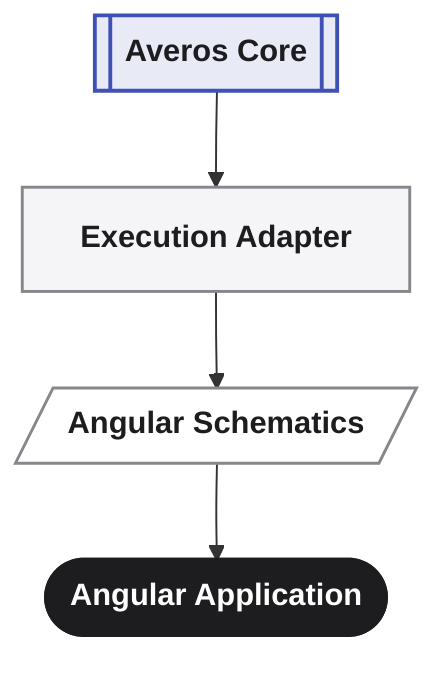
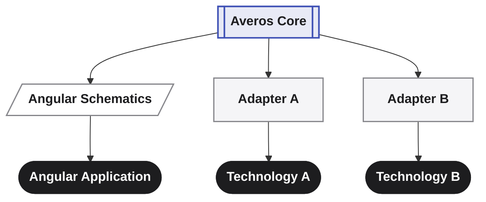

Averos is built as an ecosystem, not a single black box — adapters, integrations, and new ways of expressing intent should be able to come from the community, not only from us. That's why the layers you actually build with, extend, and integrate against are open source today.

The execution engine underneath them, which implements the averos DAG specification — the part that enforces determinism — is currently closed.

Averos is based on an architectural idea that becomes more valuable as more developers can inspect it, experiment with it, extend it, and challenge it.

> **The core defines the model.  
> The community brings it to the world.**

[Explore Averos on GitHub →](https://github.com/wiforge/averos){:target="_blank" rel="noopener noreferrer"}{: .btn .btn--success .btn--small}

---

## What is open source

Averos follows an **open-core model**.

The project is intentionally divided into two licensing layers.

### Open-source packages

The following Averos packages are released under the MIT License and are open for inspection, modification, redistribution, and contribution:

| Package | Purpose |
|---|---|
| **`@averos/cli`** | Command-line interface for working with Averos |
| **`@averos/ai`** | The AI-facing intent layer — turning conversation into a structured manifest |
| **`@averos/mcp`** | Governed, tool-based access for AI agents via the Model Context Protocol |
| **`@averos/workflow`** | Application workflows and execution adapters, including the Angular Schematics adapter that generate and evolve applications |
| **`@averos/ui-platform`** | the UI execution layer of the Averos platform. |

The exact package structure and capabilities will continue to evolve as the platform develops.

This is how you interact with Averos, how intent becomes a manifest, how AI agents get governed access instead of raw access, and how that manifest becomes a real application. All of it is yours to read, fork, and extend.

These packages are where we particularly want the community to experiment, contribute, extend the platform, and build new integrations.

The source code, issues, discussions, releases, and contribution history are available in the [Averos GitHub repository](https://github.com/wiforge/averos){:target="_blank" rel="noopener noreferrer"}.

---

### Source-available proprietary packages

| Package | Purpose |
|---|---|
| **`@averos/core`** | the runtime foundation of applications built with Averos |
| **`@averos/dag-engine`** | Dependency resolution and topological execution ordering for the application graph |
| **`@averos/executor`** | Checkpointed, resumable execution of planned operations |

Their compiled distributions are publicly available at no charge for use, including in production, subject to the terms of the [Averos Closed License]({{ "/averos/averos-closed-license/" | relative_url }} "Get Started").

This is the deterministic execution kernel itself: the part of Averos we've invested the most in getting right, and the part we're keeping closed while it's still maturing. It's a deliberate, staged decision, not a permanent one — we expect to open some or all of it as the engine and the project mature.

>**The current boundary is deliberate, but it is not necessarily permanent.**

As Averos evolves, some or all of these components may eventually be released under open-source licenses.

---

## Open-Source License

The open source packages are released under the **MIT License** — permissive, simple, and unambiguous about your right to use, modify, and build on them.

Copyright © 2020–2026 Houssemeddine LAOUITI (Wiforge). Full text: [License]({{ "/averos/license/" | relative_url }}).

External contributions are covered by a [**Contributor License Agreement (CLA)**](https://github.com/wiforge/averos/blob/main/CLA.md){:target="_blank" rel="noopener noreferrer"}, signed once, to keep the project's licensing clean and unambiguous as it grows.

---

## Why this split

The parts you need to build with Averos, extend it, and integrate it into your own tools are open now: the CLI, the AI intent layer, agent governance through MCP, the adapters that turn a manifest into real code, and the UI runtime those applications run on. That's where we want the community building — new adapters, new ways of expressing intent, new integrations — without waiting on us.
We chose to open source the components where community participation can provide the greatest leverage — particularly the CLI, AI and MCP integration, workflows, UI platform, and execution adapters.

At the same time, several foundational runtime components remain proprietary for now.
The execution kernel is where the hardest engineering work has gone, and where we're being the most conservative before opening it fully. Keeping it closed for now protects that work while it's still evolving quickly; publishing it for free, unrestricted use means that decision doesn't cost you anything today.

This allows us to:

- keep the core implementation available for users to run;
- protect parts of the platform while the architecture matures;
- invite community experimentation around the public interfaces and extension points;
- encourage development of new execution adapters and integrations;
- retain the option to open additional components as the project evolves.

>**This boundary is part of the current project strategy, not a claim that the proprietary components will remain closed forever.**

---

## What this means for trust

You can't currently read the source of the engine that enforces determinism. What you can always inspect, at every step, are its inputs and outputs: the manifest before anything runs, the validation results, the semantic diff, and the execution plan before it's applied. Nothing executes silently or invisibly — the parts of the system that decide *what* happens are fully open; the part that guarantees *how reliably* it happens is closed today and observable in everything it does.

You can't currently inspect the source code of the engine that performs deterministic execution. We think that limitation deserves to be stated plainly.

What you can inspect are the artifacts surrounding execution: the application manifest, validation results, semantic changes, execution plan, and the resulting operations.  
This means the system is designed to make the decision path inspectable, even though the current execution implementation remains closed.

The parts of the system that decide *what* happens are fully open; the part that guarantees *how reliably* it happens is closed today and observable in everything it does.

As Averos matures, opening more of this execution layer is something we intend to revisit.

---

## On the runtime dependency

Every application built with Averos depends on `@averos/core` at runtime.

We want to be direct about what that means: even when provided at no charge, a closed-source runtime dependency creates a dependency on its maintainer.

We don't pretend otherwise. This is a deliberate, staged approach to openness, and the boundary is one we intend to revisit as Averos and its ecosystem mature.

---

## Why open source?

Averos is trying to solve a problem that is larger than a single framework.

If software is increasingly going to be created and evolved from structured intent, then the infrastructure responsible for turning that intent into software needs to be:

- **Inspectable** — developers should be able to understand how it works.
- **Extensible** — new technologies should be able to connect through adapters.
- **Experimentable** — developers should be able to build on top of the core.
- **Reviewable** — architectural decisions should be visible rather than hidden.
- **Community-driven** — important capabilities should not depend entirely on one developer.
- **Portable** — the deterministic model should not be permanently tied to one technology stack.
- **Composable** — developers should be able to combine Averos capabilities with the tools and systems they already use.

Open source makes those properties possible.

It also creates an opportunity for the architecture to be tested by people who did not design it.

---

## Maintainership

Averos is currently designed, built, and maintained by one person. That's stated plainly, not apologetically.

The open-source packages are MIT-licensed, so their source can be independently maintained, forked, and extended by the community even if the project's original maintainer is no longer involved.

The architecture, the license, and contribution model are designed to make that possible.

---

## The Community Opportunity: Contribution areas

Averos is still young. That means there is substantial room to influence the project.
You can contribute at several levels.

### 🧩 Build execution adapters

Bring the Averos execution model to another framework, language, runtime, or technology.

Averos separates its deterministic execution model from technology-specific implementation through the **Execution Adapter** pattern.

The first production adapter targets **Angular Schematics**. It demonstrates the complete path from an Averos execution plan to real application changes.

But Angular is only the beginning.

The adapter boundary is intentionally designed so that the community can bring Averos to other ecosystems without changing the deterministic model itself.

>**The next adapters don't have to come from us.**
>
>**If you are interested in bringing Averos to**  
>**React, Vue, another frontend framework, a backend stack,**  
>**infrastructure tooling, or another application environment,**  
>**an Execution Adapter is one of the most meaningful ways to contribute to the project.** 

Today:

Tomorrow, the ecosystem could look more like:

The core should not need to know how every technology works.

The adapter is responsible for translating the deterministic execution model into technology-specific operations.

**This is one of the areas where we most want the community to participate.**

> If you are interested in bringing Averos to another ecosystem, building an adapter is potentially one of the most meaningful ways to contribute.

---

### 🤖 Improve AI integration

Experiment with better ways for AI agents to understand, create, validate, and evolve application intent.

---

### 🔌 Build integrations

Connect Averos to development tools, services, runtimes, CI/CD systems, databases, and other parts of the software ecosystem.

---

### 🛠️ Improve the open platform

Help improve the parts of Averos that are open to community development—from the manifest model and validation tooling to workflows, adapters, integrations, and developer tooling.

---

### 📚 Improve documentation

Examples, tutorials, architectural explanations, and real-world use cases are valuable contributions — especially while the project is young.

---

### 💡 Challenge the architecture

Not every contribution needs to be code.

 

Questions, design proposals, issues, experiments, benchmarks, and thoughtful criticism can be equally valuable.

>A young project benefits enormously from people asking:
>
>**"Why does it work this way?"**
>
>and
>
>**"Could it work better this way?"**

---

## in one sentence

>**Averos is open where we want the ecosystem to grow, while the deepest runtime remains protected for now — with the possibility of opening more of it as Averos matures.**

---

## Get involved

- ⭐ [**View the source on GitHub →**](https://github.com/wiforge/averos){:target="_blank" rel="noopener noreferrer"}
- 🐛 [**Report an issue or ask a question →**](https://github.com/wiforge/averos/issues){:target="_blank" rel="noopener noreferrer"}
- 🚀 [**Get started**]({{ "/averos/get-started/introduction/" | relative_url }} "Get Started"){:target="_blank" rel="noopener noreferrer"}
