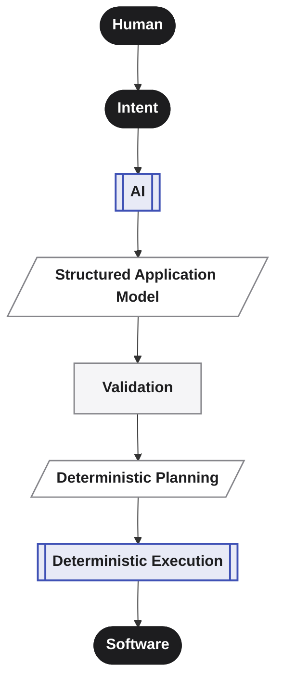
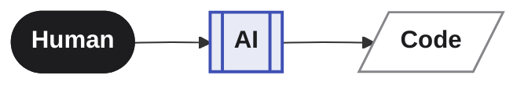
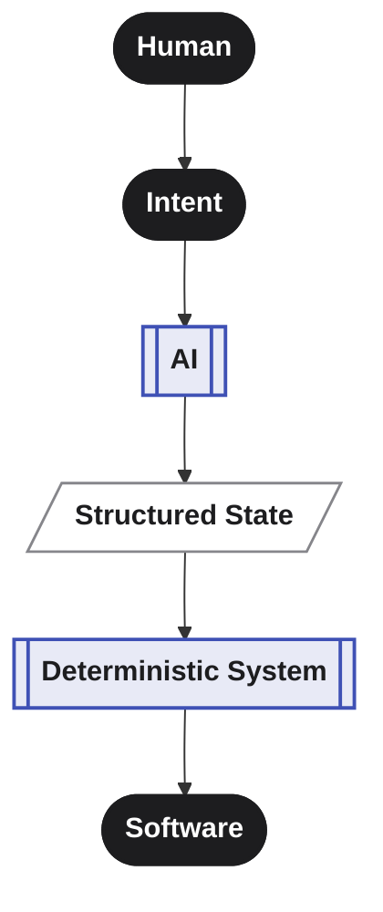

 
Software is increasingly *described* rather than written line by line. That shift is well underway, and it's not slowing down. But describing software to an AI and trusting the result are two different things — and right now, most of the industry has solved for the first and quietly hoped for the second.

We don't think hope is an engineering strategy. We think it's a missing layer.

---

## From writing software to defining software

We believe software engineering is entering a fundamental transition.

For decades, building software has meant translating human requirements into increasingly detailed implementation: architecture, models, interfaces, code, configuration, infrastructure, and integrations.

AI is changing that equation.

But generating code faster is only part of the transformation.

**The deeper opportunity is to change what we consider the primary artifact of software development.**

Instead of treating source code as the starting point, we can describe the **software we want to exist** — and let intelligent systems translate that intent into a structured, validated, executable representation.

**We believe software engineering will evolve from writing code to designing, defining, and evolving systems.**

---

## A different software development model

We imagine a future in which software development becomes increasingly centered around **intent and system state**, rather than the manual construction of implementation details.

The human defines what should exist.

AI helps interpret, refine, and structure that intent.

Deterministic systems validate it, plan its realization, and execute the required transformations.

The resulting software is not a disposable generation.

It is a **living system that can be continuously described, inspected, changed, and evolved.**

---

## From generation to evolution

The first generation of AI-assisted development has focused heavily on:

>"Generate this code for me."

We believe the more important question is:

>"What should this software become?"

Applications are not created once. They evolve.

Requirements change.
Business rules change.
Data models change.
Interfaces change.
Dependencies change.
Entire architectures change.

A future software development system should therefore understand **change as a first-class concept**.

A small change in intent should produce a corresponding, explainable change in the system — not another uncontrolled regeneration.

This is why Averos is designed around application state, semantic change, planning, and deterministic execution.

---

## The role of AI

We do not believe the future of software is simply:

We believe it can become:

AI is exceptionally good at understanding natural language, reasoning about requirements, exploring alternatives, and helping humans express what they want.

It does not need to be responsible for every side effect that follows.

AI provides intelligence. Deterministic systems provide control.

This separation is fundamental to the Averos vision.

---

## Software as a living model

We envision applications becoming increasingly **model-driven, inspectable, and evolvable.**

The application model becomes a durable representation of what the system is intended to be.

Source code becomes one of the outputs of that model rather than the only place where the system's intent is encoded.

That opens the possibility of software that can be:

- **understood** through its structured representation
- **validated** before execution
- **planned** before changes are applied
- **evolved** through explicit revisions
- **reproduced** from defined state
- **reviewed** at the level of intent and change
- **executed** through technology-specific adapters
- **maintained** by humans and AI together

> **The objective is not to eliminate code. It is to make code the consequence of a well-defined system rather than the primary medium through which the system must be understood.**

---

## What follows from our vision

If intent is going to drive software, then what AI produces can't be the code itself — it needs to be something we can validate, diff, version, and reason about *before* a single file is written. 
**That's what a manifest is for**: not a transcript of a conversation, but a contract the rest of the system can be held to.

If software is going to evolve rather than be regenerated, then change has to be a first-class operation — not a fresh guess dressed up as a diff. An application should be able to grow the way real systems grow: one deliberate, explainable revision at a time.

And if AI agents are going to act directly on production systems, they need an environment built for that responsibility — validation before mutation, plans before execution, approval before anything lands. Not raw access to a codebase and good intentions.

## Where this leads

Averos today demonstrates this discipline end to end on one stack. That's a deliberate starting point, not a ceiling. 
The same separation — intent, validation, orchestration, execution — is architected to extend beyond Angular, beyond any single adapter, to wherever software is being built from structured intent instead of hand-written syntax.

The bet isn't that AI will write better code. It's that the industry needs a deterministic layer underneath AI-authored software, the same way compilers, type systems, and version control became the deterministic layer underneath human-authored software. We're building that layer.

**This isn't a new belief for us — it's the same one Averos started with, taken to its conclusion. Software should be defined by intent, not by incidental syntax. We just finally have the tools to build that on solid ground.**

---

## An open ecosystem

Averos is not intended to be a closed system.

The deterministic core defines the execution model. 
Adapters connect that model to technologies. 
AI agents provide new ways to express and evolve intent. 
Developers build tooling, integrations, execution adapters, and new ways of interacting with the application model. 

This creates a potential ecosystem in which the core platform does not need to know how every technology works.

Instead:
> **The core defines the model.** 
> **Adapters bring it to the world.**

We hope the community will help explore what that world can look like.

---

## The future we are exploring

We don't know exactly what software engineering will look like in ten years.

But we believe one thing is increasingly clear:

**The amount of software humanity can create will grow dramatically.**

The limiting factor may no longer be our ability to write code.

**It may be our ability to define, control, understand, and evolve the systems that AI helps us create.**

That is the problem Averos is exploring.

And that is why Averos exists.

---

> **Humans define intent.** 
> **AI expands what we can express.** 
> **Deterministic systems turn intent into reality.** 
> **Software continuously evolves.** 
>
> **AI defines. Averos builds.**
>
> **The goal is not simply to generate code.**
>
> **The goal is to make software construction reproducible, explainable, and evolvable.**