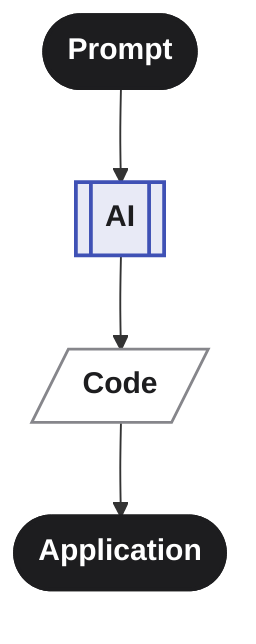
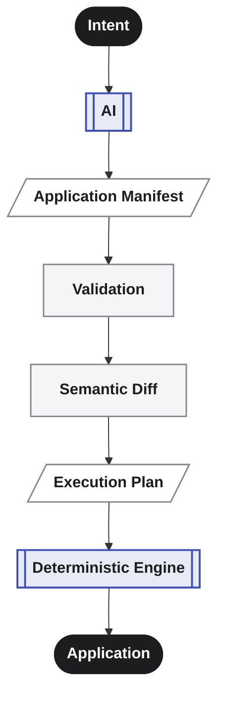
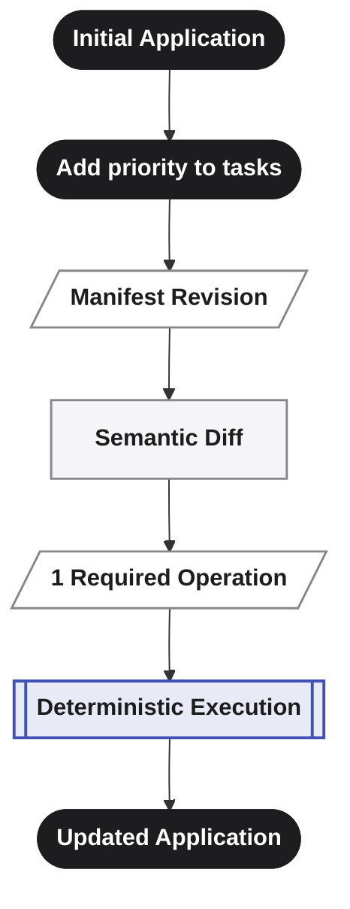

 
Most AI coding today works like this: you describe what you want, the model writes code, and when you want a change, you describe it again and hope the model doesn't quietly rewrite something you didn't ask it to touch.

The prompt becomes the source of truth — which means there is no durable, structured source of truth.
Changes are difficult to reason about before execution, reproducibility is difficult to guarantee, and every revision risks becoming another round of code generation.

**Averos takes a different approach.**

It inserts a **deterministic execution and evolution layer** between AI intent and your codebase: a structured, validated **Application Manifest** that represents the desired application state and drives everything downstream.

The AI decides **what should exist**. Averos determines **how that state is validated, planned and executed.**

**AI provides intelligence. Averos provides control.**

---

## The fundamental difference

Many AI AI coding ultimately drive changes directly through generated or agent-edited source code.

That approach is fast, but often produces:

- inconsistent architectures
- non-reproducible outputs
- difficult maintenance
- vendor lock-in
- unpredictable behavior

Averos takes a different approach.

Instead of generating source code directly, Averos generates and manages a structured **Application Manifest** (IR — Intermediate Representation) that describes an application in a deterministic format.

The manifest is then:

1. Validated
2. Normalized
3. Converted into an execution plan
4. Executed through a deterministic DAG engine using an execution adapter

The result is a system that combines Natural Language, AI Assistance, and Deterministic Engineering into a single workflow.

**Diect AI coding** asks:

> **"What code should I generate?"**

**Averos** asks:

> **"What software state should exist, and what deterministic operations are required to get there?"**

The AI is responsible for interpreting intent and producing a structured representation.

The Averos engine is responsible for validating that representation, determining what changed, resolving dependencies, producing an execution plan, and applying the required transformations.

---

## Why This Matters

| Challenge | Direct AI Coding | Averos |
|---|---|---|
| **Source of truth** | Prompts and generated code | Structured application manifest |
| **Architecture** | Implicit in generated code | Explicit in the application model |
| **Planning** | Left to the AI agent | Explicit, dependency-aware execution plan |
| **Determinism** | Model-dependent | Deterministic execution engine |
| **Validation** | Agent- or tool-dependent | Structured manifest validation (structural, referential, constraint) |
| **Change detection** | File- or code-level diffing | Semantic manifest diff |
| **Incremental evolution** | Regenerate or manually edit | Apply only the required operations |
| **Dependencies** | Inferred during generation | Explicitly modeled and planned |
| **Execution** | Agent-driven side effects | Controlled execution through adapters |
| **Failure handling** | Agent- or tool-dependent | Checkpoints, state, resumable execution |
| **Rollback / revisions** | Usually external to the AI workflow | First-class application revisions |
| **Explainability** | Inspect the generated code | Inspect manifest → validation → diff → plan → execution |
| **AI independence** | Often coupled to a specific agent or model | LLM-agnostic architecture |
| **MCP / agent integration** | Agent- or tool-dependent | Native, governed AI interaction layer |
| **Reproducibility** | Difficult to guarantee | Core architectural objective |

---

## Four Architectural Principles

### The manifest is the contract, not the transcript

Because the AI's job ends at producing a validated manifest rather than directly writing code, Averos can derive a reproducible execution plan from the same application state, manifest, engine configuration, and adapter behaviour. Determinism is an architectural objective of Averos.

### Evolution is a diff, not a do-over

Change one field on one entity, and Averos recomputes only the affected nodes in the dependency graph and touches only what actually changed. In direct AI coding workflows, a requested change often becomes another round of code generation or agent-driven editing. Averos treats the application as a living graph rather than a disposable generation.

### AI agents get a governed environment, not open access

Through `@averos/mcp`, an AI agent doesn't get raw file or shell access to your project — it gets a bounded set of tools (`update_ir`, `validate_ir`, `build_execution_plan`, `approve_plan`) that force every change through validation and an approval gate before anything is written. 
**The agent proposes. The engine plan. You control execution.**

### Extensibility is an Adapter, not a fork

Averos separates **what the application should become** from **how a particular technology stack makes it happen**.

The deterministic core operates on the application model, validation, semantic changes, execution planning, and execution lifecycle. Technology-specific transformations are delegated to **Execution Adapters** through a defined adapter contract.

The first implementation, the **Angular Schematics adapter**, is provided through `@averos/workflow`. It demonstrates the execution path from an Averos application model to concrete Angular project transformations.

The architecture is intentionally not limited to Angular. A community contributor can implement an adapter for another framework, language, runtime, infrastructure technology, or generation mechanism while preserving the same higher-level Averos execution model.

Extending Averos therefore does not require changing the deterministic core. **The core defines the execution model; adapters bring it to new technologies.**

> **Build the adapter. Keep the engine.**

---

## Built for Software Evolution

Software is not generated once. It is continuously changed.

Averos is designed around **software evolution**, not just initial generation.

For example:

The application is not regenerated from scratch.
Its desired state changes, the difference is calculated, and only the necessary operations are executed.

---

## What This Enables

- **Reproducibility** — the same defined state can produce the same planned result.
- **Explainability** — every transformation can be inspected before execution.
- **Incremental evolution** — applications change through explicit revisions rather than uncontrolled regeneration.
- **Control** — AI proposes intent; the deterministic engine controls execution.
- **Recoverability** — execution state and checkpoints support failure recovery and resumption.
- **Extensibility** — execution is separated from the core engine through adapters.
- **AI independence** — the deterministic core does not depend on a particular LLM.

---

## In one sentence

> **Averos is the deterministic execution and evolution layer between AI intent and production software.**

---